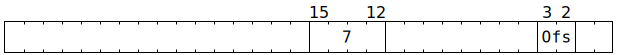

# NoC Atomic Requests

Software can instruct the NIU to perform certain atomic operations against L1 of Tensix tiles and Ethernet tiles (atomic operations cannot be performed against MMIO addresses, nor DRAM addresses, nor can they be translated to or from PCIe transactions). This can be the L1 of the initiating tile, or the L1 of any other Tensix or Ethernet tile, or the request can be broadcast to a rectangle of Tensix tiles and separately performed on the L1 of each of them.

## Atomic increment

To perform this operation, software should populate `NOC_AT_LEN_BE` with:


In the address space of the tile(s) identified by `NOC_TARG_ADDR_HI`:
```c
uint32_t Result;
atomic {
  Result = *(uint32_t*)NOC_TARG_ADDR_LO;
  uint32_t* L1Address = (uint32_t*)((NOC_TARG_ADDR_LO & ~0xf) + (NOC_AT_LEN_BE.Ofs * 4));
  uint32_t OriginalValue = *L1Address;
  uint32_t Incremented = OriginalValue + NOC_AT_DATA;
  uint32_t IntMask = (2u << NOC_AT_LEN_BE.IntWidth) - 1u;
  *L1Address = (Incremented & IntMask) | (OriginalValue & ~IntMask);
}
```

Software is encouraged to set `NOC_AT_LEN_BE.Ofs` such that `L1Address` equals `NOC_TARG_ADDR_LO`, at which point `Result` will contain `OriginalValue`. Note that setting `IntWidth` to `31` performs a full 32-bit increment, whereas setting it to a smaller value causes an increment within the low `IntWidth+1` bits (the higher bits will be left unchanged).

If `NOC_CMD_RESP_MARKED` is set, then at some later point in time, in the address space of the tile identified by `NOC_RET_ADDR_HI`:
```c
*(uint32_t*)NOC_RET_ADDR_LO = Result;
memory_barrier;
atomic {
  NIUCounters.NIU_MST_ATOMIC_RESP_RECEIVED += 1;
  NIUCounters.NIU_MST_REQS_OUTSTANDING_ID(NOC_PACKET_TRANSACTION_ID) -= 1;
}
```

Note that this is similar to the Tensix coprocessor [`ATINCGET` instruction](../TensixTile/TensixCoprocessor/ATINCGET.md).

## Atomic compare and swap

To perform this operation, software should populate `NOC_AT_LEN_BE` with:


In the address space of the tile(s) identified by `NOC_TARG_ADDR_HI`:
```c
uint32_t Result;
atomic {
  Result = *(uint32_t*)NOC_TARG_ADDR_LO;
  uint32_t* L1Address = (uint32_t*)((NOC_TARG_ADDR_LO & ~0xf) + (NOC_AT_LEN_BE.Ofs * 4));
  uint32_t OriginalValue = *L1Address;
  if (OriginalValue == NOC_AT_LEN_BE.CmpVal) {
    *L1Address = NOC_AT_LEN_BE.SetVal;
  }
}
```

Software is encouraged to set `NOC_AT_LEN_BE.Ofs` such that `L1Address` equals `NOC_TARG_ADDR_LO`, at which point `Result` will contain `OriginalValue`. Software can then use `Result` to determine whether the comparison succeeded or not.

If `NOC_CMD_RESP_MARKED` is set, then at some later point in time, in the address space of the tile identified by `NOC_RET_ADDR_HI`:
```c
*(uint32_t*)NOC_RET_ADDR_LO = Result;
memory_barrier;
atomic {
  NIUCounters.NIU_MST_ATOMIC_RESP_RECEIVED += 1;
  NIUCounters.NIU_MST_REQS_OUTSTANDING_ID(NOC_PACKET_TRANSACTION_ID) -= 1;
}
```

Note that this is similar to the Tensix coprocessor [`ATCAS` instruction](../TensixTile/TensixCoprocessor/ATCAS.md).

## Atomic swap, mask variant

To perform this operation, software should populate `NOC_AT_LEN_BE` with:


In the address space of the tile(s) identified by `NOC_TARG_ADDR_HI`:
```c
uint32_t Result;
atomic {
  Result = *(uint32_t*)NOC_TARG_ADDR_LO;
  uint16_t* L1Address = (uint16_t*)(NOC_TARG_ADDR_LO & ~0xf);
  uint16_t ToWrite[2] = {NOC_AT_DATA & 0xffff, NOC_AT_DATA >> 16};
  for (unsigned i = 0; i < 8; ++i) {
    if (NOC_AT_LEN_BE.Mask & (1u << i)) {
      L1Address[i] = ToWrite[i & 1];
    }
  }
}
```

If `NOC_CMD_RESP_MARKED` is set, then at some later point in time, in the address space of the tile identified by `NOC_RET_ADDR_HI`:
```c
*(uint32_t*)NOC_RET_ADDR_LO = Result;
memory_barrier;
atomic {
  NIUCounters.NIU_MST_ATOMIC_RESP_RECEIVED += 1;
  NIUCounters.NIU_MST_REQS_OUTSTANDING_ID(NOC_PACKET_TRANSACTION_ID) -= 1;
}
```

Note that this is similar to the Tensix coprocessor [`ATSWAP` instruction](../TensixTile/TensixCoprocessor/ATSWAP.md).

## Atomic swap, index variant

To perform this operation, software should populate `NOC_AT_LEN_BE` with any of:





In the address space of the tile(s) identified by `NOC_TARG_ADDR_HI`:
```c
uint32_t Result;
atomic {
  Result = *(uint32_t*)NOC_TARG_ADDR_LO;
  uint32_t* L1Address = (uint32_t*)((NOC_TARG_ADDR_LO & ~0xf) + (NOC_AT_LEN_BE.Ofs * 4));
  *L1Address = NOC_AT_DATA;
}
```

Software is encouraged to set `NOC_AT_LEN_BE.Ofs` such that `L1Address` equals `NOC_TARG_ADDR_LO`, at which point `Result` will contain the original value of `*L1Address`.

If `NOC_CMD_RESP_MARKED` is set, then at some later point in time, in the address space of the tile identified by `NOC_RET_ADDR_HI`:
```c
*(uint32_t*)NOC_RET_ADDR_LO = Result;
memory_barrier;
atomic {
  NIUCounters.NIU_MST_ATOMIC_RESP_RECEIVED += 1;
  NIUCounters.NIU_MST_REQS_OUTSTANDING_ID(NOC_PACKET_TRANSACTION_ID) -= 1;
}
```

## Zaamo operations

RISCV cores can use the instructions provided by ["Zaamo"](../TensixTile/BabyRISCV/InstructionSet.md#zaamo) to perform atomic operations on their local address space. All of the same underlying operations are also available via the NoC, which enables the operations to be performed against the L1 of a different Tensix or Ethernet tile. To perform one of these operations, software should populate `NOC_AT_LEN_BE` with:


In the address space of the tile(s) identified by `NOC_TARG_ADDR_HI`:
```c
uint32_t Result;
atomic {
  Result = *(uint32_t*)NOC_TARG_ADDR_LO;
  uint32_t* L1Address = (uint32_t*)((NOC_TARG_ADDR_LO & ~0xf) + (NOC_AT_LEN_BE.Ofs * 4));
  uint32_t OriginalValue = *L1Address;
  uint32_t Operated;
  switch (Op) {
  case 0: Operated = OriginalValue + NOC_AT_DATA; break; // amoadd.w
  case 1: Operated = OriginalValue ^ NOC_AT_DATA; break; // amoxor.w
  case 2: Operated = OriginalValue | NOC_AT_DATA; break; // amoor.w
  case 3: Operated = OriginalValue & NOC_AT_DATA; break; // amoand.w
  case 4: Operated = (int32_t)OriginalValue < (int32_t)NOC_AT_DATA ? OriginalValue : NOC_AT_DATA; break; // amomin.w
  case 5: Operated = (int32_t)OriginalValue > (int32_t)NOC_AT_DATA ? OriginalValue : NOC_AT_DATA; break; // amomax.w
  case 6: Operated = OriginalValue < NOC_AT_DATA ? OriginalValue : NOC_AT_DATA; break; // amominu.w
  case 7: Operated = OriginalValue > NOC_AT_DATA ? OriginalValue : NOC_AT_DATA; break; // amomaxu.w
  }
  *L1Address = Operated;
}
```

Software is encouraged to set `NOC_AT_LEN_BE.Ofs` such that `L1Address` equals `NOC_TARG_ADDR_LO`, at which point `Result` will contain `OriginalValue`.

If `NOC_CMD_RESP_MARKED` is set, then at some later point in time, in the address space of the tile identified by `NOC_RET_ADDR_HI`:
```c
*(uint32_t*)NOC_RET_ADDR_LO = Result;
memory_barrier;
atomic {
  NIUCounters.NIU_MST_ATOMIC_RESP_RECEIVED += 1;
  NIUCounters.NIU_MST_REQS_OUTSTANDING_ID(NOC_PACKET_TRANSACTION_ID) -= 1;
}
```

## Parallel addition

To perform a parallel addition, software should populate `NOC_AT_LEN_BE` with:


The possible values for `Fmt` are:

|`Fmt`|Interpretation of 16 bytes in L1|Interpretation of 4 bytes in `NOC_AT_DATA`|Notes|
|--:|---|---|---|
|`0`|4x fp32|1x fp32, broadcast up to 4x fp32|(1)|
|`1`|8x fp16|2x fp16, broadcast up to 8x fp16|(1)|
|`2`|8x bf16|2x bf16, broadcast up to 8x bf16|(1)|
|`4`|4x u32|1x u32, broadcast up to 4x u32|(2)|
|`7`|16x u8|4x u8, broadcast up to 16x u8|(3)|
|`8`|4x fp32|1x fp32, broadcast up to 4x fp32|(1)|
|`9`|8x fp16|2x fp16, broadcast up to 8x fp16|(1)|
|`10`|8x bf16|2x bf16, broadcast up to 8x bf16|(1)|
|`12`|4x u32|1x u32, broadcast up to 4x u32|(2)|
|`13`|4x u32|1x u32, broadcast up to 4x u32|(2)|
|`15`|16x u8|4x u8, broadcast up to 16x u8|(2)|

> (1) Denormals flushed to zero on input and output.
>
> (2) Wrapping two's complement arithmetic.
>
> (3) Saturating arithmetic; any value which cannot be represented in the result type is saturated to the minimum or maximum representable value.

The operation will be performed in the address space of the tile(s) identified by `NOC_TARG_ADDR_HI`, at address `NOC_TARG_ADDR_LO & ~0xf`. The operation is always performed on 16 bytes of L1; it is not possible to selectively enable a subset of lanes.

If `NOC_CMD_RESP_MARKED` is set, then at some later point in time, in the address space of the tile identified by `NOC_RET_ADDR_HI`:
```c
*(uint32_t*)NOC_RET_ADDR_LO = UndefinedValue();
memory_barrier;
atomic {
  NIUCounters.NIU_MST_ATOMIC_RESP_RECEIVED += 1;
  NIUCounters.NIU_MST_REQS_OUTSTANDING_ID(NOC_PACKET_TRANSACTION_ID) -= 1;
}
```