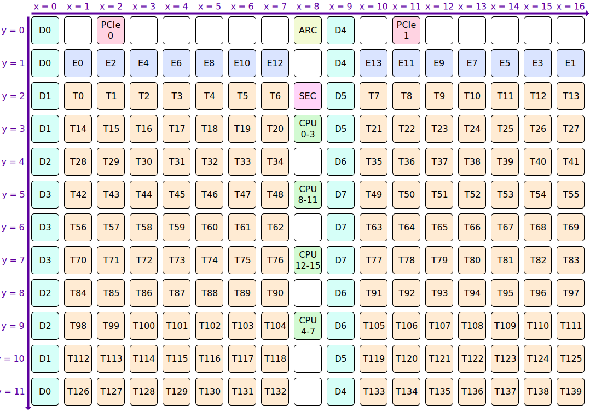
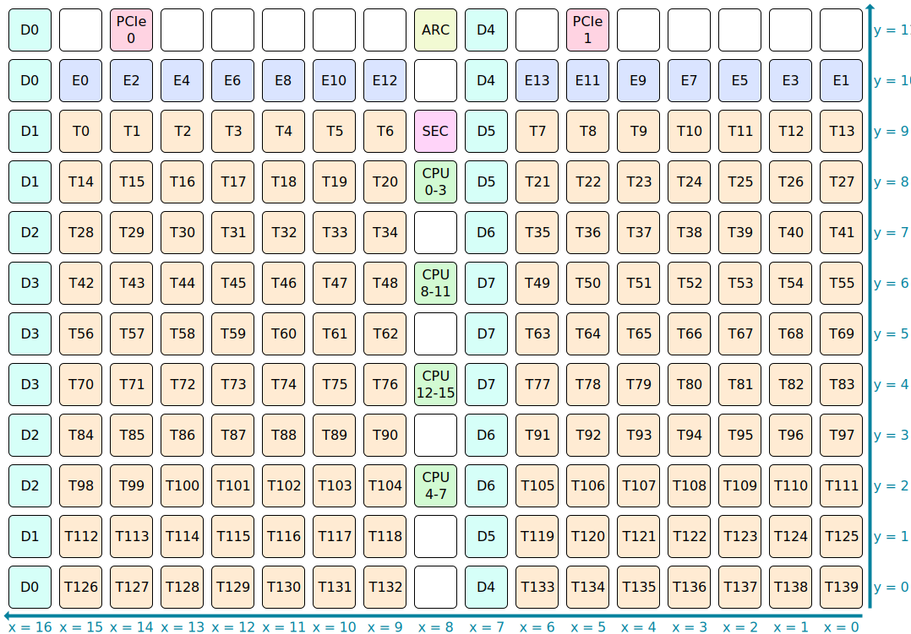

# NoC Coordinates

Each NoC uses a 2D coordinate system to identify tiles.

## NoC #0

NoC #0 coordinates have `(0, 0)` as the top left tile, and then increment in the [direction of data flow (rightwards and downwards)](RoutingPaths.md):



## NoC #1

NoC #1 coordinates have `(0, 0)` as the bottom right tile, and then increment in the [direction of data flow (leftwards and upwards)](RoutingPaths.md):



## Coordinate Translation

NIUs support a coordinate translation feature. When this feature is enabled, the X/Y coordinates within `NOC_TARG_ADDR_HI` and `NOC_RET_ADDR_HI` are not raw NoC coordinates: they instead have a translation step applied to them, with the _result_ of that translation being raw NoC coordinates. Firmware will configure the translation feature with the following aims in mind:
* Uniform coordinate system for both NoC #0 and NoC #1 (*)
* Similar types of tile having a contiguous coordinate range
* On products where some tiles have been harvested (fused off) for yield reasons, renumber tiles such that the harvested tiles are at particular coordinates, regardless of which exact tiles were harvested

> (*) This aim is not entirely achieved. Most notably, when performing broadcasts, StartX ↔ EndX need to be swapped by software, and likewise StartY ↔ EndY need to be swapped. This is because coordinate translation does not change the direction of data flow. The other point of difference arises when `Y < 2 && X != 8`.

Whereas [Wormhole](../../WormholeB0/NoC/Coordinates.md#coordinate-translation) has entirely separable translation for the X and Y axes, Blackhole instead has combined translation:

|X|Y|→|Contents|
|--:|--:|---|---|
|0&nbsp;to&nbsp;16|0|→|Row containing mostly PCI Express and ARC tiles (X translation not applied when `Y = 0`)|
|0&nbsp;to&nbsp;16|1|→|Row containing mostly Ethernet tiles (X translation not applied when `Y = 1`)|
|1&nbsp;to&nbsp;7|2&nbsp;to&nbsp;11|→|70x Tensix tile|
|10&nbsp;to&nbsp;14|2&nbsp;to&nbsp;11|→|50x Tensix tile|
|15&nbsp;to&nbsp;16|2&nbsp;to&nbsp;11|→|20x Tensix tile (fused off in p100, present in p150)|
|17|12&nbsp;to&nbsp;14|→|3x DRAM tile, same 4 GiB exposed on each|
|17|15&nbsp;to&nbsp;17|→|3x DRAM tile, same 4 GiB exposed on each|
|17|18&nbsp;to&nbsp;20|→|3x DRAM tile, same 4 GiB exposed on each|
|17|21&nbsp;to&nbsp;23|→|3x DRAM tile, same 4 GiB exposed on each|
|18|12&nbsp;to&nbsp;14|→|3x DRAM tile, same 4 GiB exposed on each|
|18|15&nbsp;to&nbsp;17|→|3x DRAM tile, same 4 GiB exposed on each|
|18|18&nbsp;to&nbsp;20|→|3x DRAM tile, same 4 GiB exposed on each|
|18|21&nbsp;to&nbsp;23|→|3x DRAM tile, same 4 GiB exposed on each (fused off in p100, present in p150)|
|19|24|→|PCI Express tile (whichever one is connected to the host)|
|20&nbsp;to&nbsp;31|25|→|12x Ethernet tile (fused off in p100, present in p150)|
|8|26&nbsp;to&nbsp;29|→|4x L2CPU tile|
|8|30|→|Security tile|

When `Y = 0` or `Y = 1`, the top two rows are selected, and `X` uses raw NoC coordinates:


When `2 ≤ Y < 12`, the Tensix rows are selected. If any Tensix columns are fused off (as two columns are on p100 boards), then `X` is remapped to put the fused columns at maximal `X`. Note that there is a gap in the `X` numbering: `X = 8` always refers to the column containing CPUs, and `X = 9` always refers to a column containing DRAM. As an example, one possible numbering for a p100 board is:


When `12 ≤ Y < 23` and `17 ≤ X < 18`, the DRAM tiles are selected. If any DRAM is fused off (as 4 GiB is on p100 boards), then the exact numbering will depend upon which DRAM is fused off. As an example, one possible numbering for a p100 board with D2 fused off is:


When `Y = 24` and `X = 19`, the in-use PCI Express tile is selected. Exactly which tile this refers to will depend on the particular product. As an example, on p150 boards, it'll refer to PCIe 0:


When `Y = 25` and `20 ≤ X < 32`, the Ethernet tiles are selected. The exact numbering will depend upon which Ethernet tiles are fused off. As an example, one possible numbering for a p150 board is:


When `X = 8`, the column containing ARC, Security, and CPUs is selected:


## Translation Algorithm

Coordinate translation is configured using various [32-bit NIU registers](MemoryMap.md#niu-and-noc-router-configuration):
* `NOC_ID_TRANSLATE_COL_MASK` and `NOC_ID_TRANSLATE_ROW_MASK`
* `NOC_X_ID_TRANSLATE_TABLE_0` through `NOC_X_ID_TRANSLATE_TABLE_5`
* `NOC_Y_ID_TRANSLATE_TABLE_0` through `NOC_Y_ID_TRANSLATE_TABLE_5`
* `DDR_COORD_TRANSLATE_COL_SWAP` and `DDR_COORD_TRANSLATE_TABLE_0` through `DDR_COORD_TRANSLATE_TABLE_5`

When translation is enabled (via bit 14 of `NIU_CFG_0`), the logic implemented in hardware for converting an `X, Y` pair to raw NoC coordinates is equivalent to:

```py
def translate_coords(x, y):
  x_table = parse_table(NOC_X_ID_TRANSLATE_TABLE_0, NOC_X_ID_TRANSLATE_TABLE_1, NOC_X_ID_TRANSLATE_TABLE_2,
                        NOC_X_ID_TRANSLATE_TABLE_3, NOC_X_ID_TRANSLATE_TABLE_4, NOC_X_ID_TRANSLATE_TABLE_5)
  y_table = parse_table(NOC_Y_ID_TRANSLATE_TABLE_0, NOC_Y_ID_TRANSLATE_TABLE_1, NOC_Y_ID_TRANSLATE_TABLE_2,
                        NOC_Y_ID_TRANSLATE_TABLE_3, NOC_Y_ID_TRANSLATE_TABLE_4, NOC_Y_ID_TRANSLATE_TABLE_5)
  ddr_table = parse_table(DDR_COORD_TRANSLATE_TABLE_0, DDR_COORD_TRANSLATE_TABLE_1, DDR_COORD_TRANSLATE_TABLE_2,
                          DDR_COORD_TRANSLATE_TABLE_3, DDR_COORD_TRANSLATE_TABLE_4, DDR_COORD_TRANSLATE_TABLE_5)
  ddr_x = set()
  if DDR_COORD_TRANSLATE_TABLE_5 & (1 << 10): ddr_x.add(9)
  if DDR_COORD_TRANSLATE_TABLE_5 & (1 << 11): ddr_x.add(0)
  x31 = x & 31
  y31 = y & 31
  # X
  if (DDR_COORD_TRANSLATE_COL_SWAP & (1 << y31)) and ((x31 ^ 9) in ddr_x): x = x31 ^ 9
  elif NOC_ID_TRANSLATE_ROW_MASK & (1 << y31): x = x
  else: x = x_table[x31]
  # Y
  if x31 in ddr_x: y = ddr_table[y31]
  elif NOC_ID_TRANSLATE_COL_MASK & (1 << x31): y = y
  else: y = y_table[y31]
  # Finished
  return x, y

def parse_table(*args):
  """Input is 6x 32-bit registers, output is 32x 5-bit"""
  result = []
  for a in args:
    for _ in range(6): # Consume up to 30 bits from each register
      result.append(a & 0x1f)
      if len(result) == 32: return result
      a >>= 5
  return result
```

Note that the logic involving `ddr_x` is only useful for NoC 0: NoC 0 has columns of GDDR tiles at `x == 0` and `x == 9`, but NoC 1 has columns of Tensix tiles at `x == 0` and `x == 9`. As such, firmware does not make use of the `ddr_x` feature.
