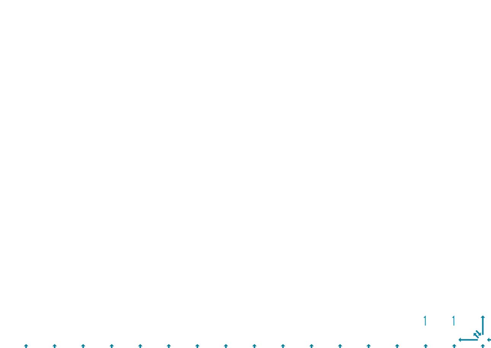

# Routing Paths

The path (or, for broadcasts, the tree) taken by a packet is a static property of the packet, determined by:
* Which NoC it travels on (NoC #0 or NoC #1)
* Which tile initiated the packet
* Which tile(s) are receiving the packet (which for broadcasts is specified as a rectangle)
* For broadcast request packets, the `NOC_CMD_BRCST_XY` flag

## NoC #0

All data flow between NoC #0 routers is rightwards and downwards, with the left/right and top/bottom edges connected to each other:

### Unicast routes

On NoC #0, unicast request packets, along with all types of response / acknowledgement packets, will travel rightwards as necessary, turn at most once, and then travel downwards as necessary. Some example routes between pairs of tiles are shown below:

### Broadcast routes, X as major axis

When request packets have `NOC_CMD_BRCST_PACKET` set and `NOC_CMD_BRCST_XY` unset, then the X axis will be the major broadcast axis. Packets will travel along the major axis as necessary, then along the minor axis as necessary, and finally on the major axis again as necessary. An example of this for NoC #0 is shown below. Note that the destination is specified as a rectangle, but tiles other than Tensix tiles opt out of receiving broadcasts.

### Broadcast routes, Y as major axis

When request packets have both `NOC_CMD_BRCST_PACKET` and `NOC_CMD_BRCST_XY` set, then the Y axis will be the major broadcast axis. Packets will travel along the major axis as necessary, then along the minor axis as necessary, and finally on the major axis again as necessary. An example of this for NoC #0 is shown below. Note that the destination is specified as a rectangle, but tiles other than Tensix tiles opt out of receiving broadcasts.

## NoC #1

All data flow between NoC #1 routers is leftwards and upwards, with the left/right and top/bottom edges connected to each other:

### Unicast routes

On NoC #1, unicast request packets, along with all types of response / acknowledgement packets, will travel upwards as necessary, turn at most once, and then travel leftwards as necessary. Some example routes between pairs of tiles are shown below:

### Broadcast routes, X as major axis

When request packets have `NOC_CMD_BRCST_PACKET` set and `NOC_CMD_BRCST_XY` unset, then the X axis will be the major broadcast axis. Packets will travel along the major axis as necessary, then along the minor axis as necessary, and finally on the major axis again as necessary. An example of this for NoC #1 is shown below. Note that the destination is specified as a rectangle, but tiles other than Tensix tiles opt out of receiving broadcasts.

### Broadcast routes, Y as major axis

When request packets have both `NOC_CMD_BRCST_PACKET` and `NOC_CMD_BRCST_XY` set, then the Y axis will be the major broadcast axis. Packets will travel along the major axis as necessary, then along the minor axis as necessary, and finally on the major axis again as necessary. An example of this for NoC #1 is shown below. Note that the destination is specified as a rectangle, but tiles other than Tensix tiles opt out of receiving broadcasts.

## Congestion

Congestion occurs when two packets want to use the same link between routers (or the same link between a router and an NIU). Congestion does _not_ occur when two packets pass through the same router on distinct links, even if the paths of those packets cross over one another _within_ the router. When congestion occurs, if the two packets have the same virtual circuit number, then one packet will wait for the other. Otherwise, the two packets will be interleaved onto the link.

## Cut-through

NoC routers always operate in cut-through mode: a router can start forwarding (the flits of) a packet _before_ it has finished receiving the entire packet. This is sometimes called [Wormhole switching](https://en.wikipedia.org/wiki/Wormhole_switching).
