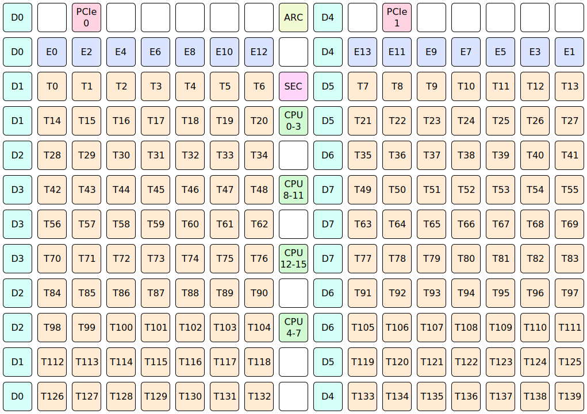

# Blackhole

Each Blackhole ASIC contains:
* [140x Tensix tile](TensixTile/README.md), also known as worker tiles or compute tiles. Depending on the particular product, either 120 or 140 will be available, with the others fused off.
* 24x DRAM tile, collectively exposing 32 GiB of GDDR6 (each 4 GiB is exposed identically on 3 tiles). Depending on the particular product, either 28 or 32 GiB will be available, with the remainder fused off.
* 4x L2CPU tile, each one containing a coherent cluster of four SiFive x280 CPUs (for an aggregate total of sixteen CPU cores). Each individual core has private L1 data cache (32 KiB), private L1 instruction cache (32 KiB), and private L2 cache (128 KiB). Each cluster has a shared L3 cache (2 MiB).
* [14x Ethernet tile](EthernetTile/README.md), each one with bidirectional 400 GbE connectivity. Depending on the particular product, either 0 or 12 will be available, with the others fused off. A pair of Ethernet tiles is connected to each QSFP-DD port, and then these bidirectional 800 GbE ports are intended for connecting multiple ASICs together using QSFP-DD cables. On p150 boards, there are four QSFP-DD ports, meaning that 8 Ethernet tiles are connected; the remaining 4 Ethernet tiles are not connected to anything - they can still be used for their RISCVs and their L1, but they cannot be used to transmit or receive Ethernet packets.
* 2x PCI Express tile, for PCI Express 5.0 x16 connectivity with a host system. One of these tiles will be in use; the other will be permanently idle (at least in current products).
* 1x ARC tile and 1x Security tile, for chip and board management purposes. Customers can mostly ignore these tiles, as they do not execute customer workloads, nor are they involved in dispatching customer workloads.
* 2x NoC (Network on Chip), for communication between different tiles on the same ASIC.

The NoCs connect the various tiles to form a 2D torus. The 2D torus is usually visualised as a 2D grid:

Tile counts for various product families are:

||p100|p150|Full ASIC|
|---|--:|--:|--:|
|**Tensix tile**|120|140|140|
|**DRAM tile**|21|24|24|
|**L2CPU tile**|(†) 4|4|4|
|**Ethernet tile**|0|12|14|
|**↳ with 400 GbE connected**|0|8|(‡) 12|
|**PCI Express tile**|1|1|(‡) 2|
|**ARC tile**|1|1|1|
|**Security tile**|1|1|1|

> (†) All four L2CPU tiles are present and enabled on p100, but depending on which 4 GiB of GDDR6 is harvested, it could be the case that one (or two) L2CPU tile(s) have no directly attached GDDR6, which will negatively impact their performance.
> 
> (‡) If no PCI Express tiles are in use, then 12 Ethernet tiles can be connected. Each PCI Express 5.0 x16 connection reduces the number of connectable Ethernet tiles by four (an x8 connection would instead reduce the number of connectable Ethernet tiles by two).
