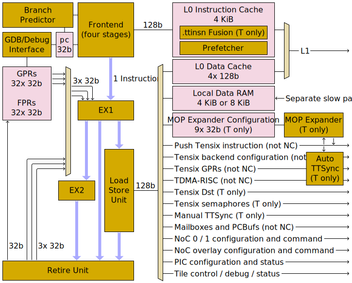

# Memory Ordering

Although the "baby" RISCV cores are typically described as being in-order cores, significant re-ordering can occur after instructions have passed through the EX1 execution stage, and notably instructions can reorder within the Load/Store Unit. To ensure correct race-free operation, the programmer (or compiler writer) should be aware of memory ordering.

## Mechanical description

The Load/Store Unit contains a four-entry store queue, and the Retire Unit contains an eight-entry retire-order queue. These queues are important for describing when instructions can enter or leave various stages:

<table><thead><tr><th/><th>Load instructions</th><th>Store instructions</th></tr></thead>
<tr><th>Requirements to enter EX1</th><td colspan="2">Correct values available for all register operands (and as instructions enter in order, correct values must also have been available for the register operands of all earlier instructions), space available in retire-order queue, and all earlier <code>fence</code> instructions retired</td></tr>
<tr><th>Action upon entering EX1</th><td colspan="2">Append to retire-order queue</td></tr>
<tr><th>Requirements to enter Load/Store Unit</th><td>No conflicting store in store queue</td><td>Space available in store queue</td></tr>
<tr><th>Action upon entering Load/Store Unit</th><td>Emit read-request into the memory subsystem</td><td>Append to store queue (NB: does <em>not</em> immediately emit a write-request into the memory subsystem), or coalesce with rear of store queue (L1 writes only)</td></tr>
<tr><th>Requirements to leave Retire Unit</th><td>Reached front of retire-order queue, read-response obtained from memory subsystem</td><td>Reached front of retire-order queue (NB: might or might not still be in store queue; stores can retire <em>before</em> their write-request makes it into the memory subsystem)</td></tr>
</table>

<table><thead><tr><th/><th>Atomic instructions</th><th>Fence instructions</th><th>Other instructions</th></tr></thead>
<tr><th>Requirements to enter EX1</th><td colspan="3">Correct values available for all register operands (and as instructions enter in order, correct values must also have been available for the register operands of all earlier instructions), space available in retire-order queue, and all earlier <code>fence</code> instructions retired</td></tr>
<tr><th>Action upon entering EX1</th><td colspan="3">Append to retire-order queue</td></tr>
<tr><th>Requirements to enter Load/Store Unit</th><td colspan="2">Store queue empty, and read-response obtained from memory subsystem for all earlier loads and all earlier atomics</td><td>N/A (†)</td></tr>
<tr><th>Action upon entering Load/Store Unit</th><td>Flush L0 data cache, emit atomic-request into the memory subsystem (directed toward L1)</td><td>Flush L0 data cache</td><td>N/A (†)</td></tr>
<tr><th>Requirements to leave Retire Unit</th><td>Reached front of retire-order queue, read-response obtained from memory subsystem</td><td colspan="2">Reached front of retire-order queue</td></tr>
</table>

> (†) Instructions other than load / store / atomic / fence do not enter the Load/Store Unit. They proceed from EX1 either onwards to EX2 or directly to the Retire Unit.

The memory subsystem is shown on the pipeline diagram as the huge mux to the right of the Load/Store Unit, along with everything to the right of that mux. It can accept _either_ one read-request or one write-request or one atomic-request every cycle, and it can also return one read-response every cycle (NB: write-requests are fire-and-forget; write-acknowledgements are _not_ returned from the memory subsystem). The mux is another source of re-ordering; the mux _itself_ can't re-order requests, but each of its outgoing branches is independent, and each of them can take a different number of cycles to process requests and return responses. One final source of re-ordering can occur for mailboxes, as another downstream mux splits out mailbox read-requests from mailbox write-requests and also splits out requests to different mailboxes.

The store queue is drained automatically; whenever possible, entries are popped from the store queue and emitted as write-requests into the memory subsystem. Incoming loads _usually_ have priority, but hardware guarantees eventual forward progress of the store queue. Note that the store queue is drained completely independently of the retire-order queue: depending on other activity, a store could leave the retire-order queue before leaving the store queue, or could leave the store queue before leaving the retire-order queue.

Once a request has been _emitted_ into the memory subsystem, it will work its way through the various muxes and queues within the memory subsystem before eventually reaching the correct memory region, at which point the request will be _processed_:
* For write-requests, processing means _actually_ writing the value to long-term storage. Subsequent read-requests will observe the stored value. For memory addresses that are actually FIFOs, processing means pushing onto the FIFO.
* For read-requests, processing means reading the value from long-term storage and sending a read-response back to the issuer. The response will work its way back through the memory subsystem, and the issuer will _obtain_ the read-response some time later. For memory addresses that are actually FIFOs, processing means popping from the FIFO: the request will remain unprocessed until a read-response can be sent (and therefore cause subsequent requests against the same memory region to stall before they reach the memory region). A similar remark applies to memory addresses that are a more exotic kind of synchronization device: the request will only be processed when the relevant wait condition allows a read-response to be sent.
* For atomic-requests (L1 only), processing is a combination of a read-request and a write-request (plus a bit of computation in the middle, and some locking to prevent concurrent access). The read-response will give the value of the memory location from before the atomic operation, but the response is not returned until after the write is complete (this is observable as atomics having a higher latency than plain loads).

Most memory regions can process at most one read-request or write-request per cycle, thus trivially allowing a strict total order of processing requests at the scope of a memory region. The notable exception to this is L1, which can handle 32 simultaneous requests per cycle: one per bank per cycle. Thankfully, each L1 access port ensures that no reordering happens as requests pass through that port: the request at the front of the queue will cause head-of-line blocking if the bank it wants to access is busy, even if a request behind it in that same port's queue wants to access an idle bank.

For reference, the pipeline diagram is:



## Instruction pairings

The consequences of the mechanical description can be worked through for various pairs of load/store instructions:

<table><thead><tr><th>Assembly code</th><th>Behavioural guarantees</th><th>Remaining dangers</th></tr></thead>
<tr><td>Load then load:<pre><code>lw t0, 0(t1)
lw t2, 0(t3)</code></pre></td><td>The earlier load (from <code>0(t1)</code>) will emit a read-request <i>before</i> the later load (from <code>0(t3)</code>) emits a read-request.<br/><br/>If the two loads are from the same region of memory, the two requests will be processed in order.</td><td>The later load might emit a read-request <i>before</i> the earlier load's read-response has been obtained.<br/><br/>If the two loads are to different regions of memory, the later load might have its request processed <i>before</i> the earlier load has its processed.</td></tr>
<tr><td>Load then store:<pre><code>lw t0, 0(t1)
sw t2, 0(t3)</code></pre></td><td>The load will emit a read-request <i>before</i> the store emits a write-request.<br/><br/>If the load and the store are against the same region of memory, the two requests will be processed in order, and so the read-response for load will contain the old value rather than any value written by the store.</td><td>The store might emit a write-request <i>before</i> the load's read-response has been obtained.<br/><br/>If the load and the store are against different regions of memory, the store might have its request processed <i>before</i> the load has its processed.</td></tr>
<tr><td>Store then store:<pre><code>sw t0, 0(t1)
sw t2, 0(t3)</code></pre></td><td>The earlier store (to <code>0(t1)</code>) will emit a write-request <i>before</i> the later store (to <code>0(t3)</code>) emits a write-request.<br/><br/>If the two stores are to the same region of memory, the two requests will be processed in order. In particular, if the byte address ranges of the two stores overlap, and the memory region isn't a FIFO, then the later store will (partially or entirely) overwrite the earlier store.</td><td>The later store might emit a write-request <i>before</i> the earlier store's write-request has been processed.<br/><br/>If the two stores are to different regions of memory, the later store might have its request processed <i>before</i> the earlier store has its processed.</td></tr>
<tr><td>Store then load:<pre><code>sw t0, 0(t1)
lw t2, 0(t3)</code></pre></td><td>If the byte address range of the store overlaps the byte address range of the load, then the store will emit a write-request <i>before</i> the load emits a read-request.<br/><br/>If the store and the load are against the same region of memory, the requests will be processed in the same order as they were emitted.<br/><br/>In particular, if both of the above points are true, and furthermore the memory address refers to a regular memory location (or to a device with memory-like semantics), then the load's read-response will return the value written by the store (for all overlapping bytes).</td><td><b>If the byte address ranges do not overlap, there is no guarantee: either of the two instructions could emit a request first.</b><br/><br/>The request which is emitted second might be emitted before the other request has been processed.<br/><br/>If the store and the load are against different regions of memory, either request might be processed first.</td></tr>
</table>

## L0 data cache

Load instructions whose address targets L1 can be satisfied by the issuing RISCV's L0 data cache. Each of these caches contains 4 lines of 16 bytes each: cache misses will populate a line from L1, whereas cache hits will return data without consulting L1. The entire L0 data cache will be flushed by any `fence` or atomic instruction, and cache hits also have a ~0.8% chance of flushing the entire cache (though see the [`cfg0` CSR](CSRs.md#cfg0) `DisLowCachePeriodicFlush` bit to disable this). The cache is _not_ coherent: if other clients write to L1, doing so will not invalidate the L0 of any baby RISCV. As such, care is required when using a baby RISCV to read data from L1, unless the data in question was written by that same baby RISCV using RISCV store instructions or RISCV atomic instructions. This particularly applies to polling loops: such loops are encouraged to either contain a `fence` instruction or use an atomic instruction to poll L1.

Stores to L1 cause the containing cache line to be flushed if it was previously present in the L0 data cache. As such, the L0 data cache is never dirty. That said, the store queue in the Load/Store Unit can be seen as a kind of cache (especially when it is coalescing stores), and if viewed in that manner, the store queue is _always_ dirty.

## Atomics

RISCV ["Zaamo" instructions](InstructionSet.md#zaamo) can be used to perform atomic operations on L1 addresses. Per-instruction `.aq` and `.rl` modifiers are ignored, and instead the Load/Store Unit takes a very conservative approach to _all_ atomic instructions: they cannot enter the Load/Store Unit until all earlier stores have drained out of the store queue, all earlier loads have obtained their read-response, and all earlier atomics have obtained their read-response. Atomic instructions also have a side-effect of flushing the entire L0 data cache. Note that L1 implements its own locking functionality to prevent concurrent access to an address which is being atomically modified (this is necessary to prevent two different clients from stepping on each other).

Though the approach is conservative, it has one gap: an in-flight atomic does not prevent _subsequent_ loads or stores from entering the Load/Store Unit. If those subsequent instructions are against L1, then ordering will be maintained by the L1 access port, but reordering is possible if they are against some other memory region (i.e. not against L1).

## Fences

The RISCV `fence` instruction can be used to enforce some ordering. The baby RISCV cores ignore the per-instruction `PI`, `PO`, `PR`, `PW`, `SI`, `SO`, `SR`, `SW` bits and instead the Load/Store Unit takes a very conservative approach to _all_ `fence` instructions:
* An instruction (of any kind) cannot enter EX1 until all earlier `fence` instructions have retired.
* A `fence` instruction will not enter the Load/Store Unit until the store queue has been drained and all in-flight loads have determined their result value (even if that value hasn't yet been committed to the register file).
* When a `fence` instruction enters the Load/Store Unit, the entire L0 data cache will be flushed.

Though the approach is conservative, it has one gap: ensuring that the store queue has been drained merely ensures that the write requests have been sent on their way to their final destination - it doesn't ensure that the write requests have actually reached their final destination and been processed. In particular, reordering can still occur between requests on opposite sides of a fence if the first request is a store and the two requests target different memory regions.

## Enforcing stronger ordering

Where the RISCV `fence` instruction is either too strong, or not strong enough, behaviours outlined in the mechanical description can be exploited to obtain desirable ordering.

It is always the case that a load's read-request is emitted before a subsequent memory operation's request is emitted.

To ensure that a load's read-response has been obtained before a subsequent memory operation's request is emitted, any of the following are sufficient:
* The result of the load is written to some register (other than `x0`), and the subsequent memory operation directly consumes that same register. This is exploiting the fact that the subsequent memory operation cannot enter EX1 until correct values are available for its register operands.
* The result of the load is written to some register (other than `x0`), and some other instruction between the load and the subsequent memory operation consumes that same register. Note that the result (if any) of that other instruction does not need to be used in any way. This is exploiting the fact that the other instruction cannot enter EX1 until correct values are available for its register operands, and that earlier instructions must enter EX1 before later instructions can.
* At least seven other instructions are executed between the load and the subsequent memory operation. This is exploiting the fact that the retire-order queue has a capacity of eight instructions, and that loads exhibit head-of-line blocking until their read-response has been obtained. If there are not enough useful instructions available for this purpose, `nop` instructions can be used for this purpose.
* A `fence` instruction is executed between the load and the subsequent memory operation.
* The subsequent memory operation is an atomic instruction.

To ensure that a store's write-request has been emitted before a subsequent memory operation's request is emitted, any of the following are sufficient:
* The subsequent memory operation is an atomic instruction or another store.
* The subsequent memory operation's byte address range overlaps the original store's byte address range.
* At least four other store instructions (to any address) are executed between the original store and the subsequent memory operation. This is exploiting the fact that the store queue has a capacity of four instructions. If there are not enough useful store instructions in the program for this purpose, various addresses exist which will discard any stores performed against them - `BRISC_INT_NO` is one such address.
* A `fence` instruction is executed between the store and the subsequent memory operation.

There is no _general_ mechanism to ensure that a store's write-request has been processed before a subsequent memory operation's request is emitted. However, it is possible (via different means) in many cases:
* If the address of the store denotes a memory location which is readable as well as writable, and reads from that location do not trigger undesirable side effects, then the store can be followed by a load from the same address, at which point the store's write-request will be processed before the load's read-request, and one of the previously-described mechanisms can be used to ensure that the load's read-response is obtained before the subsequent memory operation's request is emitted.
* As a weaker case of the above, if the store is to a memory region which has _some_ other location in that region which is readable without triggering undesirable side effects, then the store can be followed by a load from the same region, one of the previously-described mechanisms can be used to ensure that the store's write-request is emitted before the load's read-request, these two requests will be processed in order by the memory region in question, and one of the previously-described mechanisms can be used to ensure that the load's read-response is obtained before the subsequent memory operation's request is emitted.
* If the address of the store denotes an instruction FIFO or command FIFO, the effects of that instruction or command (or of a later instruction or command in the same FIFO) can be observed: once the effect has been observed, the store's write-request must have happened. For example, the effects of a Tensix instruction to modify a Tensix semaphore or Tensix GPR can be observed by issuing load instructions to poll the value of the relevant semaphore or GPR.

One very common scenario is to perform a store to Tensix GPRs or to Tensix Backend Configuration, and then perform a store to push a Tensix instruction, where execution of that instruction is intended to consume the just-written GPR or configuration. The usual rules for store-then-store apply: the write-requests will be _emitted_ in order, but as the stores are to different regions of memory, they might not be _processed_ in order: the Tensix instruction could execute _before_ the GPR write or configuration write takes effect. There are three recommended options to avoid the race condition here:
* Enable [Auto TTSync](AutoTTSync.md).
* Use the previously-described mechanisms to ensure that the earlier store's write-request has been processed before the instruction store's write-request is emitted. This involves `sw` for the earlier store, followed by `lw` of the same address to read the value back, followed by an instruction making use of the `lw` result, followed by `sw` for the instruction store.
* Push an appropriate Tensix `STALLWAIT` instruction in between the earlier store and the desired instruction store. This involves `sw` for the earlier store, followed by `sw` of an appropriate `STALLWAIT` instruction, followed by `sw` for the desired instruction. The `STALLWAIT` instruction uses special hooks into the memory subsystem to ensure that the programmer's intended ordering is achieved, but it only applies to the case of stores to Tensix GPRs or to Tensix Backend Configuration followed by a store to push a Tensix instruction.

## Other cores and clients

The memory ordering rules on this page are mostly describing the semantics of a single baby RISCV core interacting with memory. Things get more complicated when multiple RISCV cores are interacting with memory, or when other clients (for example, the NoC, the unpackers, the packers, and so forth) are interacting with memory. Things can also get more complicated when a RISCV core is _instructing_ another client to interact with memory, as the RISCV core tends to issue those instructions by performing memory stores.

### Interacting through L1, same access port

If two clients are interacting through L1, and those two clients go through the same L1 access port, then each client will be emitting its own stream of read/write requests, and those streams will be combined into a single ordered stream as they reach the L1 access port. The L1 access port will process its requests in order: the request at the front of the queue will cause head-of-line blocking if the bank it wants to access is busy, even if a request behind it in that same port's queue wants to access an idle bank.

### Interacting through L1, different access port

If two clients are interacting through L1, and those two clients go through different L1 access ports, then the point of synchronization becomes the L1 banks rather than the L1 access ports. Each bank can process at most one request per cycle, allowing a strict total order for processing of all the requests targeting any given bank.

### Interacting through other memory regions

If two clients are interacting through a memory region _other_ than L1, then each client will be emitting its own stream of read/write requests against that region, and those streams will be combined into a single ordered stream as they reach the memory region. Each memory region can process at most one request per cycle, allowing a strict total order for processing of all the requests targeting any given region.

## Examples of non-intuitive memory ordering

### Mailbox read from the future

The following example, if executed on RISCV B, with the B to B mailbox initially empty, will result in the `t2` register containing the value `123`, even though the store which pushes `123` into the mailbox appears later in the instruction stream than the load to `t2`:
```
li t0, 0xFFEC0000 # TENSIX_MAILBOX0_BASE. When running on RISCV B, this is the B to B mailbox.
li t1, 123
lw t2, 0(t0) # Pop from mailbox - will end up popping 123 even though it hasn't been pushed yet!
sw t1, 0(t0) # Push 123 to mailbox
```
This is because the read and write sides of a mailbox are considered to be different memory regions, so while the `lw`'s read-request is emitted before the `sw`'s write-request is emitted, the `sw`'s write-request can be processed before the `lw`'s read-request is processed (and indeed the `sw`'s write-request _must_ be processed first, in order to make the mailbox non-empty). Thankfully, mailboxes are the only scenario in which the same memory address can be in different memory regions depending on whether it is being read from or written to.

Variations on this example can be used to probe the capacity of the queues within the Load/Store Unit and Retire Unit, and to probe the capabilities of the register operand forwarding network. For example, the following example still results in the `t2` register containing the value `123`:
```
li t0, 0xFFEC0000 # TENSIX_MAILBOX0_BASE. When running on RISCV B, this is the B to B mailbox.
li t1, 123
lw t2, 0(t0) # Pop from mailbox - will end up popping 123 even though it hasn't been pushed yet!
mv t3, t0
ori t3, t3, 0
addi t3, t3, 0
addi t3, t3, 0
addi t3, t3, 0
addi t3, t3, 0
sw t1, 0(t3) # Push 123 to mailbox
```
However, replacing _any_ of the `addi` instructions in the above example with a `nop` instruction will mean that the `sw` instruction never executes (i.e. the example will hang forever): the next consumer of `t3` (be that `sw` or an `addi`) will not be able to enter EX1, as operand forwarding sees two unretired instructions both writing to `t3` (`mv` and `ori`) and therefore forwards from neither. If instead _all_ the `addi` and `ori` instructions are replaced with `nop`, then the example works again: operand forwarding from `mv` to `sw` is possible (as `mv` is the _only_ unretired instruction writing to `t3`). This example seems esoteric at first, but understanding it is crucial for optimal scheduling of instructions for the purpose of hiding load latency.

### Cross-core signalling using mailboxes

The following example is trying to have RISCV B write a value to L1, and have RISCV T0 read the value that was written, and use a mailbox to signal that RISCV B has finished writing and that RISCV T0 can start reading:
<table><tr><th>RISCV B</th><th>RISCV T0</th></tr>
<tr><td><pre><code>li t0, 0xFFEC1000 # B to T0 mailbox (B write side)
li t1, 123
sw t1, 0x124(x0) # Random address in L1
sw x0, 0(t0)     # Mailbox push</code></pre></td><td><pre><code>li t2, 0xFFEC0000 # B to T0 mailbox (T0 read side)<br/>
lw x0, 0(t2)     # Mailbox pop
lw t3, 0x124(x0) # Random address in L1</code></pre></td></tr>
</table>

The memory ordering rules _do_ guarantee that RISCV B's first `sw` emits a write-request before RISCV B's second `sw` emits a write-request, and that RISCV T0's first `lw` emits a read-request before RISCV T0's second `lw` emits a read-request, and the semantics of mailboxes ensure that the write-request pushing to the mailbox is processed before the read-request popping from the mailbox is processed. However, the rules do _not_ guarantee that RISCV B's write-request to L1 is processed before RISCV T0's read-request from L1 is processed. To get the desired behaviour, a few extra instructions are required:

<table><tr><th>RISCV B</th><th>RISCV T0</th></tr>
<tr><td><pre><code>li t0, 0xFFEC1000 # B to T0 mailbox (B write side)
li t1, 123
sw t1, 0x124(x0) # Random address in L1
lw t4, 0x124(x0) # Read it back
addi x0, t4, 0   # Consume the read result
sw x0, 0(t0)     # Mailbox push</code></pre></td><td><pre><code>li t2, 0xFFEC0000 # B to T0 mailbox (T0 read side)<br/>
lw x0, 0(t2)     # Mailbox pop
fence            # Ensure read complete, flush L0 data cache
lw t3, 0x124(x0) # Random address in L1</code></pre></td></tr>
</table>

### Aliasing of underlying storage

The following example, when executed on RISCV T0 / T1 / T2, relies on each Tensix GPR being mapped into the address space several times (e.g. at address `X` and also at `X + 256`). It is possible for the example to finish with `t2` containing the value `0` (as written by the earlier `sw`), whereas if a `fence` is inserted just before the `lw`, it always finishes with `t2` containing the value `1` (as written by the later `sw`). The reordering is possible because the byte address ranges do not overlap, even though the eventual underlying storage _does_ overlap.

```
li t0, 0xFFE00000 # REGFILE_BASE
li t1, 1
sw x0, 0(t0)
sw t1, 256(t0)
lw t2, 0(t0)
```
