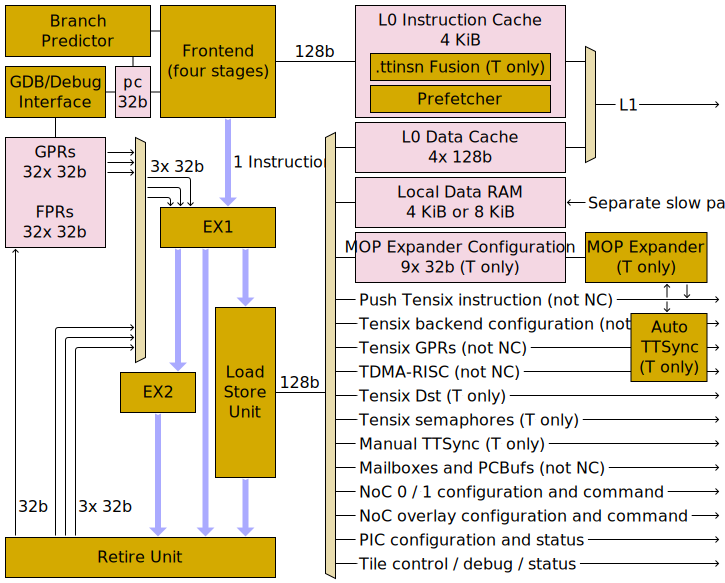
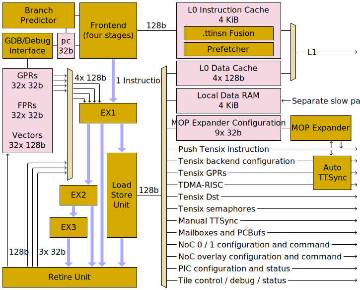

# "Baby" RISCVs

Each Tensix tile contains five RISCV cores. Collectively, these are called "baby" cores as they are relatively small 32-bit in-order single-issue cores, optimised for area and power efficiency rather than for high performance. Each RISCV core is intended to execute one RISCV instruction per cycle, running at a clock speed of 1.35 GHz. The five cores are called RISCV B, RISCV T0, RISCV T1, RISCV T2, and RISCV NC.

## Instruction set

The full RV32IM instruction set is implemented, plus all of "Zicsr" / "Zaamo" / "Zba" / "Zbb", plus some (but not all) of "Zicntr" / `F` / "Zfh". RISCV T2 additionally implements some (but not all) of `V`. See [instruction set](InstructionSet.md) for details.

One entirely bespoke instruction set extension is implemented: [`.ttinsn`](PushTensixInstruction.md#ttinsn-instruction-set-extension).

## Pipeline

All instructions execute by flowing down the pipeline. Every instruction spends at least one cycle in EX1, and then:
* Memory load / store / atomic / fence instructions spend at least one cycle in the Load/Store Unit
* Integer multiply and floating-point arithmetic instructions spend one cycle in EX2
* Other instructions proceed directly to the Retire Unit

The frontend is in-order, as is EX1, but reordering can occur after that. Any such reordering is resolved by the Retire Unit, which buffers the results of instructions and then commits their results to the register file in program order. A strong forwarding network allows EX1 to pull results out of the Retire Unit before they've been written back to registers.

All interesting interactions with the outside world happen through the Load/Store Unit: this unit _can_ access [L1](../L1.md) and local data RAM, but every other entry on its large outgoing mux represents an interesting device which has been mapped into its address space.

RISCV T2 has a few modifications to its pipeline diagram to support vector instructions:
* Register file gains 32x 128b vector registers.
* Register file read ports increased from 3x 32b (which is what `fmadd.s` requires) to 4x 128b (which is what a masked `vfmadd.vv` requires). Note that the forwarding network is not increased; vector instructions have to obtain their inputs from the register file.
* An additional EX3 execution stage, allowing vector instructions to spend time in each of EX1, EX2, and EX3.

The modified pipeline diagram for RISCV T2 therefore looks like:

## Frontend

The Frontend is responsible for fetching instructions from memory, and is capable of sending one instruction per cycle to EX1. The Frontend _predicts_ all control flow, so instructions leaving the Frontend are _speculative_: EX1 is responsible for reconciling predicted control flow with actual control flow, notifying the Frontend of actual control flow, and discarding any incorrectly predicted instructions.

Instructions can only be fetched and executed from L1; instructions cannot be executed out of any other memory regions. Each RISCV has a little [L0 instruction cache](InstructionCache.md) sitting between it and L1. In RISCV Ti, the cache is able to fuse up to four adjacent [`.ttinsn`](PushTensixInstruction.md#ttinsn-instruction-set-extension) instructions to form a 64/96/128-bit instruction, which can then be executed by the RISCV core in a single cycle (the Tensix frontend is capable of _enqueueing_ four Tensix instructions per cycle, but the maximum _dequeue_ rate is only one Tensix instruction per cycle). In all other cases, the maximum bandwidth of the instruction cache is one 32-bit instruction per cycle.

## EX1

An instruction can enter EX1 provided that:
* The previous instruction has vacated EX1
* All previous `csrrw` / `csrrs` / `csrrc` / `csrrwi` / `csrrsi` / `csrrci` / `vsetvl` / `vsetvli` / `vsetivli` / `fence` / `ecall` / `ebreak` instructions have retired
* The buffers in the Retire Unit are not full
* The values of all its register operands are known - these values can come from the register file, or (excluding vector instructions) from the buffers in the Retire Unit

Most integer instructions spend exactly one cycle in EX1, the exceptions being:
* An instruction destined for the Load/Store Unit might wait in EX1 until the Load/Store Unit is ready to accept it.
* Divide instructions (`div`, `divu`, `rem`, `remu`) occupy EX1 for a variable number of cycles. The number of cycles is dependent upon the values of the dividend and the divisor:
  * When dividing by zero or one, two cycles are required.
  * When doing signed division or remainder of -231 by -1, two cycles are required.
  * In all other cases, between six and 33 cycles are required, dependent upon the magnitude of the dividend.
* Branch instructions (`jal`, `jalr`, `beq`, `bne`, `blt`, `bge`, etc) occupy EX1 for one cycle, and this unit is where the Frontend's branch predictions get confirmed or rejected. A mispredicted branch causes a four cycle pipeline bubble, which from an external perspective looks like mispredicted branches occupy EX1 for five cycles (plus additional cycles if the branch target suffers an instruction cache miss).

## EX2

Some instructions spend exactly one cycle in EX1, and then exactly one cycle in EX2:
* Integer multiply instructions (`mul`, `mulh`, `mulhsu`, `mulhu`)
* Floating-point arithmetic instructions (`fadd.s`, `fmul.s`, `fmadd.s` et al.)

Most vector instructions also spend time in EX2.

## EX3

EX3 exists in RISCV T2 as a third pipeline stage for some vector instructions. Scalar instructions never require EX3.

## Load/Store Unit

Memory load / store / atomic / fence instructions spend one cycle in EX1 (to compute the final memory address), and then proceed to the Load/Store Unit once the unit is ready to accept them. Loads which target the local data RAM or hit the L0 data cache spend one cycle in the Load/Store Unit and associated memory subsystems, and then proceed to the Retire Unit. Loads to other addresses are sent out into the memory subsystem, and then proceed to the Retire Unit once their result comes back from memory. Atomics behave similarly to loads. Far more interesting are stores: the _instruction_ spends one cycle in Load/Store and then proceeds directly to the Retire Unit, but the _data_ is kept in a separate store queue within the Load/Store Unit. The store queue can coalesce temporally adjacent stores, provided that they target the same 16-byte aligned region of L1, and the starting byte addresses of the two stores are within ±4 of each other (stores to regions other than L1 are never coalesced). The store queue is also a source of reordering, as loads can go straight to memory, bypassing any earlier stores still sitting in the store queue (though if the load's address overlaps with any address in the store queue, the queue will be drained rather than bypassing being allowed).

The latency of a load instruction depends upon the memory region being accessed. A latency of `N` cycles means that `N - 1` independent instructions need to follow the load if the latency is to be entirely hidden. The minimum possible load latency is two cycles, due to all load instructions spending at least one cycle in EX1 and one cycle in the Load/Store Unit.

<table><thead><tr><th>Load address range</th><th>Load latency (cycles)</th></tr></thead>
<tr><td><a href="README.md#local-data-ram">Core-local data RAM</a> via <code>MEM_LOCAL_BASE</code> <a href="../L1.md">L1 scratchpad RAM (1536 KiB)</a> with L0 data cache hit</td><td>2</td></tr>
<tr><td><a href="Mailboxes.md">Mailboxes</a> <a href="PCBufs.md">PCBufs</a> <a href="TTSync.md">Manual TTSync</a> <a href="../TensixCoprocessor/SyncUnit.md#semaphores">Tensix semaphores</a></td><td>≥ 3 (more if waiting on an empty FIFO or waiting on Manual TTSync)</td></tr>
<tr><td><a href="../TensixCoprocessor/ScalarUnit.md#gprs">Tensix GPRs</a> <a href="../TensixCoprocessor/BackendConfiguration.md">Tensix backend configuration</a> <a href="../TDMA-RISC.md">TDMA-RISC&nbsp;configuration&nbsp;and&nbsp;command</a></td><td>≥ 4 (more in the case of access conflicts, or if waiting due to Auto TTSync)</td></tr>
<tr><td><a href="../TileControlDebugStatus.md">Tile control / debug / status</a> <a href="../PIC.md">PIC configuration and status</a> <a href="../../NoC/MemoryMap.md">NoC 0 configuration and command</a> <a href="../../NoC/MemoryMap.md">NoC 1 configuration and command</a> <a href="../../NoC/Overlay/README.md">NoC&nbsp;overlay&nbsp;configuration&nbsp;and&nbsp;command</a></td><td>≥ 7 (more in the case of access conflicts)</td></tr>
<tr><td><a href="README.md#local-data-ram">Core-local data RAM</a> via slow access path</td><td>≥ 8 (more in the case of access conflicts)</td></tr>
<tr><td><a href="../L1.md">L1 scratchpad RAM (1536 KiB)</a> with L0 data cache miss</td><td>≥ 8 (more in the case of access port conflicts or bank conflicts)</td></tr>
<tr><td><a href="../L1.md">L1 scratchpad RAM (1536 KiB)</a> with atomic instruction</td><td>≥ 12 (more in the case of access port conflicts or bank conflicts)</td></tr>
</table>

Throughput of sustained stores to L1 depends on whether the store queue can coalesce a sequence of small stores to form entire aligned 128-bit blocks; if it can, the constituent stores have a throughput of one store every cycle, otherwise the throughput is one coalesced store every five cycles (which can mean one store every five cycles if the stores are not amenable to coalescing). Other memory regions can achieve a throughput of one store every cycle (notwithstanding access conflicts or attempting to write to a full FIFO).

## Retire Unit

The Retire Unit contains an eight-entry retire-order queue. An instruction reserves space in this queue as it enters EX1, and then populates that reservation some number of cycles later once the instruction's computation is complete. If the front of the queue is populated, then the Retire Unit can pop one queue entry per cycle and commit the popped value to the register file. An instruction is said to have "retired" once its queue entry has been popped. Notably, instructions retire in order, even if queue entries are populated out of order.

Vector instructions with LMUL greater than one require one queue entry per written vector register. All other instructions require one queue entry, even if they don't write any value to the register file (amongst other things, this covers stores, fences, and instructions whose destination is `x0`).

A strong forwarding network allows EX1 to peek at any populated queue entry and use its value before it has been written back to the register file. The only major caveats on this are:
* Vector instructions cannot perform any peeking; their inputs can only come from the register file.
* If there are multiple populated queue entries which will eventually write to the same register, peeking might not be possible from _any_ of them. Consequently, if wishing to hide load latency, compilers are encouraged to use distinct destination registers for each of the seven instructions following a load instruction.

## Memory map

The "NoC" column indicates which parts of the address space are made available to the NoC (and to the Tensix coprocessor) in addition to being available to RISCV cores.

<table><thead><tr><th>Name and address range</th><th>RISCV&nbsp;B</th><th>RISCV&nbsp;T0</th><th>RISCV&nbsp;T1</th><th>RISCV&nbsp;T2</th><th>RISCV&nbsp;NC</th><th>NoC</th></tr></thead>
<tr><td><code>MEM_L1_BASE</code> <code>0x0000_0000</code> to <code>0x0017_FFFF</code></td><td colspan="6"><a href="../L1.md">L1 scratchpad RAM (1536 KiB)</a></td></tr>
<tr><td><code>MEM_LOCAL_BASE</code> <code>0xFFB0_0000</code> to <code>0xFFB0_0FFF</code></td><td rowspan="2"><a href="README.md#local-data-ram">RISCV B local data RAM</a></td><td><a href="README.md#local-data-ram">RISCV T0 local data RAM</a></td><td><a href="README.md#local-data-ram">RISCV T1 local data RAM</a></td><td><a href="README.md#local-data-ram">RISCV T2 local data RAM</a></td><td rowspan="2"><a href="README.md#local-data-ram">RISCV NC local data RAM</a></td><td rowspan="2">Unmapped</td></tr>
<tr><td><code>0xFFB0_1000</code> to <code>0xFFB0_1FFF</code></td><td colspan="3">Unmapped</td></tr>
<tr><td><code>RISCV_TDMA_REGS_START_ADDR</code> <code>0xFFB1_1000</code> to <code>0xFFB1_1FFF</code></td><td colspan="4"><a href="../TDMA-RISC.md">TDMA-RISC configuration registers and command interface</a></td><td colspan="2">Unmapped</td></tr>
<tr><td><code>RISCV_DEBUG_REGS_START_ADDR</code> <code>0xFFB1_2000</code> to <code>0xFFB1_2FFF</code></td><td colspan="6"><a href="../TileControlDebugStatus.md">Tile control / debug / status registers</a></td></tr>
<tr><td><code>RISC_PIC_BASE</code> <code>0xFFB1_3000</code> to <code>0xFFB1_3137</code></td><td colspan="6"><a href="../PIC.md">PIC configuration and status registers</a></td></tr>
<tr><td><code>0xFFB1_3138</code> to <code>0xFFB1_314B</code></td><td colspan="6"><a href="#riscv-pc-snapshot">RISCV <code>pc</code> snapshot</a></td></tr>
<tr><td><code>0xFFB1_4000</code> to <code>0xFFB1_5FFF</code></td><td colspan="6"><a href="README.md#local-data-ram">RISCV B local data RAM</a> (slow access path)</td></tr>
<tr><td><code>0xFFB1_6000</code> to <code>0xFFB1_7FFF</code></td><td colspan="6"><a href="README.md#local-data-ram">RISCV NC local data RAM</a> (slow access path)</td></tr>
<tr><td><code>0xFFB1_8000</code> to <code>0xFFB1_8FFF</code></td><td colspan="6"><a href="README.md#local-data-ram">RISCV T0 local data RAM</a> (slow access path)</td></tr>
<tr><td><code>0xFFB1_9000</code> to <code>0xFFB1_9FFF</code></td><td colspan="6"><a href="README.md#local-data-ram">RISCV T0 local data RAM</a> (slow access path)</td></tr>
<tr><td><code>0xFFB1_A000</code> to <code>0xFFB1_AFFF</code></td><td colspan="6"><a href="README.md#local-data-ram">RISCV T1 local data RAM</a> (slow access path)</td></tr>
<tr><td><code>0xFFB1_B000</code> to <code>0xFFB1_BFFF</code></td><td colspan="6"><a href="README.md#local-data-ram">RISCV T1 local data RAM</a> (slow access path)</td></tr>
<tr><td><code>0xFFB1_C000</code> to <code>0xFFB1_CFFF</code></td><td colspan="6"><a href="README.md#local-data-ram">RISCV T2 local data RAM</a> (slow access path)</td></tr>
<tr><td><code>0xFFB1_D000</code> to <code>0xFFB1_DFFF</code></td><td colspan="6"><a href="README.md#local-data-ram">RISCV T2 local data RAM</a> (slow access path)</td></tr>
<tr><td><code>NOC0_REGS_START_ADDR</code> <code>0xFFB2_0000</code> to <code>0xFFB2_FFFF</code></td><td colspan="6"><a href="../../NoC/MemoryMap.md">NoC 0 configuration registers and command interface</a></td></tr>
<tr><td><code>NOC1_REGS_START_ADDR</code> <code>0xFFB3_0000</code> to <code>0xFFB3_FFFF</code></td><td colspan="6"><a href="../../NoC/MemoryMap.md">NoC 1 configuration registers and command interface</a></td></tr>
<tr><td><code>NOC_OVERLAY_START_ADDR</code> <code>0xFFB4_0000</code> to <code>0xFFB7_FFFF</code></td><td colspan="6"><a href="../../NoC/Overlay/README.md">NoC overlay configuration registers and command interface</a></td></tr>
<tr><td><code>TENSIX_MOP_CFG_BASE</code> <code>0xFFB8_0000</code> to <code>0xFFB8_0023</code></td><td>Unmapped</td><td><a href="../TensixCoprocessor/MOPExpander.md#configuration">T0 MOP expander configuration</a></td><td><a href="../TensixCoprocessor/MOPExpander.md#configuration">T1 MOP expander configuration</a></td><td><a href="../TensixCoprocessor/MOPExpander.md#configuration">T2 MOP expander configuration</a></td><td colspan="2">Unmapped</td></tr>
<tr><td><code>0xFFBD_8000</code> to <code>0xFFBD_FFFF</code></td><td>Unmapped</td><td colspan="3">Tensix <code>Dst</code></td><td colspan="2">Unmapped</td></tr>
<tr><td><code>REGFILE_BASE</code> <code>0xFFE0_0000</code> to <code>0xFFE0_0FFF</code></td><td><a href="../TensixCoprocessor/ScalarUnit.md#gprs">Tensix T0/T1/T2 GPRs</a></td><td><a href="../TensixCoprocessor/ScalarUnit.md#gprs">Tensix T0 GPRs</a></td><td><a href="../TensixCoprocessor/ScalarUnit.md#gprs">Tensix T1 GPRs</a></td><td><a href="../TensixCoprocessor/ScalarUnit.md#gprs">Tensix T2 GPRs</a></td><td colspan="2">Unmapped</td></tr>
<tr><td><code>INSTRN_BUF_BASE</code> <code>0xFFE4_0000</code> to <code>0xFFE4_FFFF</code></td><td><a href="PushTensixInstruction.md">Push Tensix T0 instruction</a>, after T0 MOP expander</td><td><a href="PushTensixInstruction.md">Push Tensix T0 instruction</a>, before T0 MOP expander</td><td><a href="PushTensixInstruction.md">Push Tensix T1 instruction</a>, before T1 MOP expander</td><td><a href="PushTensixInstruction.md">Push Tensix T2 instruction</a>, before T2 MOP expander</td><td colspan="2">Unmapped</td></tr>
<tr><td><code>INSTRN1_BUF_BASE</code> <code>0xFFE5_0000</code> to <code>0xFFE5_FFFF</code></td><td><a href="PushTensixInstruction.md">Push Tensix T1 instruction</a>, after T1 MOP expander</td><td colspan="5">Unmapped</td></tr>
<tr><td><code>INSTRN2_BUF_BASE</code> <code>0xFFE6_0000</code> to <code>0xFFE6_FFFF</code></td><td><a href="PushTensixInstruction.md">Push Tensix T2 instruction</a>, after T2 MOP expander</td><td colspan="5">Unmapped</td></tr>
<tr><td><code>PC_BUF_BASE</code> <code>0xFFE8_0000</code> to <code>0xFFE8_0003</code></td><td rowspan="3"><a href="PCBufs.md">PCBuf</a> from B to T0, B side</td><td><a href="PCBufs.md">PCBuf</a> from B to T0, T side</td><td><a href="PCBufs.md">PCBuf</a> from B to T1, T side</td><td><a href="PCBufs.md">PCBuf</a> from B to T2, T side</td><td colspan="2" rowspan="3">Unmapped</td></tr>
<tr><td><code>0xFFE8_0004</code> to <code>0xFFE8_001F</code></td><td><a href="TTSync.md">Manual TTSync T0</a></td><td><a href="TTSync.md">Manual TTSync T1</a></td><td><a href="TTSync.md">Manual TTSync T2</a></td></tr>
<tr><td><code>0xFFE8_0020</code> to <code>0xFFE8_FFFF</code></td><td colspan="3"><a href="../TensixCoprocessor/SyncUnit.md#semaphores">Tensix semaphores</a></td></tr>
<tr><td><code>PC1_BUF_BASE</code> <code>0xFFE9_0000</code> to <code>0xFFE9_FFFF</code></td><td><a href="PCBufs.md">PCBuf</a> from B to T1, B side</td><td colspan="5">Unmapped</td></tr>
<tr><td><code>PC2_BUF_BASE</code> <code>0xFFEA_0000</code> to <code>0xFFEA_FFFF</code></td><td><a href="PCBufs.md">PCBuf</a> from B to T2, B side</td><td colspan="5">Unmapped</td></tr>
<tr><td><code>TENSIX_MAILBOX0_BASE</code> <code>0xFFEC_0000</code> to <code>0xFFEC_0FFF</code></td><td colspan="4" rowspan="4"><a href="Mailboxes.md">Mailboxes between pairs of RISCV cores</a></td><td colspan="2" rowspan="4">Unmapped</td></tr>
<tr><td><code>TENSIX_MAILBOX1_BASE</code> <code>0xFFEC_1000</code> to <code>0xFFEC_1FFF</code></td></tr>
<tr><td><code>TENSIX_MAILBOX2_BASE</code> <code>0xFFEC_2000</code> to <code>0xFFEC_2FFF</code></td></tr>
<tr><td><code>TENSIX_MAILBOX3_BASE</code> <code>0xFFEC_3000</code> to <code>0xFFEC_3FFF</code></td></tr>
<tr><td><code>TENSIX_CFG_BASE</code> <code>0xFFEF_0000</code> to <code>0xFFEF_FFFF</code></td><td colspan="4"><a href="../TensixCoprocessor/BackendConfiguration.md">Tensix backend configuration</a></td><td colspan="2">Unmapped</td></tr>
</table>

## L0 Data Cache

Each baby RISCV has a tiny L0 data cache between it and L1. The capacity of this L0 data cache is a mere 64 bytes: 4 lines of 16 bytes each. The entire L0 data cache will be flushed by any `fence` or atomic instruction, and cache hits also have a ~0.8% chance of flushing the entire cache (though see the [`cfg0` CSR](CSRs.md#cfg0) `DisLowCachePeriodicFlush` bit to disable this). The cache is _not_ coherent: if other clients write to L1, doing so will not invalidate the L0 of any baby RISCV.

Stores to L1 cause the containing cache line to be flushed if it was previously present in the L0 data cache. As such, the L0 data cache is never dirty. That said, the store queue in the Load/Store Unit can be seen as a kind of cache (especially when it is coalescing stores), and if viewed in that manner, the store queue is _always_ dirty.

## Local Data RAM

Each baby RISCV has either 8 KiB (B, NC) or 4 KiB (T0, T1, T2) of local data RAM. Each of these RAMs is present in the address space at two locations:
* At `MEM_LOCAL_BASE`, which is only accessible using load or store instructions from the one RISCV associated with it. Access to the RAM through this address is low latency, and never suffers from contention. A load from local RAM through this address has a latency of two cycles, meaning that so long as the one instruction immediately after the load is independent of the load result, the latency of the load is entirely hidden.
* At some address between `0xFFB1_4000` and `0xFFB1_DFFF`, which is accessible from any RISCV and accessible over the NoC. Access to the RAM through this address is higher latency, and does suffer from contention. A load from local RAM through this address has a latency of at eight seven cycles (which is the same latency as loading from L1), meaning that seven independent instructions are required to fully hide the latency.

Software is _strongly_ encouraged to place the call stack in this RAM, along with any thread-local variables and any frequently-used read-only global variables, and access it through the `MEM_LOCAL_BASE` address.

When the RISCV comes out of reset, the local data RAM will spend up to 2048 clock cycles resetting its contents to zero. If a RISCV core tries to access the RAM during this time, the core will be automatically stalled. However, the same is _not_ true for accesses coming over the NoC: software needs to ensure that any such accesses are not performed in the 2048 clock cycles after taking the RISCV out of reset.

For the purpose of RISCV memory ordering, each distinct mapping of the local data RAM into the address space is considered to be a separate memory region. As such, software is strongly encouraged to always use the `MEM_LOCAL_BASE` address for the RISCV core's own local data RAM, and only use the address between `0xFFB1_4000` and `0xFFB1_DFFF` for accessing the local data RAM of other RISCV cores.

> [!TIP]
> The Blackhole local data RAMs are twice the size of the Wormhole local data RAMs. The 2nd mapping between `0xFFB1_4000` and `0xFFB1_DFFF` is also new in Blackhole; it should enable the host to more easily initialise the local data RAM, and allow debuggers to more easily inspect it.

## RISCV `pc` snapshot

This tiny memory region contains read-only snapshots of `pc` from each of the RISCV cores. This is potentially useful to debuggers or profilers.

|Address|Contents|
|---|---|
|`0xFFB1_3138`|RISCV B `pc` snapshot|
|`0xFFB1_313C`|RISCV NC `pc` snapshot|
|`0xFFB1_3140`|RISCV T0 `pc` snapshot|
|`0xFFB1_3144`|RISCV T1 `pc` snapshot|
|`0xFFB1_3148`|RISCV T2 `pc` snapshot|

In all cases, the value of `pc` comes from instructions as they leave the frontend, which has some interesting implications:
* Execution of the instruction at the given `pc` might not yet have begun, let alone finished.
* The given `pc` can be result of speculation (from the branch predictor), which EX1 might subsequently detect as invalid and therefore squash. Accordingly, execution of the instruction at the given `pc` might never happen.
