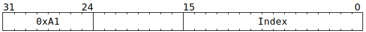

# `ATRELM` (Release a Tensix mutex)

**Summary:** Atomically release a Tensix mutex held by the current thread. The thread should have previously used [`ATGETM`](ATGETM.md) to acquire the mutex.

**Backend execution unit:** [Sync Unit](SyncUnit.md)

> [!TIP]
> Blackhole only has four mutexes per Tensix tile, whereas Wormhole had seven.

## Syntax

```c
TT_ATRELM(/* u16 */ Index)
```

## Encoding



## Functional model

This instruction will, if necessary, spend time waiting at the Wait Gate for a chance to release the mutex:

```c
if (Index == 1 || Index > 4) {
  // Invalid index causes infinite wait.
  while (true) {
    wait;
  }
}

// Maybe wait for a cycle or two. These waits can happen if other threads
// are also trying to either acquire or release the mutex in question.
if (maybe) wait;
if (maybe) wait;
```

Once the wait is complete, if the current thread already holds the mutex, it proceeds to release it:

```c
if (Mutex[Index].HeldBy == CurrentThread) {
  Mutex[Index].HeldBy = Nobody;
} else {
  // The instruction completes, but no state is changed.
}
```

If a mutex is released by thread `i`, and _both_ of the other threads are trying to acquire it using [`ATGETM`](ATGETM.md), then thread `(i + 1) % 3` is always chosen to be the acquirer. This ensures round-robin fairness when all threads are trying to acquire the same mutex.
