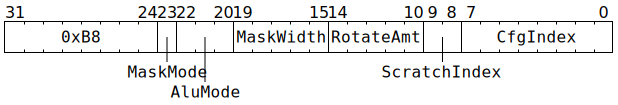

# `CFGSHIFTMASK` (Mutate thread-agnostic backend configuration)

**Summary:** Mutate 32 bits of thread-agnostic backend configuration using one of the `SCRATCH_SEC[].val` configuration registers. The current thread's `CFG_STATE_ID_StateID` determines which configuration bank is written to. This instruction cannot be used to write to `ThreadConfig` (see [`SETC16`](SETC16.md) for that).

**Backend execution unit:** [Configuration Unit](ConfigurationUnit.md)

## Syntax

```c
TT_CFGSHIFTMASK(/* u1 */ MaskMode,
                /* u3 */ AluMode,
                /* u5 */ MaskWidth,
                /* u5 */ RotateAmt,
                /* u2 */ ScratchIndex,
                /* u8 */ CfgIndex)
```

## Encoding



## Functional model

```c
if (CfgIndex >= (CFG_STATE_SIZE*4)) UndefinedBehaviour(); // Cannot index out of bounds.

uint32_t ScratchValue = Config.SCRATCH_SEC[ScratchIndex < 3 ? ScratchIndex : CurrentThread].val;
uint32_t MaskValue = (2u << MaskWidth) - 1u;
ScratchValue = rotr(ScratchValue & MaskValue, RotateAmt);

uint1_t StateID = ThreadConfig[CurrentThread].CFG_STATE_ID_StateID;
uint32_t CfgValue = Config[StateID][CfgIndex];
if (MaskMode == 0) CfgValue &= ~rotr(MaskValue, RotateAmt);
switch (AluMode) {
case 0: CfgValue |=  ScratchValue; break;
case 1: CfgValue &=  ScratchValue; break;
case 2: CfgValue ^=  ScratchValue; break;
case 3: CfgValue +=  ScratchValue; break;
case 4: CfgValue |= ~ScratchValue; break;
case 5: CfgValue &= ~ScratchValue; break;
case 6: CfgValue ^= ~ScratchValue; break;
case 7: CfgValue -=  ScratchValue; break;
}
Config[StateID][CfgIndex] = CfgValue;
```

Supporting definitions:
```c
uint32_t rotr(uint32_t x, uint32_t amt) {
  // Bitwise rotate x right by amt bits.
  return (x << (32 - amt)) | (x >> amt);
}
```

Note that `CfgIndex` values line up exactly with the `Name_ADDR32` constants in `cfg_defines.h`, though be aware that the `// Registers for THREAD` section of `cfg_defines.h` is for indexing into `ThreadConfig` rather than `Config` (see [`SETC16`](SETC16.md) for that).

## Performance

This instruction requires two cycles to execute, and is not pipelined, so a `CFGSHIFTMASK` instruction can only be started every other cycle. The issuing thread is not blocked, so it can potentially start its next instruction (of any kind) during `CFGSHIFTMASK`'s 2nd cycle.

## Instruction scheduling

Software must ensure that the instruction immediately after `CFGSHIFTMASK` is not trying to consume the configuration written by the `CFGSHIFTMASK` instruction. A NOP instruction can be inserted to ensure this (any kind of Tensix NOP suffices, though plain `NOP` is conventional). A NOP instruction does not need to be inserted if the consuming instruction is another Configuration Unit instruction, as the pipeline insertion rules of the Configuration Unit will already ensure that an idle cycle is inserted if necessary.
