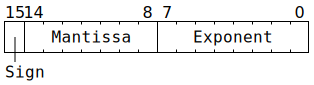
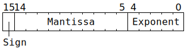
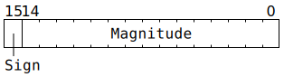
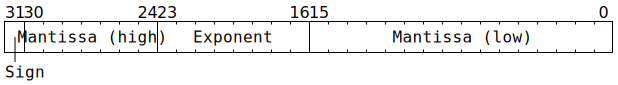
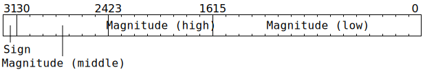

# `Dst`

The `Dst` register can be viewed as either having 1024 rows and 16 columns of 16-bit data, or 512 rows and 16 columns of 32-bit data. Instruction descriptions use `Dst16b` for the former, and `Dst32b` for the latter. In either case, the underlying storage is the same:

```c
uint16_t DstBits[1024][16];
```

Most of the time, `Dst16b[Row][Col]` is simple syntactic sugar for `DstBits[Adj16(Row)][Col]`.

The same region of memory can instead be viewed as a 512x16 matrix of 32-bit data; reads from `Dst32b[Row][Col]` give `(DstBits[Adj32(Row)][Col] << 16) | DstBits[Adj32(Row) + 8][Col]`, and writes to `Dst32b[Row][Col]` perform the inverse unpacking and write to `DstBits[Adj32(Row)][Col]` and `DstBits[Adj32(Row) + 8][Col]`. At any given time, software is expected to be exclusively using `Dst16b` or exclusively using `Dst32b`; mixing and matching `Dst16b` and `Dst32b` is _possible_, but tends to require great care. When using `Dst32b`, `Row` remains a 10-bit index, though the mapping down to `Adj32(Row)` can only yield 512 distinct values.

If bit 11 of `RISCV_DEBUG_REG_DBG_FEATURE_DISABLE` is set, then `Dst16b[Row][Col]` stops being syntactic sugar for `DstBits[Adj16(Row)][Col]`, and instead reads from `Dst16b[Row][Col]` give the high 16 bits of `Dst32b[Row][Col]`, and writes to `Dst16b[Row][Col]` write to the high 16 bits of `Dst32b[Row][Col]` (and also write _something_ - generally garbage - to the low 16 bits).

The `Adj16` and `Adj32` functions are:
```c
uint10_t Adj16(uint10_t r) {
  if (Config.DEST_ACCESS_CFG_remap_addrs) {
    r = (r & 0x3c7) ^ ((r & 0x030) >> 1) ^ ((r & 0x008) << 2);
  }
  return r;
}

uint10_t Adj32(uint10_t r) {
  r = Adj16(r);
  if (Config.DEST_ACCESS_CFG_swizzle_32b) {
    r = (r & 0x3f3) ^ ((r & 0x018) >> 1) ^ ((r & 0x004) << 1);
  }
  return ((r & 0x1f8) << 1) | (r & 0x207);
}
```

Note that `Config` in the above functions refers to Tensix backend configuration. In addition to their usage in these two functions, `Config.DEST_ACCESS_CFG_remap_addrs` and `Config.DEST_ACCESS_CFG_swizzle_32b` also affect how packers address `Dst`.

## Data types

Each datum in `Dst16b` is up to 16 bits wide, holding one of:
* **BF16 (1 sign bit, 8 bit exponent, 7 bit mantissa)**. Unpackers can losslessly convert BFP8 / BFP4 / BFP2 to BF16.
* **FP16 (1 sign bit, 5 bit exponent, 10 bit mantissa)**. Unpackers can losslessly convert FP8 (1 sign bit, 5 bit exponent, 3 bit mantissa) to FP16. They can also losslessly convert BFP8a / BFP4a / BFP2a to FP16.
* **Integer "8" (1 sign bit, 10 bit magnitude)**. The range of this type is -1023 through +1023, albeit the majority of hardware conversions to/from this type involve a range of -127 through +127 or 0 through 255. Internally, this type is overlaid onto FP16, using a fixed raw exponent of 16 (or sometimes a raw exponent of 0 when the magnitude is zero).
* **Integer "16" (1 sign bit, 15 bit magnitude)**. This type is intended only for opaque data transfer of 16 bits; there are no computation instructions involving this type. If used for opaque data transfer, this type can be used to contain _any_ 16 bits, including unsigned 16-bit data.

Each datum in `Dst32b` is 32 bits wide, holding one of:
* **FP32 (1 sign bit, 8 bit exponent, 23 bit mantissa)**. TF32 data can also be stored in this form, though most computation instructions will operate on it with full FP32 precision for as long as it is in `Dst32b`.
* **Integer "32" (1 sign bit, 31 bit magnitude)**. This is a sign/magnitude format rather than a two's complement format, though the Vector Unit (SFPU) can convert between the two.

Note that the coprocessor does not entirely conform to IEEE 754 for FP32 / FP16 / BF16. See [floating-point bit patterns](FloatBitPatterns.md) for details.

## Data type bit layout

Most of the time, software does not need to care about the exact bit layout of types in `Dst`. Nevertheless, the information is provided here to clarify the semantics of what happens if software does an implicit `bitcast` from one type to another.

**BF16:**



**FP16:**



The representation of infinity differs from IEEE 754, and NaN is not supported; see [FP16 bit patterns](FloatBitPatterns.md#fp16) for details.

**Integer "8":**


The low five bits usually contain the value `16`, but unpackers will instead set these bits to `0` when the magnitude is zero.

**Integer "16":**



**FP32:**



**Integer "32":**



## Moving data around

Unpacker 0 can be used to move from L1 to Dst (`UNPACR`), and [packers](Packers/README.md) can be used to move from Dst back to L1 ([`PACR`](PACR.md)).

The Vector Unit (SFPU) can move from Dst to LReg (`SFPLOAD`) and from LReg to Dst (`SFPSTORE`).

The Matrix Unit (FPU) can move from Dst to SrcA (`MOVD2A`) and from Dst to SrcB (`MOVD2B`). The other direction usually involves computation instructions rather than movement instructions, but plain movement is possible via `MOVA2D` and `MOVB2D`.

## Instruction scheduling

After issuing an instruction which writes to `Dst`, then for the next four cycles, the aligned 8x16 block of `Dst` containing that write cannot be read. If a thread presents a Matrix Unit (FPU) or [`PACR`](PACR.md) instruction which wants to read from that block, then hardware will automatically stall the thread for an appropriate number of cycles. In particular, for instructions which accumulate onto `Dst` (such as [`MVMUL`](MVMUL.md), [`GAPOOL`](GAPOOL.md), [`DOTPV`](DOTPV.md), [`GMPOOL`](GMPOOL.md), [`ELWMUL`](ELWMUL.md)), software needs to be looping over at least five distinct 8x16 blocks of `Dst` to avoid being stalled. Additionally, if using multiple fidelity phases, with one loop over blocks of `Dst` and one loop over fidelity phases, then the fidelity loop should be the _outer_ loop to avoid being stalled.

## RISCV access to `Dst`

RISCV T0 / T1 / T2 have `Dst` mapped into their address space, starting at address `0xFFBD_8000`. The nature of this mapping varies based on the Tensix backend configuration settings `RISC_DEST_ACCESS_CTRL_SEC[].{no_swizzle, unsigned_int, fmt}`. Of these, the value of `fmt` controls the high level shape of the mapping:

|`fmt`|Shape of mapping|Possible conversions|
|--:|---|---|
|0|`float    Dst32b[ 512][16]` or<br/>`uint32_t Dst32b[ 512][16]`|Between IEEE754 FP32 bit layout and Dst FP32 bit layout,<br/>between conventional integer bit layout and Dst Integer "32" bit layout|
|1|`int32_t  Dst32b[ 512][16]`|Between two's complement and sign-magnitude,<br/>between conventional integer bit layout and Dst Integer "32" bit layout|
|2|`__fp16   Dst16b[1024][16]`|Between IEEE754 FP16 bit layout and Dst FP16 bit layout|
|3|`__bf16   Dst16b[1024][16]`|Between truncated IEEE754 FP32 bit layout and Dst BF16 bit layout|
|4|`int16_t  Dst16b[1024][16]` or<br/>`uint16_t Dst16b[1024][16]`|Between two's complement and sign-magnitude|
|5|`int8_t   Dst16b[1024][16]` or<br/>`uint8_t  Dst16b[1024][16]`|Between two's complement and sign-magnitude,<br/>between conventional integer bit layout and Dst Integer "8" bit layout|
|≥&nbsp;6|Reserved|N/A|

RISCV T0 and T1 can only access a single array element at a time, e.g. when viewing a 16-bit type, 16-bit `sh` / `lhu` instructions need to be used (32-bit `sw` / `lw` instructions will generally misbehave in these cases). RISCV T2 can access multiple array elements at once, using either scalar load/store instructions or vector load/store instructions, though the load or store still needs to be aligned to the overall size of the load or store.

For RISCV T0 and T1, the following functions describe the behaviour of accessing a single element via a scalar load/store instruction. For RISCV T2, the behaviour is similar, just splitting the the load/store into an appropriate number of separate scalars based on `fmt`.

```c
uint32_t Load32(uint32_t Addr) {
  uint1_t StateID = ThreadConfig[CurrentThread].CFG_STATE_ID_StateID;
  auto& ConfigState = Config[StateID];
  uint3_t fmt = ConfigState.RISC_DEST_ACCESS_CTRL_SEC[CurrentThread].fmt;
  bool no_swizzle = ConfigState.RISC_DEST_ACCESS_CTRL_SEC[CurrentThread].no_swizzle;
  bool unsigned_int = ConfigState.RISC_DEST_ACCESS_CTRL_SEC[CurrentThread].unsigned_int;
  Addr = (Addr - 0xFFBD8000) / 4;
  uint32_t Value = Dst32b[Addr / 16][Addr % 16];
  if (!no_swizzle) {
    // Convert from Dst32b bit layout to CPU bit layout.
    Value = (Value & 0x8000ffff) | ((Value & 0x7f000000) >> 8) | ((Value & 0x00ff0000) << 7);
  }
  switch (fmt) {
  case 0: // float    Dst32b[ 512][16]
    break;
  case 1: // int32_t  Dst32b[ 512][16]
    if (no_swizzle || Value < 0x80000000) {
      // Value is Integer "32".
    } else {
      // Convert from sign-magnitude to two's complement (-0 becomes +0).      
      Value = -(Value & 0x7fffffff);
    }
    break;
  default:
    UndefinedBehaviour();
    break;
  }
  return Value;
}

uint16_t Load16(uint32_t Addr) {
  uint1_t StateID = ThreadConfig[CurrentThread].CFG_STATE_ID_StateID;
  auto& ConfigState = Config[StateID];
  uint3_t fmt = ConfigState.RISC_DEST_ACCESS_CTRL_SEC[CurrentThread].fmt;
  bool no_swizzle = ConfigState.RISC_DEST_ACCESS_CTRL_SEC[CurrentThread].no_swizzle;
  bool unsigned_int = ConfigState.RISC_DEST_ACCESS_CTRL_SEC[CurrentThread].unsigned_int;
  Addr = (Addr - 0xFFBD8000) / 2;
  uint16_t Value = Dst16b[Addr / 16][Addr % 16];
  switch (fmt) {
  case 2: // __fp16   Dst16b[1024][16]
    if (!no_swizzle) {
      // Convert from Dst16b FP16 bit layout to CPU bit layout.
      Value = (Value & 0x8000) | ((Value & 0x7fe0) >> 5) | ((Value & 0x001f) << 10);
    }
    break;
  case 3: // __bf16   Dst16b[1024][16]
    if (!no_swizzle) {
      // Convert from Dst16b BF16 bit layout to CPU bit layout.
      Value = (Value & 0x8000) | ((Value & 0x7f00) >> 8) | ((Value & 0x00ff) << 7);
    }
    break;
  case 4: // int16_t  Dst16b[1024][16]
    if (no_swizzle || unsigned_int || Value < 0x8000) {
      // Value is Integer "16".
    } else {
      // Convert from sign-magnitude to two's complement (-0 becomes +0).
      Value = -(Value & 0x7fff);
    }
    break;
  default:
    UndefinedBehaviour();
    break;
  }
  return Value;
}

uint8_t Load8(uint32_t Addr) {
  uint1_t StateID = ThreadConfig[CurrentThread].CFG_STATE_ID_StateID;
  auto& ConfigState = Config[StateID];
  uint3_t fmt = ConfigState.RISC_DEST_ACCESS_CTRL_SEC[CurrentThread].fmt;
  bool no_swizzle = ConfigState.RISC_DEST_ACCESS_CTRL_SEC[CurrentThread].no_swizzle;
  bool unsigned_int = ConfigState.RISC_DEST_ACCESS_CTRL_SEC[CurrentThread].unsigned_int;
  Addr = (Addr - 0xFFBD8000) / 1;
  uint16_t Value16 = Dst16b[Addr / 16][Addr % 16];
  switch (fmt) {
  case 5: // int8_t   Dst16b[1024][16]
    if (no_swizzle || unsigned_int) {
      // Return low eight bits of Integer "8" magnitude.
      return (Value16 >> 5) & 0xff;
    } else {
      // Unwrap Integer "8" to sign bit and low seven bits of magnitude, then
      // convert from sign-magnitude to two's complement (-0 becomes +0).
      uint8_t Mag = (Value16 >> 5) & 0x7f;
      return Value16 & 0x8000 ? -Mag : Mag;
    }
  default:
    UndefinedBehaviour();
    break;
  }
}

void Store32(uint32_t Addr, uint32_t Value) {
  uint1_t StateID = ThreadConfig[CurrentThread].CFG_STATE_ID_StateID;
  auto& ConfigState = Config[StateID];
  uint3_t fmt = ConfigState.RISC_DEST_ACCESS_CTRL_SEC[CurrentThread].fmt;
  bool no_swizzle = ConfigState.RISC_DEST_ACCESS_CTRL_SEC[CurrentThread].no_swizzle;
  switch (fmt) {
  case 0: // float    Dst32b[ 512][16]
    break;
  case 1: // int32_t  Dst32b[ 512][16]
    if (no_swizzle || Value < 0x80000000) {
      // Value is Integer "32".
    } else {
      // Convert from two's complement to sign-magnitude, clamping -2**31 to -(2**31-1).
      Value = 0x80000000 | -(Value + (Value == 0x80000000));
    }
    break;
  default:
    UndefinedBehaviour();
    break;
  }
  if (!no_swizzle) {
    // Convert from CPU bit layout to Dst32b bit layout.
    Value = (Value & 0x8000ffff) | ((Value & 0x7f800000) >> 7) | ((Value & 0x007f0000) << 8);
  }
  Addr = (Addr - 0xFFBD8000) / 4;
  Dst32b[Addr / 16][Addr % 16] = Value;
}

void Store16(uint32_t Addr, uint16_t Value) {
  uint1_t StateID = ThreadConfig[CurrentThread].CFG_STATE_ID_StateID;
  auto& ConfigState = Config[StateID];
  uint3_t fmt = ConfigState.RISC_DEST_ACCESS_CTRL_SEC[CurrentThread].fmt;
  bool no_swizzle = ConfigState.RISC_DEST_ACCESS_CTRL_SEC[CurrentThread].no_swizzle;
  bool unsigned_int = ConfigState.RISC_DEST_ACCESS_CTRL_SEC[CurrentThread].unsigned_int;
  switch (fmt) {
  case 2: // __fp16   Dst16b[1024][16]
    if (!no_swizzle) {
      // Convert from CPU bit layout to Dst16b FP16 bit layout.
      Value = (Value & 0x8000) | ((Value & 0x7c00) >> 10) | ((Value & 0x03ff) << 5);
    }
    break;
  case 3: // __bf16   Dst16b[1024][16]
    if (!no_swizzle) {
      // Convert from CPU bit layout to Dst16b BF16 bit layout.
      Value = (Value & 0x8000) | ((Value & 0x7f80) >> 7) | ((Value & 0x007f) << 8);
    }
    break;
  case 4: // int16_t  Dst16b[1024][16]
    if (no_swizzle || unsigned_int || Value < 0x8000) {
      // Value is Integer "16".
    } else {
      // Convert from two's complement to sign-magnitude, clamping -2**15 to -(2**15-1).
      Value = 0x8000 | -(Value + (Value == 0x8000));
    }
    break;
  default:
    UndefinedBehaviour();
    break;
  }
  Addr = (Addr - 0xFFBD8000) / 2;
  Dst16b[Addr / 16][Addr % 16] = Value;
}

void Store8(uint32_t Addr, uint8_t Value) {
  uint1_t StateID = ThreadConfig[CurrentThread].CFG_STATE_ID_StateID;
  auto& ConfigState = Config[StateID];
  uint3_t fmt = ConfigState.RISC_DEST_ACCESS_CTRL_SEC[CurrentThread].fmt;
  bool no_swizzle = ConfigState.RISC_DEST_ACCESS_CTRL_SEC[CurrentThread].no_swizzle;
  bool unsigned_int = ConfigState.RISC_DEST_ACCESS_CTRL_SEC[CurrentThread].unsigned_int;
  uint16_t Value16;
  switch (fmt) {
  case 5: // int8_t   Dst16b[1024][16]
    if (no_swizzle || unsigned_int || Value < 0x80) {
      // Value becomes 7 or 8 bits of Integer "8" magnitude.
      Value16 = (Value << 5) | (Value ? 16 : 0);
    } else {
      // Meant to be conversion from two's complement to sign-magnitude, but isn't.
      uint8_t Mag = 0x180 - Value - (Value == 0x80);
      // Result is then wrapped up as Integer "8".
      Value16 = 0x8000 | (Mag << 5) | 16;
    }
    break;
  default:
    UndefinedBehaviour();
    break;
  }
  Addr = (Addr - 0xFFBD8000) / 1;
  Dst16b[Addr / 16][Addr % 16] = Value16;
}
```
