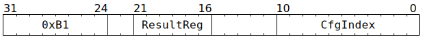

# `RDCFG` (Move from thread-agnostic backend configuration to GPRs)

**Summary:** Move 32 bits from thread-agnostic backend configuration to a Tensix GPR. The current thread's `CFG_STATE_ID_StateID` determines which configuration bank is read from. This instruction cannot be used to read from `ThreadConfig`.

**Backend execution unit:** [Configuration Unit](ConfigurationUnit.md)

## Syntax

```c
TT_RDCFG(/* u6 */ ResultReg, /* u11 */ CfgIndex)
```

## Encoding



## Functional model

```c
if (CfgIndex >= (CFG_STATE_SIZE*4)) UndefinedBehaviour(); // Cannot index out of bounds.

uint1_t StateID = ThreadConfig[CurrentThread].CFG_STATE_ID_StateID;
GPRs[CurrentThread][ResultReg] = Config[StateID][CfgIndex];
```

Note that `CfgIndex` values line up exactly with the `Name_ADDR32` constants in `cfg_defines.h`, though be aware that the `// Registers for THREAD` section of `cfg_defines.h` is for indexing into `ThreadConfig` rather than `Config`.

## Performance

This instruction requires at least two cycles to execute, and then additional cycles if there is contention for GPR writes. Assuming no contention, it is fully pipelined, so an `RDCFG` instruction can be started every cycle. The issuing thread is not blocked, so it can potentially start its next instructions (of any kind) during `RDCFG`'s subsequent cycles.

## Instruction scheduling

Software must ensure that the instruction(s) immediately after `RDCFG` are not trying to consume the GPR written by the `RDCFG` instruction. In _most_ cases, this applies to the one instruction after `RDCFG`, but it can apply to more than one instruction if there is contention for the GPR write. After issuing one or more `RDCFG` instructions, software is encouraged to use `STALLWAIT` to wait for the Configuration Unit to no longer be busy.
