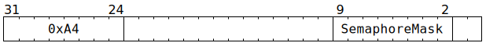

# `SEMPOST` (Increment the `Value` of some semaphores)

**Summary:** Various semaphores are selected using a bitmask, and the selected semaphores have their `Value` incremented (unless their `Value` is already 15, in which case it remains at 15).

**Backend execution unit:** [Sync Unit](SyncUnit.md)

## Syntax

```c
TT_SEMPOST(/* u8 */ SemaphoreMask)
```

## Encoding



## Functional model

```c
atomic {
  for (unsigned i = 0; i < 8; ++i) {
    if (SemaphoreMask.Bit[i] && Semaphores[i].Value < 15) {
      Semaphores[i].Value += 1;
    }
  }
}
```

## Instruction scheduling

If the programmer intent is for the semaphore increment to happen after some earlier Tensix instruction has _finished_ execution, it may be necessary to insert a [`STALLWAIT`](STALLWAIT.md) instruction (with block bit B1) somewhere between that earlier instruction and the `SEMPOST` instruction.
