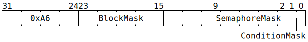

# `SEMWAIT` (Limit thread execution until semaphore conditions met)

**Summary:** One or more semaphore conditions are selected using a bitmask, and one or more blocked instructions are selected using another bitmask. The issuing thread can continue execution until one of the blocked instructions is reached, at which point execution of the thread is paused until all of the selected conditions are simultaneously met.

**Backend execution unit:** [Sync Unit](SyncUnit.md)

## Syntax

```c
TT_SEMWAIT(/* u9 */ BlockMask, /* u8 */ SemaphoreMask, /* u2 */ ConditionMask)
```

## Encoding



## Functional model

The instruction is considered complete once the following happens:
```c
if (ConditionMask) {
  WaitGate[CurrentThread].LatchedWaitInstruction.Opcode = SEMWAIT;
  WaitGate[CurrentThread].LatchedWaitInstruction.ConditionMask = ConditionMask;
  WaitGate[CurrentThread].LatchedWaitInstruction.SemaphoreMask = SemaphoreMask;
} else {
  WaitGate[CurrentThread].LatchedWaitInstruction.Opcode = STALLWAIT;
  WaitGate[CurrentThread].LatchedWaitInstruction.ConditionMask = 0x0F;
  WaitGate[CurrentThread].LatchedWaitInstruction.SemaphoreMask = 0;
}
WaitGate[CurrentThread].LatchedWaitInstruction.BlockMask = BlockMask ? BlockMask : (1u << 6);
```

The Wait Gate will then continuously re-evaluate the latched wait instruction until all of the selected conditions are simultaneously met, at which point the latched wait instruction will be forgotten, and instructions will no longer be blocked. The new latched wait instruction takes effect immediately, so it will influence whether or not the instruction immediately after `SEMWAIT` can pass through the Wait Gate. There is a one cycle lag between the condition(s) being met and the block mask being removed - in particular this means that the instruction immediately after `SEMWAIT` will always be subject to the block mask for at least one cycle, even if the condition(s) are met immediately.

## Block mask

The block mask consists of nine bits, named B0 (least significant bit) through B8 (most significant bit). Their meaning is exactly the same [as for `STALLWAIT`](STALLWAIT.md#block-mask).

## Condition mask

The condition mask consists of 2 bits, named C0 (least significant bit) and C1 (most significant bit). The meaning of each bit is:

||Keep on waiting and blocking if...|
|---|---|
|**C0**|Any of the semaphores selected by `SemaphoreMask` have `Value == 0`.|
|**C1**|Any of the semaphores selected by `SemaphoreMask` have `Value >= Max`.|
