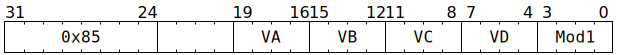

# `SFPADD` (Vectorised floating-point addition/subtraction)

**Summary:** Identical to [`SFPMAD`](SFPMAD.md), but is the preferred opcode when `VA == 10`, as this causes the computation to be lanewise FP32 `VD = ±(1.0 * VB) ± VC` (see the definition of [`LReg[10]`](LReg.md)).

**Backend execution unit:** [Vector Unit (SFPU)](VectorUnit.md), MAD sub-unit

## Syntax

```c
TT_SFPADD(/* u4 */ VA, /* u4 */ VB, /* u4 */ VC, /* u4 */ VD, /* u4 */ Mod1)
```

## Encoding



## Functional model

As per [`SFPMAD`](SFPMAD.md#functional-model).

## IEEE754 conformance / divergence

As per [`SFPMAD`](SFPMAD.md#ieee754-conformance--divergence).

## Instruction scheduling

As per [`SFPMAD`](SFPMAD.md#instruction-scheduling).
