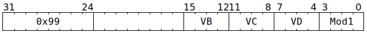

# `SFPARECIP` (Vectorised approximate floating-point reciprocal or exponential)

**Summary:** Performs lanewise FP32 reciprocal (`1/x`) or lanewise FP32 exponential (<code>e<sup>x</sup></code>). In both cases, the computation is [approximate](#approximation-accuracy). Software may wish to follow this instruction with other instructions to improve the accuracy (for example performing a few Newton-Raphson iterations), or precede it with other instructions to reduce the input range down to where the approximation works best.

**Backend execution unit:** [Vector Unit (SFPU)](VectorUnit.md), simple sub-unit

> [!TIP]
> This instruction is new in Blackhole.

## Syntax

```c
TT_SFPARECIP(/* u4 */ VB, /* u4 */ VC, /* u4 */ VD, /* u4 */ Mod1)
```

## Encoding



## Functional model

```c
if (VD < 8 || VD == 16) {
  lanewise {
    if (LaneEnabled) {
      uint32_t x = LReg[VC].u32; // FP32
      uint32_t Sign = x & 0x80000000u;
      switch (Mod1) {
      case SFPARECIP_MOD1_RECIP:
        x = Sign + ApproxRecip(x - Sign);
        break;
      case SFPARECIP_MOD1_COND_RECIP:
        if (LReg[VB].i32 < 0) {
          x = ApproxRecip(x - Sign);
        }
        break;
      case SFPARECIP_MOD1_EXP:
      default:
        x = Sign + ApproxExp(x - Sign);
        break;
      }
      LReg[VD].u32 = x; // FP32
    }
  }
}
```

Supporting definitions:
```c
#define SFPARECIP_MOD1_RECIP 0
#define SFPARECIP_MOD1_COND_RECIP 1
#define SFPARECIP_MOD1_EXP 2

uint32_t ApproxRecip(uint32_t x) {
  static const uint8_t LUT[128] = {
    127, 125, 123, 121, 119, 117, 116, 114, 112, 110, 109, 107, 105, 104, 102, 100, 99,
    97, 96, 94, 93, 91, 90, 88, 87, 85, 84, 83, 81, 80, 79, 77, 76, 75, 74, 72, 71, 70,
    69, 68, 66, 65, 64, 63, 62, 61, 60, 59, 58, 57, 56, 55, 54, 53, 52, 51, 50, 49, 48,
    47, 46, 45, 44, 43, 42, 41, 40, 40, 39, 38, 37, 36, 35, 35, 34, 33, 32, 31, 31, 30,
    29, 28, 28, 27, 26, 25, 25, 24, 23, 23, 22, 21, 21, 20, 19, 19, 18, 17, 17, 16, 15,
    15, 14, 14, 13, 12, 12, 11, 11, 10, 9, 9, 8, 8, 7, 7, 6, 5, 5, 4, 4, 3, 3, 2, 2, 1,
    1, 0
  };

  if (x < 0x00800000) { // x < 2**-126
    return 0x7f800000; // Inf
  } else if (x < 0x7e800000) { // x < 2**126
    return ((253 - (x >> 23)) << 23) | (LUT[(x >> 16) & 0x7f] << 16);
  } else {
    return 0;
  }
}

uint32_t ApproxExp(uint32_t x) {
  static const uint8_t LUT[896] = {
    2, 2, 2, 2, 2, 2, 2, 2, 2, 2, 2, 2, 2, 2, 2, 2, 2, 2, 2, 2, 2, 2, 2, 2, 2, 2, 2, 2,
    2, 2, 2, 2, 2, 2, 2, 2, 2, 2, 2, 2, 2, 2, 2, 2, 2, 2, 2, 2, 2, 2, 2, 2, 2, 2, 2, 2,
    2, 2, 2, 2, 2, 2, 3, 3, 3, 3, 3, 3, 3, 3, 3, 3, 3, 3, 3, 3, 3, 3, 3, 3, 3, 3, 3, 3,
    3, 3, 3, 3, 3, 3, 3, 3, 3, 3, 3, 3, 3, 3, 3, 3, 3, 3, 3, 3, 3, 3, 3, 3, 3, 3, 3, 3,
    3, 3, 3, 3, 3, 3, 3, 3, 3, 3, 3, 3, 3, 4, 4, 4, 4, 4, 4, 4, 4, 4, 4, 4, 4, 4, 4, 4,
    4, 4, 4, 4, 4, 4, 4, 4, 4, 4, 4, 4, 4, 4, 4, 4, 4, 5, 5, 5, 5, 5, 5, 5, 5, 5, 5, 5,
    5, 5, 5, 5, 5, 5, 5, 5, 5, 5, 5, 5, 5, 5, 5, 5, 5, 5, 5, 5, 6, 6, 6, 6, 6, 6, 6, 6,
    6, 6, 6, 6, 6, 6, 6, 6, 6, 6, 6, 6, 6, 6, 6, 6, 6, 6, 6, 6, 6, 6, 6, 7, 7, 7, 7, 7,
    7, 7, 7, 7, 7, 7, 7, 7, 7, 7, 7, 7, 7, 7, 7, 7, 7, 7, 7, 7, 7, 7, 7, 7, 7, 8, 8, 8,
    8, 8, 8, 8, 8, 8, 8, 8, 8, 8, 8, 8, 8, 8, 8, 8, 9, 9, 9, 9, 9, 9, 9, 9, 9, 9, 9, 9,
    9, 9, 9, 10, 10, 10, 10, 10, 10, 10, 10, 10, 10, 10, 10, 10, 10, 11, 11, 11, 11,
    11, 11, 11, 11, 11, 11, 11, 11, 11, 11, 11, 12, 12, 12, 12, 12, 12, 12, 12, 12, 12,
    12, 12, 12, 12, 12, 13, 13, 13, 13, 13, 13, 13, 13, 13, 13, 13, 13, 13, 13, 14, 14,
    14, 14, 14, 14, 14, 14, 14, 14, 14, 14, 14, 14, 15, 15, 15, 15, 15, 15, 15, 15, 15,
    15, 15, 15, 15, 15, 15, 16, 16, 16, 16, 16, 16, 16, 16, 16, 16, 16, 16, 16, 16, 17,
    17, 17, 17, 17, 17, 17, 18, 18, 18, 18, 18, 18, 18, 19, 19, 19, 19, 19, 19, 19, 20,
    20, 20, 20, 20, 20, 20, 21, 21, 21, 21, 21, 21, 21, 22, 22, 22, 22, 22, 22, 22, 23,
    23, 23, 23, 23, 23, 24, 24, 24, 24, 24, 24, 24, 25, 25, 25, 25, 25, 25, 25, 26, 26,
    26, 26, 26, 26, 27, 27, 27, 27, 27, 27, 27, 28, 28, 28, 28, 28, 28, 28, 29, 29, 29,
    29, 29, 29, 30, 30, 30, 30, 30, 30, 30, 31, 31, 31, 31, 31, 31, 32, 32, 32, 32, 32,
    32, 33, 33, 33, 33, 33, 33, 33, 34, 34, 34, 34, 34, 34, 35, 35, 35, 35, 35, 35, 36,
    36, 36, 36, 36, 37, 37, 37, 38, 38, 38, 39, 39, 39, 40, 40, 40, 41, 41, 41, 42, 42,
    42, 43, 43, 43, 44, 44, 44, 45, 45, 45, 46, 46, 46, 47, 47, 47, 48, 48, 49, 49, 49,
    50, 50, 50, 51, 51, 51, 52, 52, 52, 53, 53, 53, 54, 54, 54, 55, 55, 56, 56, 56, 57,
    57, 57, 58, 58, 58, 59, 59, 60, 60, 60, 61, 61, 61, 62, 62, 63, 63, 63, 64, 64, 64,
    65, 65, 66, 66, 66, 67, 67, 67, 68, 68, 69, 69, 69, 70, 70, 71, 71, 71, 72, 72, 72,
    73, 73, 74, 74, 74, 75, 75, 76, 76, 76, 77, 77, 78, 78, 78, 79, 79, 80, 80, 80, 81,
    81, 82, 82, 83, 83, 84, 85, 86, 87, 88, 88, 89, 90, 91, 92, 93, 94, 94, 95, 96, 97,
    98, 99, 100, 101, 101, 102, 103, 104, 105, 106, 107, 108, 109, 110, 111, 112, 113,
    113, 114, 115, 116, 117, 118, 119, 120, 121, 122, 123, 124, 125, 126, 127,
    0, 0, 1, 1, 2, 2, 3, 3, 4, 4, 5, 5, 6, 6, 7, 8, 8, 9, 9, 10, 10, 11, 11, 12, 12,
    13, 13, 14, 15, 15, 16, 16, 17, 17, 18, 19, 19, 20, 20, 21, 21, 22, 23, 23, 24, 24,
    25, 26, 26, 27, 27, 28, 29, 29, 30, 31, 31, 32, 32, 33, 34, 34, 35, 36, 36, 37, 38,
    38, 39, 39, 40, 41, 41, 42, 43, 43, 44, 45, 45, 47, 48, 50, 51, 52, 54, 55, 57, 58,
    60, 61, 63, 64, 66, 67, 69, 70, 72, 73, 75, 76, 78, 80, 81, 83, 85, 86, 88, 90, 91,
    93, 95, 97, 98, 100, 102, 104, 106, 107, 109, 111, 113, 115, 117, 119, 121, 123,
    125, 127, 128, 129, 130, 131, 132, 133, 134, 135, 136, 137, 139, 140, 141, 142,
    143, 144, 145, 146, 147, 149, 150, 151, 152, 153, 155, 156, 157, 158, 159, 161,
    162, 163, 165, 166, 167, 168, 170, 171, 172, 174, 175, 177, 178, 179, 181, 182,
    184, 185, 187, 188, 189, 191, 192, 194, 196, 197, 199, 200, 202, 203, 205, 207,
    208, 210, 211, 213, 215, 216, 218, 220, 222, 223, 225, 227, 229, 230, 232, 234
  };

  if (x < 0x00800000) { // x < 2**-126
    return 0x3f800000; // 1.0
  } else if (x < 0x3c800000) { // x < 0.015625
    return 0x3f810000 | (uint16_t)x;
  } else if (x < 0x3f320000) { // x < 0.6953125
    return 0x3f800000 | (LUT[(x >> 16) - 0x3c80] << 16) | (uint16_t)x;
  } else if (x < 0x40000000) { // x < 2
    return 0x40000000 | (LUT[(x >> 16) - 0x3c80] << 16) | (uint16_t)x;
  } else {
    return 0x40800000 | (uint16_t)x;
  }
}
```

## Approximation accuracy

For all <code>2<sup>-126</sup> ≤ x &lt; 2<sup>126</sup></code>, `ApproxRecip` satisfies `0.9944 * 1/x < ApproxRecip(x) < 1/x * 1.0054`. Outside of this range, it gives either 0 or infinity. The `ApproxRecip` of `1.0` is `0.99609375`. When called by `SFPARECIP_MOD1_RECIP`, the sign is removed before the `ApproxRecip` call, and then joined back on afterwards. When called by `SFPARECIP_MOD1_COND_RECIP`, the sign is removed before the `ApproxRecip` call, but not joined back on afterwards.

For all `0 ≤ x < 2`, `ApproxExp` satisfies <code>0.9922 * e<sup>x</sup> &lt; ApproxExp(x) &lt; e<sup>x</sup> * 1.016</code>. The `ApproxExp` of `1.0` is `2.703125`. For `2 ≤ x`, `ApproxExp` does not return a useful result, and thus software is strongly encouraged to avoid this range. When called by `SFPARECIP_MOD1_EXP`, the sign is removed before the `ApproxExp` call, and then joined back on afterwards - this is potentially useful in some scenarios (for example to feed a subsequent `SFPARECIP_MOD1_COND_RECIP`), but is distinctly unlike <code>e<sup>x</sup></code>.

Future architectures might improve the approximation accuracy and/or change the approximation mechanism such that it improves accuracy in the aggregate but decreases the accuracy of particular inputs. Portable software is encouraged to not rely on the exact bit patterns generated by approximate instructions.
