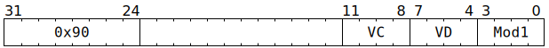

# `SFPCAST` (Vectorised convert between two's complement integer and sign-magnitude integer)

**Summary:** Performs lanewise conversion of 32-bit signed two's complement integers to 32-bit sign-magnitude integers, or conversion of 32-bit sign-magnitude integers to 32-bit signed two's complement integers. Both formats have one value not representable in the other (two's complement <code>-2<sup>31</sup></code> and sign-magnitude `-0`), and the conversion maps these values to each other. To avoid surprises, software is encouraged to avoid input values which are not representable in the output format.

**Backend execution unit:** [Vector Unit (SFPU)](VectorUnit.md), simple sub-unit

## Syntax

```c
TT_SFPCAST(/* u4 */ VC, /* u4 */ VD, /* u4 */ Mod1)
```

## Encoding



## Data type conversions

One of the following data type conversions is performed. Software does not need to explicitly indicate which of the two it desires, as their implementations are identical.

|Input [`LReg` data type](LReg.md#data-type)|→|Output [`LReg` data type](LReg.md#data-type)|Notes|
|---|---|---|---|
|Sign-magnitude integer|→|Two's complement integer|`-0` becomes <code>-2<sup>31</sup></code>|
|Two's complement integer|→|Sign-magnitude integer|<code>-2<sup>31</sup></code> becomes `-0`|

## Functional model

```c
if ((Mod1 & 3) != SFPCAST_MOD1_INT32_SM32) {
  // Is some other flavour of SFPCAST; see other pages for details.
  UndefinedBehaviour();
}

if (VD < 8 || VD == 16) {
  lanewise {
    if (LaneEnabled) {
      uint32_t c = LReg[VC].u32;
      uint32_t Sign = c & 0x80000000u;
      LReg[VD].u32 = Sign | (Sign ? -c : c);
    }
  }
}
```

Supporting definitions:
```c
#define SFPCAST_MOD1_INT32_SM32 3
```
