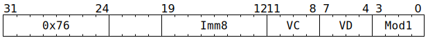

# `SFPDIVP2` (Vectorised adjust floating-point exponent)

**Summary:** Performs lanewise adjustment of FP32 exponent bits. The exponent bits are either set to the provided immediate, or the provided immediate is added to the exponent bits. In the latter case, no addition is performed if the starting value is infinity or NaN, and the result of the addition can wrap around. If software wishes to have exponent saturation rather than exponent wrapping, [`SFPMULI`](SFPMULI.md) can be used instead.

**Backend execution unit:** [Vector Unit (SFPU)](VectorUnit.md), simple sub-unit

## Syntax

```c
TT_SFPDIVP2(/* u8 */ Imm8, /* u4 */ VC, /* u4 */ VD, /* u4 */ Mod1)
```

## Encoding



## Functional model

```c
if (VD < 8 || VD == 16) {
  lanewise {
    if (LaneEnabled) {
      uint32_t c = LReg[VC].u32;
      uint32_t Sign = c >> 31;
      uint32_t Exp = (c >> 23) & 0xff;
      uint32_t Man = c & 0x7fffff;
      if (Mod1 & SFPDIVP2_MOD1_ADD) {
        if (Exp == 255) {
          // Infinity and NaN left unchanged.
        } else {
          // Perform wrapping addition of 8-bit exponent and 8-bit immediate.
          Exp = (Exp + Imm8) & 0xff;
        }
      } else {
        // The 8-bit immediate becomes the exponent.
        Exp = Imm8;
      }
      LReg[VD].u32 = (Sign << 31) | (Exp << 23) | Man;
    }
  }
}
```

Supporting definitions:
```c
#define SFPDIVP2_MOD1_ADD 1
```
