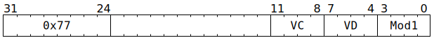

# `SFPEXEXP` (Vectorised extract FP32 exponent bits)

**Summary:** Performs lanewise extraction of FP32 exponent bits, depositing them as an integer either in the range 0 through 255 or -127 through +128. When the latter range is used, the result is a two's complement integer. Lane flags can also be set based on the sign of the result.

**Backend execution unit:** [Vector Unit (SFPU)](VectorUnit.md), simple sub-unit

## Syntax

```c
TT_SFPEXEXP(0, /* u4 */ VC, /* u4 */ VD, /* u4 */ Mod1)
```

## Encoding



## Functional model

```c
int32_t Bias = Mod1 & SFPEXEXP_MOD1_NODEBIAS ? 0 : 127;
if (VD < 8 || VD == 16) {
  lanewise {
    if (LaneEnabled) {
      uint32_t c = LReg[VC].u32; // FP32.
      int32_t Exp = (c >> 23) & 0xff;
      LReg[VD].i32 = Exp - Bias; // Two's complement integer.
      if (VD < 8) {
        if (Mod1 & SFPEXEXP_MOD1_SET_CC_SGN_EXP) {
          LaneFlags = LReg[VD].i32 < 0;
        }
        if (Mod1 & SFPEXEXP_MOD1_SET_CC_COMP_EXP) {
          LaneFlags = !LaneFlags;
        }
      }
    }
  }
}
```

Supporting definitions:
```c
#define SFPEXEXP_MOD1_NODEBIAS        1
#define SFPEXEXP_MOD1_SET_CC_SGN_EXP  2
#define SFPEXEXP_MOD1_SET_CC_COMP_EXP 8
```
