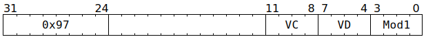

# `SFPGT` (Vectorised sign-magnitude integer comparison)

**Summary:** Operating lanewise on 32-bit sign-magnitude integers, performs a comparison `VD > VC`, and writes the result of the comparison to `VD` and/or `LaneFlags` and/or the top of the vector conditional execution stack. Can instead be operating on FP32 values, in which case it uses the total order where -NaN < -Inf < ... < -0 < +0 < ... < +Inf < +NaN.

**Backend execution unit:** [Vector Unit (SFPU)](VectorUnit.md), simple sub-unit

> [!TIP]
> This instruction is new in Blackhole, as is its inverse, [`SFPLE`](SFPLE.md).

## Syntax

```c
TT_SFPGT(0, /* u4 */ VC, /* u4 */ VD, /* u4 */ Mod1)
```

## Encoding



## Functional model

```c
unsigned VB = VD;
lanewise {
  if (VD < 12 || LaneConfig.DISABLE_BACKDOOR_LOAD) {
    bool IsVcSmaller = SignMagIsSmaller(LReg[VC].u32, LReg[VB].u32);
    if (LaneEnabled) {
      if (Mod1 & SFPGT_MOD1_SET_VD) {
        if (VD < 8 || VD == 16) LReg[VD].i32 = IsVcSmaller ? -1 : 0;
      }
      if (Mod1 & SFPGT_MOD1_SET_CC) {
        LaneFlags = IsVcSmaller;
      }
    }
    if (Mod1 & SFPGT_MOD1_MUTATE_STACK) {
      if (!FlagStack.IsEmpty()) {
        if (Mod1 & SFPGT_MOD1_MUTATE_OR) {
          FlagStack.Top().LaneFlags |= IsVcSmaller;
        } else {
          FlagStack.Top().LaneFlags &= IsVcSmaller;
        }
      }
    }
  }
}
```

Supporting definitions:
```c
#define SFPGT_MOD1_SET_CC       1
#define SFPGT_MOD1_MUTATE_STACK 2
#define SFPGT_MOD1_MUTATE_OR    4
#define SFPGT_MOD1_SET_VD       8

bool SignMagIsSmaller(uint32_t C, uint32_t D) {
  // This treats C and D as sign-magnitude integers and determines
  // whether C is less than D. If C and D are instead FP32, this
  // still determines whether C is less than D, using the total
  // order where -NaN < -Inf < ... < -0 < +0 < ... < +Inf < +NaN.

  // For purposes of exposition, remap sign-mag -0 ... -(2^31-1)
  // to two's-comp -1 ... -2^31, then perform two's-comp comparison.
  C ^= (uint32_t)((int32_t)C >> 30) >> 1;
  D ^= (uint32_t)((int32_t)D >> 30) >> 1;
  return (int32_t)C < (int32_t)D;
}
```
