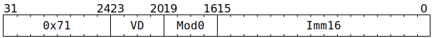

# `SFPLOADI` (Move immediate to `LReg`)

**Summary:** Convert a 16-bit immediate to 32 bits and then write it to all lanes of an `LReg`, or write just 16 bits to the upper or lower half of all lanes of an `LReg`, leaving the other half of all lanes unchanged.

A 32-bit immediate can be written to all lanes of an `LReg` by using two `SFPLOADI` instructions: one to write the high 16 bits, and one to write just the low 16 bits.

**Backend execution unit:** [Vector Unit (SFPU)](VectorUnit.md), load sub-unit

## Syntax

```c
TT_SFPLOADI(/* u4 */ VD, /* u4 */ Mod0, /* u16 */ Imm16)
```

## Encoding



## Data type conversions

One of the following data type conversions is specified using the `Mod0` field:

|`SFPLOADI` Mode|Interpretation of `Imm16`|→|Resultant [`LReg` data type](LReg.md#data-type)|
|---|---|---|---|
|`SFPLOADI_MOD0_FLOATB`|BF16|→|FP32|
|`SFPLOADI_MOD0_FLOATA`|FP16 ([ish](FloatBitPatterns.md#fp16))|→|FP32|
|`SFPLOADI_MOD0_USHORT`|Unsigned 16-bit integer|→|Unsigned 32-bit integer|
|`SFPLOADI_MOD0_SHORT`|Two's complement 16-bit integer|→|Two's complement 32-bit integer|
|`SFPLOADI_MOD0_FLOATB`|Opaque 16 bits|→|Written to high 16 bits of `LReg`, low 16 bits set to zero|
|`SFPLOADI_MOD0_UPPER`|Opaque 16 bits|→|Written to high 16 bits of `LReg`, low 16 bits preserved|
|`SFPLOADI_MOD0_USHORT`|Opaque 16 bits|→|Written to low 16 bits of `LReg`, high 16 bits set to zero|
|`SFPLOADI_MOD0_LOWER`|Opaque 16 bits|→|Written to low 16 bits of `LReg`, high 16 bits preserved|

## Functional model

```c
if (VD < 8) {
  lanewise {
    if (LaneEnabled) {
      switch (Mod0) {
      case SFPLOADI_MOD0_FLOATB: LReg[VD].u32 = BF16toFP32(Imm16); break;
      case SFPLOADI_MOD0_FLOATA: LReg[VD].u32 = FP16toFP32(Imm16); break;
      case SFPLOADI_MOD0_USHORT: LReg[VD].u32 = ZeroExtend(Imm16); break;
      case SFPLOADI_MOD0_SHORT:  LReg[VD].u32 = SignExtend(Imm16); break;
      case SFPLOADI_MOD0_UPPER:  LReg[VD].u32 = (Imm16 << 16) | (LReg[VD].u32 & 0x0000ffff); break;
      case SFPLOADI_MOD0_LOWER:  LReg[VD].u32 = (LReg[VD].u32 & 0xffff0000) | Imm16; break;
      default: UndefinedBehaviour(); break;
      }
    }
  }
} else {
  // Cannot write directly to LReg[11] through LReg[14]; if this is desired,
  // software should instead write to LReg[0] and then use SFPCONFIG.
}
```

Supporting definitions:
```c
#define SFPLOADI_MOD0_FLOATB 0 // Immediate is BF16
#define SFPLOADI_MOD0_FLOATA 1 // Immediate is FP16 (ish)
#define SFPLOADI_MOD0_USHORT 2 // Immediate is UINT16
#define SFPLOADI_MOD0_SHORT  4 // Immediate is INT16
#define SFPLOADI_MOD0_UPPER  8 // Immediate overwrites upper 16 bits
#define SFPLOADI_MOD0_LOWER 10 // Immediate overwrites lower 16 bits

uint32_t BF16toFP32(uint32_t x) {
  return x << 16;
}

uint32_t FP16toFP32(uint16_t x) {
  // This just widens the exponent field from 5b to 8b and rebiases
  // it. There is no handling of denormals or NaNs or infinities.
  uint32_t Sign = x >> 15;
  uint32_t Exp  = (x >> 10) & 0x1f;
  uint32_t Man  = x & 0x3ff;
  Exp += 112; // Rebias 5b exponent to 8b
  return (Sign << 31) | (Exp << 23) | (Man << 13);
}

uint32_t ZeroExtend(uint16_t x) {
  return x;
}

uint32_t SignExtend(uint16_t x) {
  return (uint32_t)(int32_t)(int16_t)x;
}
```
