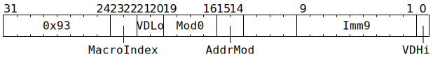
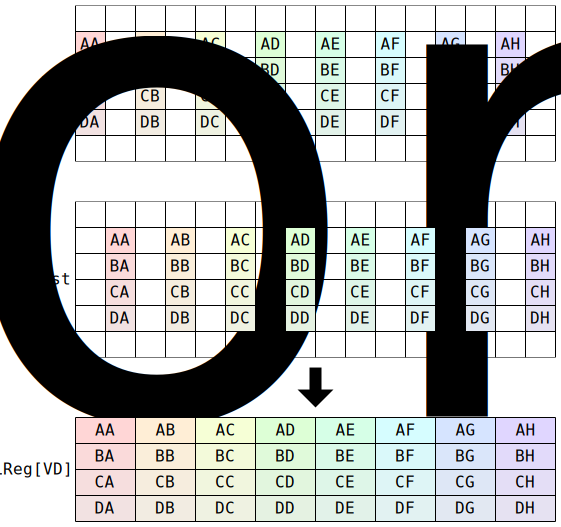

# `SFPLOADMACRO` (Move from `Dst` to `LReg` and then schedule up to four additional vector instructions)

**Summary:** This instruction starts by executing as per [`SFPLOAD`](SFPLOAD.md) to move (up to) 32 datums from [`Dst`](Dst.md) to an `LReg`. It then schedules up to four additional Vector Unit (SFPU) instructions for execution in future cycles, with this consisting of at most one instruction from each of the following four columns:

|Simple (at most one †)|MAD (at most one)|Round (at most one †)|Store (at most one)|
|---|---|---|---|
|`SFPABS`<br/>`SFPAND`<br/>`SFPARECIP`<br/>`SFPCAST`<br/>`SFPCOMPC`<br/>`SFPCONFIG`<br/>`SFPDIVP2`<br/>`SFPENCC`<br/>`SFPEXEXP`<br/>`SFPEXMAN`<br/>`SFPGT`<br/>`SFPIADD`<br/>`SFPLE`<br/>`SFPLZ`<br/>`SFPMOV`<br/>`SFPNOP`<br/>`SFPNOT`<br/>`SFPOR`<br/>`SFPPOPC`<br/>`SFPPUSHC`<br/>`SFPSETCC`<br/>`SFPSETEXP`<br/>`SFPSETMAN`<br/>`SFPSETSGN`<br/>`SFPSHFT`<br/>`SFPSWAP` (‡)<br/>`SFPTRANSP`<br/>`SFPXOR`|`SFPADD`<br/>`SFPADDI`<br/>`SFPLUT`<br/>`SFPLUTFP32`<br/>`SFPMAD`<br/>`SFPMUL`<br/>`SFPMULI`<br/>`SFPMUL24`<br/>`SFPNOP`|`SFPNOP`<br/>`SFPSHFT2`<br/>`SFPSTOCHRND`|`SFPSTORE`|

(†) If a Simple instruction and a Round instruction execute on the same cycle, then one of them needs to have `VD == 16` and the other needs to have `VD != 16`, or one needs to have `VD < 4` and the other needs to have `4 <= VD < 8`.

(‡) If `SFPSWAP` is scheduled to the Simple sub-unit, then `SFPNOP` needs to be scheduled to the MAD sub-unit for the same time.

The Vector Unit (SFPU) is capable of executing up to five instructions per cycle: one load-style instruction (`SFPLOAD` or `SFPLOADI` or `SFPLOADMACRO` or `SFPNOP`), and then one instruction from each of the above four columns. However, `SFPLOADMACRO` is the only mechanism for attaining more than one instruction per cycle, and some pre-configuration is required (via [`SFPCONFIG`](SFPCONFIG.md)).

**Backend execution unit:** [Vector Unit (SFPU)](VectorUnit.md), load sub-unit

## Syntax

```c
TT_SFPLOADMACRO(((/* u2 */ MacroIndex) << 2) +
                  /* u2 */ VDLo,
                  /* u4 */ Mod0,
                  /* u2 */ AddrMod,
                ((/* u9 */ Imm9) << 1) +
                  /* u1 */ VDHi)
```

## Encoding



## Cross-lane data movement pattern

Assuming all 32 lanes active:



Note that this pattern is the exact inverse of [`SFPSTORE`](SFPSTORE.md).

## Functional model

The `SFPLOAD` part of `SFPLOADMACRO` executes as per the [`SFPLOAD` functional model](SFPLOAD.md#functional-model), using this pair of definitions:

```c
uint4_t VD = (0 << 3) | (VDHi << 2) | VDLo;
uint10_t Imm10 = (Imm9 << 1) | VDHi;
```

The remaining part of `SFPLOADMACRO` assumes the following state, which is written via [`SFPCONFIG`](SFPCONFIG.md):

```c
struct {
  struct { // This consists of 12 bits, tightly packed, described starting from the least significant bit.
    uint4_t StoreMod0;
    uint4_t UsesLoadMod0ForStore; // 1 bit per macro
    uint4_t UnitDelayKind; // 1 bit per sub-unit
  } Misc;
  uint32_t Sequence[4]; // 32 bits per macro, with that 32 consisting of 8 bits per sub-unit
  uint32_t InstructionTemplate[4]; // Each of these is an arbitrary Vector Unit (SFPU) instruction
} LoadMacroConfig[32];
```

With this state in mind, the remaining part of `SFPLOADMACRO` is:

```c
for (auto [i, SubUnit] in enumerate({SimpleSubUnit, MADSubUnit, RoundSubUnit, StoreSubUnit}) {
  uint8_t SequenceBits = LoadMacroConfig[Lane].Sequence[MacroIndex] >> (i * 8);
  uint3_t Delay = (SequenceBits >> 3) & 7;

  // Forget any pre-existing scheduled instruction which would execute at the same point
  // in time as the instruction we're about to schedule:
  if (Delay != 7) {
    SubUnit.ForgetFutureInstructionWhoseDelayIs(Delay);
  }

  // Start with an instruction template:
  Instruction Insn;
  switch (SequenceBits & 7) {
  case 0: continue; // Do not schedule anything for this sub-unit.
  case 1: UndefinedBehaviour(); break;
  case 2: Insn.Opcode = SFPNOP; break;
  case 3: Insn.Opcode = SFPSTORE; Insn.VD = 0; break;
  case 4: Insn = ParseInsn(LoadMacroConfig[Lane].InstructionTemplate[0]); break;
  case 5: Insn = ParseInsn(LoadMacroConfig[Lane].InstructionTemplate[1]); break;
  case 6: Insn = ParseInsn(LoadMacroConfig[Lane].InstructionTemplate[2]); break;
  case 7: Insn = ParseInsn(LoadMacroConfig[Lane].InstructionTemplate[3]); break;
  }
  if (!SubUnit.CanExecuteOpcode(Insn.Opcode)) { // Consult the table at the top of this page.
    Insn.Opcode = SFPNOP;
    if (!SubUnit.CanExecuteOpcode(Insn.Opcode)) {
      // This branch applies to StoreSubUnit, which should not be fed SFPNOP.
      UndefinedBehaviour();
    }
  }

  // Override some instruction fields with values from the SFPLOADMACRO instruction:
  if (i != 3) {
    // This branch applies to SimpleSubUnit, MADSubUnit, and RoundSubUnit. The instruction's
    // VD (result LReg index) is overridden, as is either VB or VC (input LReg indices).
    if (SequenceBits & 0x80) {
      Insn.VB = VD;
      if (Insn.VC is None) {
        Insn.VC = Insn.VD;
      }
    } else {
      Insn.VC = VD;
      if (Insn.VB is None) {
        Insn.VB = Insn.VD;
      }
    }
    if (SequenceBits & 0x40) {
      Insn.VD = 16; // LReg[16] is a bonus extra LReg only writable via SFPLOADMACRO.
    } else {
      Insn.VD = VD;
    }
  } else {
    // This branch applies to StoreSubUnit. The instruction's VD (input LReg index) is
    // overridden, as are Mod0 and Imm10.
    if (SequenceBits & 0x40) {
      Insn.VD = 16; // LReg[16] is a bonus extra LReg only readable via SFPLOADMACRO.
    } else if (SequenceBits & 0x80) {
      // Leave Insn.VD as-is.
    } else {
      Insn.VD = VD;
    }
    Insn.Mod0 = LoadMacroConfig[Lane].Misc.UsesLoadMod0ForStore.Bit[MacroIndex] ? Mod0 : LoadMacroConfig[Lane].Misc.StoreMod0;
    Insn.Imm10 = Imm10;
  }

  // Schedule the instruction for future execution:
  auto DelayKind = LoadMacroConfig[Lane].Misc.UnitDelayKind.Bit[i] ? WaitForElapsedInstructions : WaitForElapsedCycles;
  SubUnit.ScheduleInstructionForFutureExecution(Insn, Delay, DelayKind);
}
```
An instruction scheduled with a delay of 0 will execute on the cycle immediately after `SFPLOADMACRO`, whereas an instruction scheduled with a delay greater than zero will gradually count down, and then execute on the cycle _after_ the cycle on which it counts down from 1 to 0. If _any_ outstanding instruction (on any sub-unit) scheduled for future execution has a delay kind of `WaitForElapsedInstructions`, then _all_ outstanding instructions (on all sub-units) have their delay counter decremented by one every time a thread issues an instruction to the Vector Unit (SFPU). On the other hand, if all outstanding instructions have a delay kind of `WaitForElapsedCycles`, then all outstanding instructions have their delay counter decremented by one every cycle. The `WaitForElapsedInstructions` delay kind is useful when a scheduled instruction consumes an input which is produced by a future instruction (it is not required when the producing instruction and the consuming instruction come from the same `SFPLOADMACRO`, but it generally is required in other cases).

There are some extra considerations for `StoreSubUnit`:
* In theory, `LoadMacroConfig` can differ between lanes (though this is not encouraged). If _any_ lane invokes `ScheduleInstructionForFutureExecution` on `StoreSubUnit`, then _all_ lanes must do so.
* The call to `ApplyPartialAddrMod` in `SFPSTORE`'s functional model is skipped for `SFPSTORE` instructions scheduled via `SFPLOADMACRO`.
* The computation of `uint10_t Addr` in `SFPSTORE`'s functional model is totally different for `SFPSTORE` instructions scheduled via `SFPLOADMACRO`: the computation in `SFPSTORE` will resolve to whatever was computed in `SFPLOADMACRO`, regardless of whether `SFPLOADMACRO` (or any other intermediate instruction) advanced any RWCs.
* In `SFPSTORE`'s functional model, `LaneConfig[Lane].DISABLE_BACKDOOR_LOAD` is replaced with `true` for `SFPSTORE` instructions scheduled via `SFPLOADMACRO`.

Instructions on other units also have extra considerations for instructions scheduled via `SFPLOADMACRO`:
* All instructions: any occurrence of `LaneConfig.DISABLE_BACKDOOR_LOAD` or `LaneConfig[Lane].DISABLE_BACKDOOR_LOAD` in the functional model is replaced with `true`.
* Simple sub-unit instructions: The usual `unsigned VB = VD;` assignment in the functional model is skipped, as the `SFPLOADMACRO` logic determines a value for `Insn.VB`.
* `SFPADDI` and `SFPMULI`: The usual `unsigned VC = VD;` assignment in the functional model is skipped, as the `SFPLOADMACRO` logic determines a value for `Insn.VC`.
* `SFPSHFT2` in `SFPSHFT2_MOD1_SHFT_IMM` mode: If the `SFPLOADMACRO` logic does `Insn.VB = VD`, then the usual `unsigned VB = Imm12 & 15;` assignment in the functional model is skipped.

If an instruction scheduled via `SFPLOADMACRO` arrives at a sub-unit on the same cycle as software issues a regular Vector Unit (SFPU) instruction to that sub-unit, then the scheduled instruction takes priority and the regular instruction is silently discarded.

## Instruction scheduling

At least three unrelated Tensix instructions need to execute after a Matrix Unit (FPU) instruction which writes (or accumulates) to `Dst` and an `SFPLOADMACRO` instruction which wants to read that same region of `Dst`. If software lacks useful instructions to fill the gap, any kind of Tensix NOP instruction can be used for this purpose. Software can also use [`STALLWAIT`](STALLWAIT.md) (with block bit B8 and condition code C7), though the recommendation (in this context) is to insert three unrelated Tensix instructions rather than using `STALLWAIT`.

If scheduling Vector Unit (SFPU) instructions for future execution, software should ensure that it doesn't subsequently issue a regular Vector Unit (SFPU) instruction to the same sub-unit for the same cycle.
