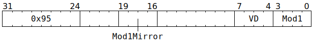

# `SFPLUTFP32` (Vectorised evaluate piecewise linear floating-point function)

**Summary:** Operating lanewise, performs one of the FP32 multiply then add variants from one of the following tables. After the computation, the sign bit of the result can optionally be replaced with the original sign bit of `LReg[3]`.

### `SFPLUTFP32_MOD1_FP32_3ENTRY_TABLE`

|Input Range|Computation|
|---|---|
|0.0 ≤ `Abs(LReg[3])` < 1.0|`VD = LReg[0] * Abs(LReg[3]) + LReg[4]`|
|1.0 ≤ `Abs(LReg[3])` < 2.0|`VD = LReg[1] * Abs(LReg[3]) + LReg[5]`|
|2.0 ≤ `Abs(LReg[3])`      |`VD = LReg[2] * Abs(LReg[3]) + LReg[6]`|

### `SFPLUTFP32_MOD1_FP16_3ENTRY_TABLE`

Due to a hardware bug, this mode writes to `LReg[LReg[7] & 15]` rather than to `LReg[VD]`. To work around this, software should ensure that the low four bits of `LReg[7]` contains the four bits which would appear as `VD`.

|Input Range|Computation|
|---|---|
|0.0 ≤ `Abs(LReg[3])` < 1.0|`LReg[LReg[7] & 15] = Lut16ToFp32(LReg[0] >> 16) * Abs(LReg[3]) + Lut16ToFp32(LReg[0])`|
|1.0 ≤ `Abs(LReg[3])` < 2.0|`LReg[LReg[7] & 15] = Lut16ToFp32(LReg[1] >> 16) * Abs(LReg[3]) + Lut16ToFp32(LReg[1])`|
|2.0 ≤ `Abs(LReg[3])`      |`LReg[LReg[7] & 15] = Lut16ToFp32(LReg[2] >> 16) * Abs(LReg[3]) + Lut16ToFp32(LReg[2])`|

### `SFPLUTFP32_MOD1_FP16_6ENTRY_TABLE1`

|Input Range|Computation|
|---|---|
|0.0 ≤ `Abs(LReg[3])` < 0.5|`VD = Lut16ToFp32(LReg[0]      ) * Abs(LReg[3]) + Lut16ToFp32(LReg[4]      )`|
|0.5 ≤ `Abs(LReg[3])` < 1.0|`VD = Lut16ToFp32(LReg[0] >> 16) * Abs(LReg[3]) + Lut16ToFp32(LReg[4] >> 16)`|
|1.0 ≤ `Abs(LReg[3])` < 1.5|`VD = Lut16ToFp32(LReg[1]      ) * Abs(LReg[3]) + Lut16ToFp32(LReg[5]      )`|
|1.5 ≤ `Abs(LReg[3])` < 2.0|`VD = Lut16ToFp32(LReg[1] >> 16) * Abs(LReg[3]) + Lut16ToFp32(LReg[5] >> 16)`|
|2.0 ≤ `Abs(LReg[3])` < 3.0|`VD = Lut16ToFp32(LReg[2]      ) * Abs(LReg[3]) + Lut16ToFp32(LReg[6]      )`|
|3.0 ≤ `Abs(LReg[3])`      |`VD = Lut16ToFp32(LReg[2] >> 16) * Abs(LReg[3]) + Lut16ToFp32(LReg[6] >> 16)`|

### `SFPLUTFP32_MOD1_FP16_6ENTRY_TABLE2`

This is almost identical to `SFPLUTFP32_MOD1_FP16_6ENTRY_TABLE1`, except that the final non-linear split happens at `4.0` rather than `3.0`.

|Input Range|Computation|
|---|---|
|0.0 ≤ `Abs(LReg[3])` < 0.5|`VD = Lut16ToFp32(LReg[0]      ) * Abs(LReg[3]) + Lut16ToFp32(LReg[4]      )`|
|0.5 ≤ `Abs(LReg[3])` < 1.0|`VD = Lut16ToFp32(LReg[0] >> 16) * Abs(LReg[3]) + Lut16ToFp32(LReg[4] >> 16)`|
|1.0 ≤ `Abs(LReg[3])` < 1.5|`VD = Lut16ToFp32(LReg[1]      ) * Abs(LReg[3]) + Lut16ToFp32(LReg[5]      )`|
|1.5 ≤ `Abs(LReg[3])` < 2.0|`VD = Lut16ToFp32(LReg[1] >> 16) * Abs(LReg[3]) + Lut16ToFp32(LReg[5] >> 16)`|
|2.0 ≤ `Abs(LReg[3])` < 4.0|`VD = Lut16ToFp32(LReg[2]      ) * Abs(LReg[3]) + Lut16ToFp32(LReg[6]      )`|
|4.0 ≤ `Abs(LReg[3])`      |`VD = Lut16ToFp32(LReg[2] >> 16) * Abs(LReg[3]) + Lut16ToFp32(LReg[6] >> 16)`|

**Backend execution unit:** [Vector Unit (SFPU)](VectorUnit.md), MAD sub-unit

## Syntax

```c
TT_SFPLUTFP32(/* u4 */ VD, /* u4 */ Mod1)
```

## Encoding



## Functional model

```c
lanewise {
  if (VD < 12 || LaneConfig[Lane].DISABLE_BACKDOOR_LOAD) {
    if (LaneEnabled) {
      float l3 = LReg[3].f32;
      float b = fabsf(l3);
      float a, c;
      uint32_t i = b < 1.0 ? 0
                 : b < 2.0 ? 1
                 :           2;
      if (Mod1 & SFPLUTFP32_MOD1_FP16_6ENTRY_TABLE1) {
        if ((Mod1 & SFPLUTFP32_MOD1_FP16_3ENTRY_TABLE) == SFPLUTFP32_MOD1_FP16_3ENTRY_TABLE) {
          a = Lut16ToFp32((LReg[i].u32 >> 16) & 0xffff);
          c = Lut16ToFp32( LReg[i].u32        & 0xffff);
        } else {
          float cut = ((Mod1 & SFPLUTFP32_MOD1_FP16_6ENTRY_TABLE2) == SFPLUTFP32_MOD1_FP16_6ENTRY_TABLE2) ? 4.0 : 3.0;
          uint32_t j = b < 0.5 ?  0
                     : b < 1.0 ? 16
                     : b < 1.5 ?  0
                     : b < 2.0 ? 16
                     : b < cut ?  0
                     :           16;
          a = Lut16ToFp32((LReg[0 + i].u32 >> j) & 0xffff);
          c = Lut16ToFp32((LReg[4 + i].u32 >> j) & 0xffff);
        }
      } else {
        a = LReg[0 + i].f32;
        c = LReg[4 + i].f32;
      }
      float d = a * b + c;
      if (Mod1 & SFPLUTFP32_MOD1_SGN_RETAIN) {
        d = copysignf(d, l3);
      }
      unsigned vd;
      if ((Mod1 & SFPLUTFP32_MOD1_INDIRECT_VD) && VD != 16) {
        vd = LReg[7].u32 & 15;
      } else {
        vd = VD;
      }
      if (vd < 8 || vd == 16) {
        LReg[vd].f32 = d;
      }
    }
  }
}
```

Supporting definitions:
```c
#define SFPLUTFP32_MOD1_FP32_3ENTRY_TABLE  0
#define SFPLUTFP32_MOD1_FP16_3ENTRY_TABLE 10 // Overlaps with SFPLUTFP32_MOD1_INDIRECT_VD!
#define SFPLUTFP32_MOD1_FP16_6ENTRY_TABLE1 2
#define SFPLUTFP32_MOD1_FP16_6ENTRY_TABLE2 3

#define SFPLUTFP32_MOD1_SGN_RETAIN 4

#define SFPLUTFP32_MOD1_INDIRECT_VD 8 // Overlaps with SFPLUTFP32_MOD1_FP16_3ENTRY_TABLE!

float Lut16ToFp32(uint16_t x) {
  uint32_t Sign = x >> 15;
  uint32_t Exp  = (x >> 10) & 0x1f;
  uint32_t Man  = x & 0x3ff;
  return std::bit_cast<float>((Sign << 31) | ((Exp == 0x1f ? 0 : 112 + Exp) << 23) | (Man << 13)); 
}
```

Note that `Lut16ToFp32` interprets some bit patterns in a way which matches IEEE754 FP16, but others are interpreted differently:

<table><thead><tr><th>Sign</th><th>Exp&nbsp;(5b)</th><th>Mant&nbsp;(10b)</th><th>IEEE 754 FP16</th><th><code>SFPLUTFP32</code>'s <code>Lut16ToFp32</code></th></tr></thead>
<tr><td>0</td><td>31</td><td>Non-zero</td><td>+NaN</td><td>+0</td></tr>
<tr><td>0</td><td>31</td><td>0</td><td>+Infinity</td><td>+0</td></tr>
<tr><td>0</td><td>1 - 30</td><td>Any</td><td colspan="2">(1 + Mant/2<sup>10</sup>) * 2<sup>Exp-15</sup></td></tr>
<tr><td>0</td><td>0</td><td>Non-zero</td><td>(0 + Mant/2<sup>10</sup>) * 2<sup>-14</sup></td><td>(1 + Mant/2<sup>10</sup>) * 2<sup>Exp-15</sup></td></tr>
<tr><td>0</td><td>0</td><td>0</td><td>+0</td><td>(1 + Mant/2<sup>10</sup>) * 2<sup>Exp-15</sup></td></tr>
<tr><td>1</td><td>0</td><td>0</td><td>-0</td><td>-(1 + Mant/2<sup>10</sup>) * 2<sup>Exp-15</sup></td></tr>
<tr><td>1</td><td>0</td><td>Non-zero</td><td>-(0 + Mant/2<sup>10</sup>) * 2<sup>-14</sup></td><td>-(1 + Mant/2<sup>10</sup>) * 2<sup>Exp-15</sup></td></tr>
<tr><td>1</td><td>1 - 30</td><td>Any</td><td colspan="2">-(1 + Mant/2<sup>10</sup>) * 2<sup>Exp-15</sup></td></tr>
<tr><td>1</td><td>31</td><td>0</td><td>-Infinity</td><td>-0</td></tr>
<tr><td>1</td><td>31</td><td>Non-zero</td><td>-NaN</td><td>-0</td></tr></table>

## IEEE754 conformance / divergence

The evaluation of `float d = a * b + c;` is as per [`SFPMAD`](SFPMAD.md#ieee754-conformance--divergence).

## Instruction scheduling

As per [`SFPMAD`](SFPMAD.md#instruction-scheduling).

For the purpose of computing the result, the `Mod1` field from the instruction encoding is used. However, for the purpose of automatic instruction scheduling, the `Mod1Mirror` field from the instruction encoding is used, and furthermore only the `SFPLUTFP32_MOD1_INDIRECT_VD` bit therein is used. The implications for the automatic stalling logic are:
* When `SFPLUTFP32_MOD1_INDIRECT_VD` is set in `Mod1Mirror`: the stalling logic conservatively assumes that `SFPLUTFP32` reads from every `LReg` and writes to every `LReg`.
* When `SFPLUTFP32_MOD1_INDIRECT_VD` is clear in `Mod1Mirror`: the stalling logic conservatively assumes that `SFPLUTFP32` reads from every `LReg` other than `LReg[7]`, and writes to `VD`.

When using `SFPLUTFP32_MOD1_FP16_3ENTRY_TABLE`, the stalling logic is conservative: it assumes that `LReg[4]`, `LReg[5]`, and `LReg[6]` are read, even though `SFPLUTFP32_MOD1_FP16_3ENTRY_TABLE` doesn't depend on any of these. This can have negative effects on performance. Software can work around this by entirely disabling the automatic stalling logic, with the tradeoff that software then becomes responsible for correct instruction scheduling.
