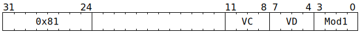

# `SFPLZ` (Vectorised count leading zeroes)

**Summary:** Performs lanewise count leading zeroes (`lzcnt`) on a vector of 32-bit unsigned integers or on the magnitudes of a vector of sign-magnitude integers. Inputs equal to zero are considered to have 32 leading zeroes. Lane flags can also be set based on whether the input was equal to zero.

**Backend execution unit:** [Vector Unit (SFPU)](VectorUnit.md), simple sub-unit

## Syntax

```c
TT_SFPLZ(0, /* u4 */ VC, /* u4 */ VD, /* u4 */ Mod1)
```

## Encoding



## Functional model

```c
if (VD < 8 || VD == 16) {
  lanewise {
    if (LaneEnabled) {
      uint32_t c = LReg[VC].u32; // Unsigned integer or sign-magnitude integer.
      if (Mod1 & SFPLZ_MOD1_NOSGN_MASK) {
        // Mask off top bit (i.e. sign bit) of c.
        c &= 0x7fffffffu;
      }
      LReg[VD].u32 = (c != 0) ? __builtin_clz(c) : 32; // Any kind of integer.
      if (VD < 8) {
        if (Mod1 & SFPLZ_MOD1_CC_NE0) {
          LaneFlags = (c != 0);
        }
        if (Mod1 & SFPLZ_MOD1_CC_COMP) {
          LaneFlags = !LaneFlags;
        }
      }
    }
  }
}
```

Supporting definitions:
```c
#define SFPLZ_MOD1_CC_NE0     2
#define SFPLZ_MOD1_NOSGN_MASK 4
#define SFPLZ_MOD1_CC_COMP    8
```
