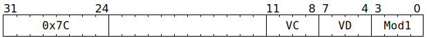

# `SFPMOV` (Vector register move)

**Summary:** Usually just moves one vector register to another, though some other modes of operation are also available:
* Move one vector register to another.
* Move one vector register to another, ignoring current lane-enable mask.
* Move from a configuration vector register to a regular vector register (i.e. inverse of [`SFPCONFIG`](SFPCONFIG.md)).
* Negate a vector of sign-magnitude integers or a vector of FP32.
* Obtain a vector of random bits from the PRNG.

**See also:** [`SFPLOAD`](SFPLOAD.md) for moving from `Dst` to `LReg`, [`SFPSTORE`](SFPSTORE.md) for moving from `LReg` to `Dst`, [`SFPCONFIG`](SFPCONFIG.md) for moving from `LReg[0]` to configuration.

**Backend execution unit:** [Vector Unit (SFPU)](VectorUnit.md), simple sub-unit

## Syntax

```c
TT_SFPMOV(0, /* u4 */ VC, /* u4 */ VD, /* u4 */ Mod1)
```

## Encoding



## Functional model

```c
lanewise {
  if (VD < 12 || LaneConfig.DISABLE_BACKDOOR_LOAD) {
    if (LaneEnabled || Mod1 == SFPMOV_MOD1_ALL_LANES_ENABLED) {
      uint32_t x;
      if (Mod1 & SFPMOV_MOD1_FROM_SPECIAL) {
        // The interpretation of VC here mostly matches SFPCONFIG's interpretation of VD.
        switch (VC) {
        case  0: case 1: case 2: case 3: x = LoadMacroConfig.InstructionTemplate[VC]; break;
        case  4: case 5: case 6: case 7: x = LoadMacroConfig.Sequence[VC - 4]; break;
        case  8: x = LoadMacroConfig.Misc; break;
        case  9: x = AdvancePRNG(); break;
        case 15: x = LaneConfig; break;
        default: x = 0; break;
        }
      } else {
        x = LReg[VC].u32;
        if (Mod1 & SFPMOV_MOD1_NEGATE) {
          x ^= 0x80000000; // Inverts sign bit (FP32 or sign-magnitude integer).
        }
      }
      if (VD < 8 || VD == 16) {
        LReg[VD].u32 = x;
      }
    }
  }
}
```

Supporting definitions:
```c
#define SFPMOV_MOD1_NEGATE            1
#define SFPMOV_MOD1_ALL_LANES_ENABLED 2
#define SFPMOV_MOD1_FROM_SPECIAL      8
```
