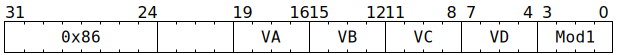

# `SFPMUL` (Vectorised floating-point multiply)

**Summary:** Identical to [`SFPMAD`](SFPMAD.md), but is the preferred opcode when `VC == 9`, as this causes the computation to be lanewise FP32 `VD = ±(VA * VB) ± 0` (see the definition of [`LReg[9]`](LReg.md)). If software cares about preserving the sign of negative zero in multiplications, it should use `SFPMUL` with `VC == 9` and `SFPMAD_MOD1_NEGATE_VC` set within `Mod1`, as `-0` rather than `+0` is the identity element in floating-point addition.

**Backend execution unit:** [Vector Unit (SFPU)](VectorUnit.md), MAD sub-unit

## Syntax

```c
TT_SFPMUL(/* u4 */ VA, /* u4 */ VB, /* u4 */ VC, /* u4 */ VD, /* u4 */ Mod1)
```

## Encoding



## Functional model

As per [`SFPMAD`](SFPMAD.md#functional-model).

## IEEE754 conformance / divergence

As per [`SFPMAD`](SFPMAD.md#ieee754-conformance--divergence).

## Instruction scheduling

As per [`SFPMAD`](SFPMAD.md#instruction-scheduling).
