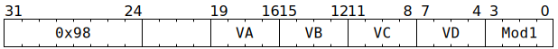

# `SFPMUL24` (Vectorised multiply of 23-bit integers)

**Summary:** Performs lanewise multiplication of two 23-bit integers, returning either the low 23 bits or high 23 bits of their product. In some modes, the `VA` and/or `VD` indices from the instruction bits are ignored, and instead come from the low four bits of `LReg[7]` (which allows these bits to potentially differ between lanes). Due to how the floating-point datapath is reused for `SFPMUL24`, an exotic shift/add-like operation is performed after the multiply, though software is strongly encouraged to turn this operation into a no-op by always setting `VC == 9` (which refers to the constant zero; see the definition of [`LReg[9]`](LReg.md)).

**Backend execution unit:** [Vector Unit (SFPU)](VectorUnit.md), MAD sub-unit

> [!TIP]
> This instruction is new in Blackhole.

## Syntax

```c
TT_SFPMUL24(/* u4 */ VA, /* u4 */ VB, /* u4 */ VC, /* u4 */ VD, /* u4 */ Mod1)
```

## Encoding



## Functional model

```c
lanewise {
  if (VD < 12 || LaneConfig[Lane].DISABLE_BACKDOOR_LOAD) {
    if (LaneEnabled) {
      unsigned va = Mod1 & SFPMUL24_MOD1_INDIRECT_VA ? LReg[7].u32 & 15 : VA;
      uint32_t a = LReg[va].u32;
      uint32_t b = LReg[VB].u32;
      uint32_t d;
      if (Mod1 & SFPMUL24_MOD1_UPPER) {
        d = ((a & 0x7fffffull) * (b & 0x7fffffull)) >> 23;
      } else {
        d = (a * b) & 0x7fffff;
      }
      d = Mul24ShiftAdd(d, LReg[VC].u32);
      unsigned vd;
      if ((Mod1 & SFPMUL24_MOD1_INDIRECT_VD) && VD != 16) {
        vd = LReg[7].u32 & 15;
      } else {
        vd = VD;
      }
      if (vd < 8 || vd == 16) {
        LReg[vd].u32 = d;
      }
    }
  }
}
```

Supporting definitions:

```c
#define SFPMUL24_MOD1_UPPER 1
#define SFPMUL24_MOD1_INDIRECT_VA 4
#define SFPMUL24_MOD1_INDIRECT_VD 8

uint32_t Mul24ShiftAdd(uint32_t p_m, uint32_t z) {
  unsigned z_e = (z >> 23) & 0xff;
  if (z_e) {
    unsigned p_e = 129;
    unsigned r_e = p_e > z_e ? p_e : z_e;
    unsigned s = (r_e - z_e) & 31;
    uint32_t z_m = (1u << 23) + (z & 0x7fffff);
    uint32_t z_m_grs = z_m << 3;
    p_m >>= (r_e - p_e) & 31;
    if ((z_m = z_m_grs >> s)) {
      p_m += z_m;
      p_m += (((z_m << s) ^ z_m_grs) > 0xffff) << 16;
      p_m &= 0x7fffff;
    }
  }
  return p_m;
}
```

## Instruction scheduling

As per [`SFPMAD`](SFPMAD.md#instruction-scheduling).
