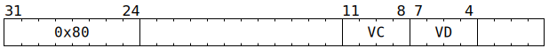

# `SFPNOT` (Vectorised bitwise-not)

**Summary:** Performs lanewise bitwise-not on a vector of 32-bit unsigned integers.

**Backend execution unit:** [Vector Unit (SFPU)](VectorUnit.md), simple sub-unit

## Syntax

```c
TT_SFPNOT(0, /* u4 */ VC, /* u4 */ VD, 0)
```

## Encoding



## Functional model

```c
if (VD < 8 || VD == 16) {
  lanewise {
    if (LaneEnabled) {
      LReg[VD].u32 = ~LReg[VC].u32;
    }
  }
}
```
