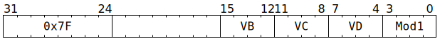

# `SFPOR` (Vectorised bitwise-or)

**Summary:** Performs lanewise bitwise-or between two vectors of 32-bit unsigned integers.

**Backend execution unit:** [Vector Unit (SFPU)](VectorUnit.md), simple sub-unit

> [!TIP]
> Compared to Wormhole, the major upgrade to `SFPOR` in Blackhole is the `SFPOR_MOD1_USE_VB` modifier.

## Syntax

```c
TT_SFPOR(/* u4 */ VB, /* u4 */ VC, /* u4 */ VD, /* u4 */ Mod1)
```

## Encoding



## Functional model

```c
unsigned vb = (Mod1 & SFPOR_MOD1_USE_VB) ? VB : VD;
if (VD < 8 || VD == 16) {
  lanewise {
    if (LaneEnabled) {
      LReg[VD].u32 = LReg[vb].u32 | LReg[VC].u32;
    }
  }
}
```

Supporting definitions:

```c
#define SFPOR_MOD1_USE_VB 1
```
