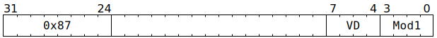

# `SFPPUSHC` (Push onto vector conditional execution stack)

**Summary:** Pushes a copy of the current lane predication masks (per-lane `LaneFlags` and `UseLaneFlagsForLaneEnable`) onto the vector conditional execution stack. The stack has a maximum capacity of eight elements, and this instruction must not be used if the stack is already full.

**Backend execution unit:** [Vector Unit (SFPU)](VectorUnit.md), simple sub-unit

> [!TIP]
> Compared to Wormhole, the major upgrade to `SFPPUSHC` in Blackhole is `Mod1`: the value of `0` (plain push) corresponds to the Wormhole behaviour, whereas all the non-zero values are new and perform replacements or modifications of the stack top rather than pushing.

## Syntax

```c
TT_SFPPUSHC(0, 0, /* u4 */ VD, /* u4 */ Mod1)
```

## Encoding



## Functional model

```c
lanewise {
  if (VD < 12 || LaneConfig.DISABLE_BACKDOOR_LOAD) {
    if (Mod1 == 0) {
      // Plain push to stack.
      if (FlagStack.Size() >= 8) {
        // Software should avoid using `Mod1 == 0` when the stack is full.
        UndefinedBehaviour();
      }
      FlagStack.Push({LaneFlags, UseLaneFlagsForLaneEnable});
    } else {
      // Replace or mutate top of stack.
      if (FlagStack.IsEmpty()) {
        // Software should avoid using `Mod1 != 0` when the stack is empty.
        UndefinedBehaviour();
      }
      FlagStackEntry Top = FlagStack.Top();
      if (Mod1 <= 12) {
        // Replace stack top UseLaneFlagsForLaneEnable with current state,
        // and mutate stack top LaneFlags using current state.
        Top.UseLaneFlagsForLaneEnable = UseLaneFlagsForLaneEnable;
        Top.LaneFlags = BooleanOp(Mod1, Top.LaneFlags, LaneFlags);
      } else if (Mod1 == 13) {
        // Invert LaneFlags, then replace stack top with revised current state.
        LaneFlags = !LaneFlags;
        Top.UseLaneFlagsForLaneEnable = UseLaneFlagsForLaneEnable;
        Top.LaneFlags = LaneFlags;
      } else if (Mod1 == 14) {
        // Replace stack top with constants.
        Top.UseLaneFlagsForLaneEnable = true;
        Top.LaneFlags = true;
      } else if (Mod1 == 15) {
        // Replace stack top with constants.
        Top.UseLaneFlagsForLaneEnable = true;
        Top.LaneFlags = false;
      }
      FlagStack.Top() = Top;
    }
  }
}
```

Supporting definitions:
```c
bool BooleanOp(uint4_t Mod1, bool A, bool B) {
  switch (Mod1) {
  case  1: return        B;
  case  2: return       !B;
  case  3: return  A &&  B;
  case  4: return  A ||  B;
  case  5: return  A && !B;
  case  6: return  A || !B;
  case  7: return !A &&  B;
  case  8: return !A ||  B;
  case  9: return !A && !B;
  case 10: return !A || !B;
  case 11: return  A !=  B;
  case 12: return  A ==  B;
  }
}
```
