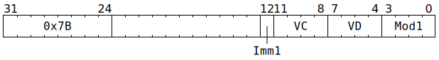

# `SFPSETCC` (Vectorised compare against zero)

**Summary:** Operating lanewise, performs a comparison `VC < 0` or `VC != 0` or `VC >= 0` or `VC == 0`, and writes the result of the comparison to `LaneFlags`. The elements of the input vector can be any type of 32-bit data, though software should ensure that sign-magnitude integers and FP32 have had negative zero flushed to positive zero.

**Backend execution unit:** [Vector Unit (SFPU)](VectorUnit.md), simple sub-unit

## Syntax

```c
TT_SFPSETCC(/* u1 */ Imm1, /* u4 */ VC, /* u4 */ VD, /* u4 */ Mod1)
```

## Encoding



## Functional model

```c
lanewise {
  if (VD < 12 || LaneConfig.DISABLE_BACKDOOR_LOAD) {
    if (LaneEnabled) {
      if (!UseLaneFlagsForLaneEnable) {
        LaneFlags = false;
      } else if (Mod1 & SFPSETCC_MOD1_CLEAR) {
        LaneFlags = false;
      } else if (Mod1 & SFPSETCC_MOD1_IMM_BIT0) {
        LaneFlags = (Imm1 != 0);
      } else {
        int32_t c = LReg[VC].i32;
        switch (Mod1) {
        case SFPSETCC_MOD1_LREG_LT0:  LaneFlags = (c <  0); break;
        case SFPSETCC_MOD1_LREG_NE0:  LaneFlags = (c != 0); break;
        case SFPSETCC_MOD1_LREG_GTE0: LaneFlags = (c >= 0); break;
        case SFPSETCC_MOD1_LREG_EQ0:  LaneFlags = (c == 0); break;
        }
      }
    }
  }
}
```

Supporting definitions:
```c
#define SFPSETCC_MOD1_IMM_BIT0  1
#define SFPSETCC_MOD1_CLEAR     8

#define SFPSETCC_MOD1_LREG_LT0  0
#define SFPSETCC_MOD1_LREG_NE0  2
#define SFPSETCC_MOD1_LREG_GTE0 4
#define SFPSETCC_MOD1_LREG_EQ0  6
```
