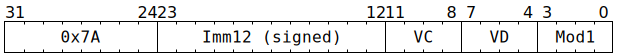

# `SFPSHFT` (Vectorised bitwise shift)

**Summary:** Performs lanewise bitwise shift left or arithmetic shift right or bitwise shift right on a vector of 32-bit integers.

**Backend execution unit:** [Vector Unit (SFPU)](VectorUnit.md), simple sub-unit

> [!TIP]
> Compared to Wormhole, the major upgrades to `SFPSHFT` in Blackhole are the `SFPSHFT_MOD1_ARITHMETIC` and `SFPSHFT_MOD1_ARG_IMM_USE_VC` modifiers.

## Syntax

```c
TT_SFPSHFT(/* i12 */ (Imm12 & 0xfff), /* u4 */ VC, /* u4 */ VD, /* u4 */ Mod1)
```

## Encoding



## Functional model

```c
unsigned VB = VD;
if (VD < 8 || VD == 16) {
  lanewise {
    if (LaneEnabled) {
      uint32_t x = LReg[VB].u32;
      int32_t ShiftAmount = LReg[VC].i32;
      if (Mod1 & SFPSHFT_MOD1_ARG_IMM) {
        if (Mod1 & SFPSHFT_MOD1_ARG_IMM_USE_VC) {
          x = (uint32_t)ShiftAmount;
        }
        ShiftAmount = Imm12;
      }
      if (ShiftAmount >= 0) {
        LReg[VD].u32 = x << (ShiftAmount & 31);
      } else if (Mod1 & SFPSHFT_MOD1_ARITHMETIC) {
        LReg[VD].i32 = (int32_t)x >> ((-ShiftAmount) & 31);
      } else {
        LReg[VD].u32 = x >> ((-ShiftAmount) & 31);
      }
    }
  }
}
```

Supporting definitions:
```c
#define SFPSHFT_MOD1_ARG_IMM        1
#define SFPSHFT_MOD1_ARITHMETIC     2
#define SFPSHFT_MOD1_ARG_IMM_USE_VC 4
```
