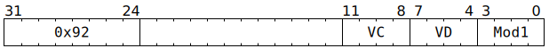

# `SFPSWAP` (Vectorised swap or min+max or argmin+argmax)

**Summary:** In its simplest mode, `SFPSWAP` swaps the contents of two vectors. In the next mode up, it takes two vectors of FP32 or two vectors of 32-bit sign-magnitude integers, simultaneously computes the lanewise minimum and lanewise maximum, and returns both vectors. In its most complex mode, it can be used for argmin+argmax: conditionally swap a pair of vectors (lanewise) based on the results of comparing a different pair of vectors (lanewise).

**Backend execution unit:** [Vector Unit (SFPU)](VectorUnit.md)

## Syntax

```c
TT_SFPSWAP(0, /* u4 */ VC, /* u4 */ VD, /* u4 */ Mod1)
```

## Encoding



## Functional model

```c
uint32_t VDGetsMin;
switch (Mod1) {
case SFPSWAP_MOD1_SWAP:            /* VDGetsMin not used */    break; // Unconditional swap of VD and VC.
case SFPSWAP_MOD1_VEC_MIN_MAX:        VDGetsMin = 0xffffffffu; break; // In all lanes, VD = min and VC = max.
case SFPSWAP_MOD1_SUBVEC_MIN01_MAX23: VDGetsMin = 0x0000ffffu; break; // In first 16 lanes, VD = min and VC = max, opposite in last 16 lanes.
case SFPSWAP_MOD1_SUBVEC_MIN02_MAX13: VDGetsMin = 0x00ff00ffu; break;
case SFPSWAP_MOD1_SUBVEC_MIN03_MAX12: VDGetsMin = 0xff0000ffu; break; // In first 8 lanes and last 8 lanes, VD = min and VC = max, opposite in middle 16 lanes.
case SFPSWAP_MOD1_SUBVEC_MIN0_MAX123: VDGetsMin = 0x000000ffu; break; // In first 8 lanes, VD = min and VC = max, opposite in other 24 lanes.
case SFPSWAP_MOD1_SUBVEC_MIN1_MAX023: VDGetsMin = 0x0000ff00u; break;
case SFPSWAP_MOD1_SUBVEC_MIN2_MAX013: VDGetsMin = 0x00ff0000u; break;
case SFPSWAP_MOD1_SUBVEC_MIN3_MAX012: VDGetsMin = 0xff000000u; break;
default:                              VDGetsMin = 0x00000000u; break; // In all lanes, VD = max and VC = min.
}
for (unsigned Lane = 0; Lane < 32; ++Lane) {
  // NB: All operations are lanewise; explicit Lane indexing is done
  // because in some modes, one bit of VDGetsMin is used per lane.
  if (VD < 12 || LaneConfig[Lane].DISABLE_BACKDOOR_LOAD) {
    if (LaneEnabled[Lane]) {
      uint32_t VCVal = LReg[VC][Lane].u32;
      uint32_t VDVal = LReg[VD][Lane].u32;
      bool ShouldSwap;
      if (Mod1 == SFPSWAP_MOD1_SWAP) {
        // Unconditional swap.
        ShouldSwap = true;
      } else {
        // Min+max or argmin+argmax, implemented as a conditional swap: do
        // nothing if the values are already correctly ordered, otherwise
        // swap them.
        if (VDGetsMin.Bit[Lane]) {
          // Want to end up with VD = min, so swap if VC is smaller.
          ShouldSwap = SignMagIsSmaller(VCVal, VDVal);
        } else {
          // Want to end up with VD = max, so swap if VC is larger.
          ShouldSwap = !SignMagIsSmaller(VCVal, VDVal);
        }
        if (LaneConfig[Lane].EXCHANGE_SRCB_SRCC) {
          ShouldSwap = !ShouldSwap;
        }
      }
      if (ShouldSwap) {
        if (LaneConfig[Lane].ENABLE_DEST_INDEX) {
          // If VC/VD in LReg[0] ... LReg[3], write min+max results there as
          // part of doing argmin+argmax.
          if (VC < 4) LReg[VC][Lane].u32 = VDVal;
          if (VD < 4) LReg[VD][Lane].u32 = VCVal;
          // Then the argmin+argmax part: perform a conditional swap in
          // LReg[4] ... LReg[7] based on the VC/VD comparison.
          uint4_t VCA = 4 + (VC & 3);
          uint4_t VDA = 4 + (VD & 3);
          uint32_t VCAVal = LReg[VCA][Lane].u32;
          uint32_t VDAVal = LReg[VDA][Lane].u32;
          LReg[VCA][Lane].u32 = VDAVal;
          LReg[VDA][Lane].u32 = VCAVal;
        } else {
          // Unconditional swap or write min+max results.
          if (VC < 8) LReg[VC][Lane].u32 = VDVal;
          if (VD < 8) LReg[VD][Lane].u32 = VCVal;
        }
      }
    }
  }
}
```

Supporting definitions:
```c
#define SFPSWAP_MOD1_SWAP               0
#define SFPSWAP_MOD1_VEC_MIN_MAX        1
#define SFPSWAP_MOD1_SUBVEC_MIN01_MAX23 2
#define SFPSWAP_MOD1_SUBVEC_MIN02_MAX13 3
#define SFPSWAP_MOD1_SUBVEC_MIN03_MAX12 4
#define SFPSWAP_MOD1_SUBVEC_MIN0_MAX123 5
#define SFPSWAP_MOD1_SUBVEC_MIN1_MAX023 6
#define SFPSWAP_MOD1_SUBVEC_MIN2_MAX013 7
#define SFPSWAP_MOD1_SUBVEC_MIN3_MAX012 8

bool SignMagIsSmaller(uint32_t C, uint32_t D) {
  // This treats C and D as sign-magnitude integers and determines
  // whether C is less than D. If C and D are instead FP32, this
  // still determines whether C is less than D, using the total
  // order where -NaN < -Inf < ... < -0 < +0 < ... < +Inf < +NaN.

  // For purposes of exposition, remap sign-mag -0 ... -2^31-1
  // to two's-comp -1 ... -2^31, then perform two's-comp comparison.
  C ^= (uint32_t)((int32_t)C >> 30) >> 1;
  D ^= (uint32_t)((int32_t)D >> 30) >> 1;
  return (int32_t)C < (int32_t)D;
}
```

## Instruction scheduling

If `SFPSWAP` is used, then on the next cycle, the only instruction that the Vector Unit (SFPU) can accept is `SFPNOP`. If a thread presents any other Vector Unit (SFPU) instruction, then hardware will automatically stall the thread for one cycle. As such, software does not _need_ to insert an `SFPNOP` instruction after `SFPSWAP`, but if it does regardless, the sequence of `SFPSWAP` and `SFPNOP` only requires two cycles rather than three.

> [!CAUTION]
> Automatic stalling does not apply to `SFPSWAP` instructions executed as part of an [`SFPLOADMACRO`](SFPLOADMACRO.md) sequence. When constructing such sequences, software should be aware that `SFPSWAP` executes for two cycles: it reads `VC` and `VD` on its 1<sup>st</sup> cycle to compare them, and then if a swap is to be performed, the 2<sup>nd</sup> cycle involves reading `VC` and `VD` again and then writing them (swapped around).
