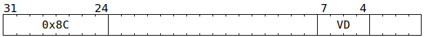
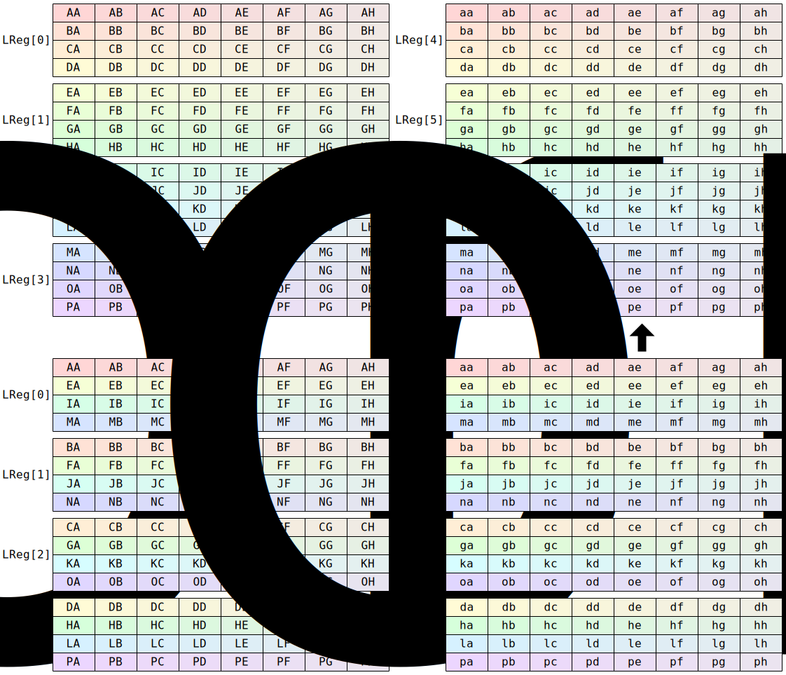

# `SFPTRANSP` (Transpose rows between vector registers)

**Summary:** Viewing each vector register as a 4x8 grid of lanes, a group of four registers is stacked vertically to form a 16x8 grid, then a transpose is performed within each column: the 16 values in the column are reshaped to 4x4, transposed, then reshaped back. This is applied to `LReg[0:4]` and also to `LReg[4:8]`.

> [!CAUTION]
> This instruction is _not_ performing a transpose on a 4x8 grid, nor is it stacking two registers to form an 8x8 grid and then transposing that. Instead, it stacks four registers and then the data movement is purely column-wise. The "transpose" part of the name comes from viewing each column of 16 values as a 4x4 matrix and transposing _that_. Alternatively, the stacked registers can be viewed as a 3D tensor of shape 4x4x8, with the instruction swapping the axes whose length is 4 (i.e. transposing the _leftmost_ two axes of that tensor, not the rightmost two as might be expected).

**Backend execution unit:** [Vector Unit (SFPU)](VectorUnit.md), simple sub-unit

## Syntax

```c
TT_SFPTRANSP(0, 0, /* u4 */ VD, 0)
```

## Encoding



## Cross-lane data movement pattern

Assuming all 32 lanes active:



## Functional model

```c
if (VD < 12 || LaneConfig.DISABLE_BACKDOOR_LOAD) {
  Transpose4(0);
  Transpose4(4);
}
```

Supporting definitions:

```c
void Transpose4(unsigned Base) {
  for (unsigned Column = 0; Column < 8; ++Column) {
    for (unsigned i = 0; i < 4; ++i) {
      for (unsigned j = 0; j < i; ++j) {
        auto ij = LReg[Base + i][j * 8 + Column];
        auto ji = LReg[Base + j][i * 8 + Column];
        if (LaneEnabled[j * 8 + Column]) LReg[Base + i][j * 8 + Column] = ji;
        if (LaneEnabled[i * 8 + Column]) LReg[Base + j][i * 8 + Column] = ij;
      }
    }
  }
}
```
