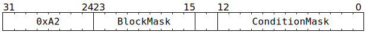

# `STALLWAIT` (Limit thread execution until assorted conditions met)

**Summary:** One or more assorted conditions are selected using a bitmask, and one or more blocked instructions are selected using another bitmask. The issuing thread can continue execution until one of the blocked instructions is reached, at which point execution of the thread is paused until all of the selected conditions are simultaneously met.

**Backend execution unit:** [Sync Unit](SyncUnit.md)

> [!TIP]
> Blackhole renumbers the condition mask bits slightly as compared to Wormhole. Software is encouraged to use architecture-specific defines to abstract away the differences.

## Syntax

```c
TT_STALLWAIT(/* u9 */ BlockMask, /* u13 */ ConditionMask)
```

## Encoding



## Functional model

The instruction is considered complete once the following happens:
```c
WaitGate[CurrentThread].LatchedWaitInstruction.Opcode = STALLWAIT;
WaitGate[CurrentThread].LatchedWaitInstruction.ConditionMask = ConditionMask ? ConditionMask : 0x0F;
WaitGate[CurrentThread].LatchedWaitInstruction.BlockMask = BlockMask ? BlockMask : (1u << 6);
WaitGate[CurrentThread].LatchedWaitInstruction.SemaphoreMask = 0;
```

The Wait Gate will then continuously re-evaluate the latched wait instruction until all of the selected conditions are simultaneously met, at which point the latched wait instruction will be forgotten, and instructions will no longer be blocked. The new latched wait instruction takes effect immediately, so it will influence whether or not the instruction immediately after `STALLWAIT` can pass through the Wait Gate. There is a one cycle lag between the condition(s) being met and the block mask being removed - in particular this means that the instruction immediately after `STALLWAIT` will always be subject to the block mask for at least one cycle, even if the condition(s) are met immediately.

## Block mask

The block mask consists of nine bits, named B0 (least significant bit) through B8 (most significant bit). The approximate meaning of each bit is:

||Approximate meaning|
|---|---|
|**B0**|Block thread from starting new [Miscellaneous Unit](MiscellaneousUnit.md), [Mover](XMOV.md), [Scalar Unit (ThCon)](ScalarUnit.md), [Packer](Packers/README.md), or Unpacker instructions|
|**B1**|Block thread from starting new [Sync Unit](SyncUnit.md) instructions|
|**B2**|Block thread from starting new [Packer](Packers/README.md) instructions|
|**B3**|Block thread from starting new Unpacker instructions|
|**B4**|Block thread from starting new [Mover](XMOV.md) instructions|
|**B5**|Block thread from starting new [Scalar Unit (ThCon)](ScalarUnit.md) instructions|
|**B6**|Block thread from starting new [Matrix Unit (FPU)](MatrixUnit.md) instructions|
|**B7**|Block thread from starting new [Configuration Unit](ConfigurationUnit.md) instructions|
|**B8**|Block thread from starting new Vector Unit (SFPU) instructions|

The exact set of instructions blocked from starting by each bit is:

<table><thead><tr><th>Instruction</th><th>B0</th><th>B1</th><th>B2</th><th>B3</th><th>B4</th><th>B5</th><th>B6</th><th>B7</th><th>B8</th></tr></thead>
<tr><th align="left"><code>ADDDMAREG</code></th><td align="center">❌</td><td></td><td></td><td></td><td></td><td align="center">❌</td><td></td><td></td><td></td></tr>
<tr><th align="left"><code>ADDRCRXY</code></th><td align="center">❌</td><td></td><td></td><td></td><td></td><td></td><td></td><td></td><td></td></tr>
<tr><th align="left"><code>ADDRCRZW</code></th><td align="center">❌</td><td></td><td></td><td></td><td></td><td></td><td></td><td></td><td></td></tr>
<tr><th align="left"><code>APOOL3S1</code></th><td></td><td></td><td></td><td></td><td></td><td></td><td align="center">❌</td><td></td><td></td></tr>
<tr><th align="left"><code>APOOL3S2</code></th><td></td><td></td><td></td><td></td><td></td><td></td><td align="center">❌</td><td></td><td></td></tr>
<tr><th align="left"><code>ATCAS</code></th><td align="center">❌</td><td></td><td></td><td></td><td></td><td align="center">❌</td><td></td><td></td><td></td></tr>
<tr><th align="left"><code>ATGETM</code></th><td></td><td align="center">❌</td><td></td><td></td><td></td><td></td><td></td><td></td><td></td></tr>
<tr><th align="left"><code>ATINCGET</code></th><td align="center">❌</td><td></td><td></td><td></td><td></td><td align="center">❌</td><td></td><td></td><td></td></tr>
<tr><th align="left"><code>ATINCGETPTR</code></th><td align="center">❌</td><td></td><td></td><td></td><td></td><td align="center">❌</td><td></td><td></td><td></td></tr>
<tr><th align="left"><code>ATRELM</code></th><td></td><td align="center">❌</td><td></td><td></td><td></td><td></td><td></td><td></td><td></td></tr>
<tr><th align="left"><code>ATSWAP</code></th><td align="center">❌</td><td></td><td></td><td></td><td></td><td align="center">❌</td><td></td><td></td><td></td></tr>
<tr><th align="left"><code>BITWOPDMAREG</code></th><td align="center">❌</td><td></td><td></td><td></td><td></td><td align="center">❌</td><td></td><td></td><td></td></tr>
<tr><th align="left"><code>CFGSHIFTMASK</code></th><td></td><td></td><td></td><td></td><td></td><td></td><td></td><td align="center">❌</td><td></td></tr>
<tr><th align="left"><code>CLEARDVALID</code></th><td></td><td></td><td></td><td></td><td></td><td></td><td align="center">❌</td><td></td><td></td></tr>
<tr><th align="left"><code>CLREXPHIST</code></th><td></td><td></td><td></td><td></td><td></td><td></td><td align="center">❌</td><td></td><td></td></tr>
<tr><th align="left"><code>CMPDMAREG</code></th><td align="center">❌</td><td></td><td></td><td></td><td></td><td align="center">❌</td><td></td><td></td><td></td></tr>
<tr><th align="left"><code>CONV3S1</code></th><td></td><td></td><td></td><td></td><td></td><td></td><td align="center">❌</td><td></td><td></td></tr>
<tr><th align="left"><code>CONV3S2</code></th><td></td><td></td><td></td><td></td><td></td><td></td><td align="center">❌</td><td></td><td></td></tr>
<tr><th align="left"><code>DMANOP</code></th><td align="center">❌</td><td></td><td></td><td></td><td></td><td align="center">❌</td><td></td><td></td><td></td></tr>
<tr><th align="left"><code>DOTPV</code></th><td></td><td></td><td></td><td></td><td></td><td></td><td align="center">❌</td><td></td><td></td></tr>
<tr><th align="left"><code>ELWADD</code></th><td></td><td></td><td></td><td></td><td></td><td></td><td align="center">❌</td><td></td><td></td></tr>
<tr><th align="left"><code>ELWMUL</code></th><td></td><td></td><td></td><td></td><td></td><td></td><td align="center">❌</td><td></td><td></td></tr>
<tr><th align="left"><code>ELWSUB</code></th><td></td><td></td><td></td><td></td><td></td><td></td><td align="center">❌</td><td></td><td></td></tr>
<tr><th align="left"><code>FLUSHDMA</code></th><td align="center">❌</td><td></td><td></td><td></td><td></td><td align="center">❌</td><td></td><td></td><td></td></tr>
<tr><th align="left"><code>GAPOOL</code></th><td></td><td></td><td></td><td></td><td></td><td></td><td align="center">❌</td><td></td><td></td></tr>
<tr><th align="left"><code>GATESRCRST</code></th><td></td><td></td><td></td><td></td><td></td><td></td><td align="center">❌</td><td></td><td></td></tr>
<tr><th align="left"><code>GMPOOL</code></th><td></td><td></td><td></td><td></td><td></td><td></td><td align="center">❌</td><td></td><td></td></tr>
<tr><th align="left"><code>INCADCXY</code></th><td align="center">❌</td><td></td><td></td><td></td><td></td><td></td><td></td><td></td><td></td></tr>
<tr><th align="left"><code>INCADCZW</code></th><td align="center">❌</td><td></td><td></td><td></td><td></td><td></td><td></td><td></td><td></td></tr>
<tr><th align="left"><code>INCRWC</code></th><td></td><td></td><td></td><td></td><td></td><td></td><td align="center">❌</td><td></td><td></td></tr>
<tr><th align="left"><code>LOADIND</code></th><td align="center">❌</td><td></td><td></td><td></td><td></td><td align="center">❌</td><td></td><td></td><td></td></tr>
<tr><th align="left"><code>LOADREG</code></th><td align="center">❌</td><td></td><td></td><td></td><td></td><td align="center">❌</td><td></td><td></td><td></td></tr>
<tr><th align="left"><code>MFCONV3S1</code></th><td></td><td></td><td></td><td></td><td></td><td></td><td align="center">❌</td><td></td><td></td></tr>
<tr><th align="left"><code>MOP</code></th><td align="center" colspan="9">N/A: Processed by MOP Expander, so never reaches the Wait Gate</td></tr>
<tr><th align="left"><code>MOP_CFG</code></th><td align="center" colspan="9">N/A: Processed by MOP Expander, so never reaches the Wait Gate</td></tr>
<tr><th align="left"><code>MOVA2D</code></th><td></td><td></td><td></td><td></td><td></td><td></td><td align="center">❌</td><td></td><td></td></tr>
<tr><th align="left"><code>MOVB2A</code></th><td></td><td></td><td></td><td></td><td></td><td></td><td align="center">❌</td><td></td><td></td></tr>
<tr><th align="left"><code>MOVB2D</code></th><td></td><td></td><td></td><td></td><td></td><td></td><td align="center">❌</td><td></td><td></td></tr>
<tr><th align="left"><code>MOVD2A</code></th><td></td><td></td><td></td><td></td><td></td><td></td><td align="center">❌</td><td></td><td></td></tr>
<tr><th align="left"><code>MOVD2B</code></th><td></td><td></td><td></td><td></td><td></td><td></td><td align="center">❌</td><td></td><td></td></tr>
<tr><th align="left"><code>MOVDBGA2D</code></th><td></td><td></td><td></td><td></td><td></td><td></td><td align="center">❌</td><td></td><td></td></tr>
<tr><th align="left"><code>MPOOL3S1</code></th><td></td><td></td><td></td><td></td><td></td><td></td><td align="center">❌</td><td></td><td></td></tr>
<tr><th align="left"><code>MPOOL3S2</code></th><td></td><td></td><td></td><td></td><td></td><td></td><td align="center">❌</td><td></td><td></td></tr>
<tr><th align="left"><code>MULDMAREG</code></th><td align="center">❌</td><td></td><td></td><td></td><td></td><td align="center">❌</td><td></td><td></td><td></td></tr>
<tr><th align="left"><code>MVMUL</code></th><td></td><td></td><td></td><td></td><td></td><td></td><td align="center">❌</td><td></td><td></td></tr>
<tr><th align="left"><code>NOP</code></th><td align="center" colspan="9">Special case: ❌ if all bits of the block mask are set</td></tr>
<tr><th align="left"><code>PACR</code></th><td align="center">❌</td><td></td><td align="center">❌</td><td></td><td></td><td></td><td></td><td></td><td></td></tr>
<tr><th align="left"><code>PACR_SETREG</code></th><td align="center">❌</td><td></td><td align="center">❌</td><td></td><td></td><td></td><td></td><td></td><td></td></tr>
<tr><th align="left"><code>RDCFG</code></th><td></td><td></td><td></td><td></td><td></td><td></td><td></td><td align="center">❌</td><td></td></tr>
<tr><th align="left"><code>REG2FLOP</code></th><td align="center">❌</td><td></td><td></td><td></td><td></td><td align="center">❌</td><td></td><td></td><td></td></tr>
<tr><th align="left"><code>REPLAY</code></th><td align="center" colspan="9">N/A: Processed by Replay Expander, so never reaches the Wait Gate</td></tr>
<tr><th align="left"><code>RESOURCEDECL</code></th><td align="center" colspan="9">N/A: Processed by Auto TTSync, so never reaches the Wait Gate</td></tr>
<tr><th align="left"><code>RMWCIB</code></th><td></td><td></td><td></td><td></td><td></td><td></td><td></td><td align="center">❌</td><td></td></tr>
<tr><th align="left"><code>RSTDMA</code></th><td align="center">❌</td><td></td><td></td><td></td><td></td><td></td><td></td><td></td><td></td></tr>
<tr><th align="left"><code>SEMGET</code></th><td></td><td align="center">❌</td><td></td><td></td><td></td><td></td><td></td><td></td><td></td></tr>
<tr><th align="left"><code>SEMINIT</code></th><td></td><td align="center">❌</td><td></td><td></td><td></td><td></td><td></td><td></td><td></td></tr>
<tr><th align="left"><code>SEMPOST</code></th><td></td><td align="center">❌</td><td></td><td></td><td></td><td></td><td></td><td></td><td></td></tr>
<tr><th align="left"><code>SEMWAIT</code></th><td align="center">❌</td><td align="center">❌</td><td align="center">❌</td><td align="center">❌</td><td align="center">❌</td><td align="center">❌</td><td align="center">❌</td><td align="center">❌</td><td align="center">❌</td></tr>
<tr><th align="left"><code>SETADC</code></th><td align="center">❌</td><td></td><td></td><td></td><td></td><td></td><td></td><td></td><td></td></tr>
<tr><th align="left"><code>SETADCXX</code></th><td align="center">❌</td><td></td><td></td><td></td><td></td><td></td><td></td><td></td><td></td></tr>
<tr><th align="left"><code>SETADCXY</code></th><td align="center">❌</td><td></td><td></td><td></td><td></td><td></td><td></td><td></td><td></td></tr>
<tr><th align="left"><code>SETADCZW</code></th><td align="center">❌</td><td></td><td></td><td></td><td></td><td></td><td></td><td></td><td></td></tr>
<tr><th align="left"><code>SETC16</code></th><td></td><td></td><td></td><td></td><td></td><td></td><td></td><td align="center">❌</td><td></td></tr>
<tr><th align="left"><code>SETDMAREG</code></th><td align="center">❌</td><td></td><td></td><td></td><td></td><td align="center">❌</td><td></td><td></td><td></td></tr>
<tr><th align="left"><code>SETDVALID</code></th><td align="center">❌</td><td></td><td></td><td></td><td></td><td></td><td></td><td></td><td></td></tr>
<tr><th align="left"><code>SETRWC</code></th><td></td><td></td><td></td><td></td><td></td><td></td><td align="center">❌</td><td></td><td></td></tr>
<tr><th align="left"><code>SFPABS</code></th><td></td><td></td><td></td><td></td><td></td><td></td><td></td><td></td><td align="center">❌</td></tr>
<tr><th align="left"><code>SFPADD</code></th><td></td><td></td><td></td><td></td><td></td><td></td><td></td><td></td><td align="center">❌</td></tr>
<tr><th align="left"><code>SFPADDI</code></th><td></td><td></td><td></td><td></td><td></td><td></td><td></td><td></td><td align="center">❌</td></tr>
<tr><th align="left"><code>SFPAND</code></th><td></td><td></td><td></td><td></td><td></td><td></td><td></td><td></td><td align="center">❌</td></tr>
<tr><th align="left"><code>SFPARECIP</code></th><td></td><td></td><td></td><td></td><td></td><td></td><td></td><td></td><td align="center">❌</td></tr>
<tr><th align="left"><code>SFPCAST</code></th><td></td><td></td><td></td><td></td><td></td><td></td><td></td><td></td><td align="center">❌</td></tr>
<tr><th align="left"><code>SFPCOMPC</code></th><td></td><td></td><td></td><td></td><td></td><td></td><td></td><td></td><td align="center">❌</td></tr>
<tr><th align="left"><code>SFPCONFIG</code></th><td></td><td></td><td></td><td></td><td></td><td></td><td></td><td></td><td align="center">❌</td></tr>
<tr><th align="left"><code>SFPDIVP2</code></th><td></td><td></td><td></td><td></td><td></td><td></td><td></td><td></td><td align="center">❌</td></tr>
<tr><th align="left"><code>SFPENCC</code></th><td></td><td></td><td></td><td></td><td></td><td></td><td></td><td></td><td align="center">❌</td></tr>
<tr><th align="left"><code>SFPEXEXP</code></th><td></td><td></td><td></td><td></td><td></td><td></td><td></td><td></td><td align="center">❌</td></tr>
<tr><th align="left"><code>SFPEXMAN</code></th><td></td><td></td><td></td><td></td><td></td><td></td><td></td><td></td><td align="center">❌</td></tr>
<tr><th align="left"><code>SFPGT</code></th><td></td><td></td><td></td><td></td><td></td><td></td><td></td><td></td><td align="center">❌</td></tr>
<tr><th align="left"><code>SFPIADD</code></th><td></td><td></td><td></td><td></td><td></td><td></td><td></td><td></td><td align="center">❌</td></tr>
<tr><th align="left"><code>SFPLE</code></th><td></td><td></td><td></td><td></td><td></td><td></td><td></td><td></td><td align="center">❌</td></tr>
<tr><th align="left"><code>SFPLOAD</code></th><td></td><td></td><td></td><td></td><td></td><td></td><td></td><td></td><td align="center">❌</td></tr>
<tr><th align="left"><code>SFPLOADI</code></th><td></td><td></td><td></td><td></td><td></td><td></td><td></td><td></td><td align="center">❌</td></tr>
<tr><th align="left"><code>SFPLOADMACRO</code></th><td></td><td></td><td></td><td></td><td></td><td></td><td></td><td></td><td align="center">❌</td></tr>
<tr><th align="left"><code>SFPLUT</code></th><td></td><td></td><td></td><td></td><td></td><td></td><td></td><td></td><td align="center">❌</td></tr>
<tr><th align="left"><code>SFPLUTFP32</code></th><td></td><td></td><td></td><td></td><td></td><td></td><td></td><td></td><td align="center">❌</td></tr>
<tr><th align="left"><code>SFPLZ</code></th><td></td><td></td><td></td><td></td><td></td><td></td><td></td><td></td><td align="center">❌</td></tr>
<tr><th align="left"><code>SFPMAD</code></th><td></td><td></td><td></td><td></td><td></td><td></td><td></td><td></td><td align="center">❌</td></tr>
<tr><th align="left"><code>SFPMOV</code></th><td></td><td></td><td></td><td></td><td></td><td></td><td></td><td></td><td align="center">❌</td></tr>
<tr><th align="left"><code>SFPMUL</code></th><td></td><td></td><td></td><td></td><td></td><td></td><td></td><td></td><td align="center">❌</td></tr>
<tr><th align="left"><code>SFPMUL24</code></th><td></td><td></td><td></td><td></td><td></td><td></td><td></td><td></td><td align="center">❌</td></tr>
<tr><th align="left"><code>SFPMULI</code></th><td></td><td></td><td></td><td></td><td></td><td></td><td></td><td></td><td align="center">❌</td></tr>
<tr><th align="left"><code>SFPNOP</code></th><td></td><td></td><td></td><td></td><td></td><td></td><td></td><td></td><td align="center">❌</td></tr>
<tr><th align="left"><code>SFPNOT</code></th><td></td><td></td><td></td><td></td><td></td><td></td><td></td><td></td><td align="center">❌</td></tr>
<tr><th align="left"><code>SFPOR</code></th><td></td><td></td><td></td><td></td><td></td><td></td><td></td><td></td><td align="center">❌</td></tr>
<tr><th align="left"><code>SFPPOPC</code></th><td></td><td></td><td></td><td></td><td></td><td></td><td></td><td></td><td align="center">❌</td></tr>
<tr><th align="left"><code>SFPPUSHC</code></th><td></td><td></td><td></td><td></td><td></td><td></td><td></td><td></td><td align="center">❌</td></tr>
<tr><th align="left"><code>SFPSETCC</code></th><td></td><td></td><td></td><td></td><td></td><td></td><td></td><td></td><td align="center">❌</td></tr>
<tr><th align="left"><code>SFPSETEXP</code></th><td></td><td></td><td></td><td></td><td></td><td></td><td></td><td></td><td align="center">❌</td></tr>
<tr><th align="left"><code>SFPSETMAN</code></th><td></td><td></td><td></td><td></td><td></td><td></td><td></td><td></td><td align="center">❌</td></tr>
<tr><th align="left"><code>SFPSETSGN</code></th><td></td><td></td><td></td><td></td><td></td><td></td><td></td><td></td><td align="center">❌</td></tr>
<tr><th align="left"><code>SFPSHFT</code></th><td></td><td></td><td></td><td></td><td></td><td></td><td></td><td></td><td align="center">❌</td></tr>
<tr><th align="left"><code>SFPSHFT2</code></th><td></td><td></td><td></td><td></td><td></td><td></td><td></td><td></td><td align="center">❌</td></tr>
<tr><th align="left"><code>SFPSTOCHRND</code></th><td></td><td></td><td></td><td></td><td></td><td></td><td></td><td></td><td align="center">❌</td></tr>
<tr><th align="left"><code>SFPSTORE</code></th><td></td><td></td><td></td><td></td><td></td><td></td><td></td><td></td><td align="center">❌</td></tr>
<tr><th align="left"><code>SFPSWAP</code></th><td></td><td></td><td></td><td></td><td></td><td></td><td></td><td></td><td align="center">❌</td></tr>
<tr><th align="left"><code>SFPTRANSP</code></th><td></td><td></td><td></td><td></td><td></td><td></td><td></td><td></td><td align="center">❌</td></tr>
<tr><th align="left"><code>SFPXOR</code></th><td></td><td></td><td></td><td></td><td></td><td></td><td></td><td></td><td align="center">❌</td></tr>
<tr><th align="left"><code>SHIFTDMAREG</code></th><td align="center">❌</td><td></td><td></td><td></td><td></td><td align="center">❌</td><td></td><td></td><td></td></tr>
<tr><th align="left"><code>SHIFTXA</code></th><td></td><td></td><td></td><td></td><td></td><td></td><td align="center">❌</td><td></td><td></td></tr>
<tr><th align="left"><code>SHIFTXB</code></th><td></td><td></td><td></td><td></td><td></td><td></td><td align="center">❌</td><td></td><td></td></tr>
<tr><th align="left"><code>STALLWAIT</code></th><td align="center">❌</td><td align="center">❌</td><td align="center">❌</td><td align="center">❌</td><td align="center">❌</td><td align="center">❌</td><td align="center">❌</td><td align="center">❌</td><td align="center">❌</td></tr>
<tr><th align="left"><code>STOREIND</code></th><td align="center">❌</td><td></td><td></td><td></td><td></td><td align="center">❌</td><td></td><td></td><td></td></tr>
<tr><th align="left"><code>STOREREG</code></th><td align="center">❌</td><td></td><td></td><td></td><td></td><td align="center">❌</td><td></td><td></td><td></td></tr>
<tr><th align="left"><code>STREAMWAIT</code></th><td align="center">❌</td><td align="center">❌</td><td align="center">❌</td><td align="center">❌</td><td align="center">❌</td><td align="center">❌</td><td align="center">❌</td><td align="center">❌</td><td align="center">❌</td></tr>
<tr><th align="left"><code>STREAMWRCFG</code></th><td></td><td></td><td></td><td></td><td></td><td></td><td></td><td align="center">❌</td><td></td></tr>
<tr><th align="left"><code>SUBDMAREG</code></th><td align="center">❌</td><td></td><td></td><td></td><td></td><td align="center">❌</td><td></td><td></td><td></td></tr>
<tr><th align="left"><code>TRNSPSRCB</code></th><td></td><td></td><td></td><td></td><td></td><td></td><td align="center">❌</td><td></td><td></td></tr>
<tr><th align="left"><code>UNPACR</code></th><td align="center">❌</td><td></td><td></td><td align="center">❌</td><td></td><td></td><td></td><td></td><td></td></tr>
<tr><th align="left"><code>UNPACR_NOP</code></th><td align="center">❌</td><td></td><td></td><td align="center">❌</td><td></td><td></td><td></td><td></td><td></td></tr>
<tr><th align="left"><code>WRCFG</code></th><td></td><td></td><td></td><td></td><td></td><td></td><td></td><td align="center">❌</td><td></td></tr>
<tr><th align="left"><code>XMOV</code></th><td align="center">❌</td><td></td><td></td><td></td><td align="center">❌</td><td></td><td></td><td></td><td></td></tr>
<tr><th align="left"><code>ZEROACC</code></th><td></td><td></td><td></td><td></td><td></td><td></td><td align="center">❌</td><td></td><td></td></tr>
<tr><th align="left"><code>ZEROSRC</code></th><td></td><td></td><td></td><td></td><td></td><td></td><td align="center">❌</td><td></td><td></td></tr></table>

As the blocking happens at the Wait Gate, and instructions pass through the Wait Gate in order, once the first blocked instruction reaches the Wait Gate, no instructions of any kind can pass through the Wait Gate until the `STALLWAIT`'s conditions are met.

If multiple block bits are set in the block mask, then an instruction will be blocked if it is blocked by _any_ of the selected block bits. In particular, if all block bits are set, then all instructions will be blocked from passing through the Wait Gate: the `STALLWAIT` will be the last instruction executed by the thread until the selected conditions are met.

## Condition mask

The condition mask consists of 13 bits, named C0 (least significant bit) through C12 (most significant bit). The meaning of each bit is:

||Keep on waiting and blocking if...|
|---|---|
|**C0**|The Scalar Unit (ThCon) has any memory requests still outstanding for the current thread.|
|**C1**|The current thread has an instruction in any stage of Unpacker 0's pipeline.|
|**C2**|The current thread has an instruction in any stage of Unpacker 1's pipeline.|
|**C3**|The current thread has an instruction in any stage of the Packer pipeline.|
|**C4**|The current thread has an instruction in any stage of the Matrix Unit (FPU) pipeline. If the Matrix Unit (FPU) is being concurrently used by multiple threads, this _might_ wait longer than strictly necessary.|
|**C5**|`SrcA[Unpackers[0].SrcBank].AllowedClient != SrcClient::Unpackers`|
|**C6**|`SrcB[Unpackers[1].SrcBank].AllowedClient != SrcClient::Unpackers`|
|**C7**|`SrcA[MatrixUnit.SrcABank].AllowedClient != SrcClient::MatrixUnit`|
|**C8**|`SrcB[MatrixUnit.SrcBBank].AllowedClient != SrcClient::MatrixUnit`|
|**C9**|The mover has any memory requests still outstanding (from any thread or from TDMA-RISC).|
|**C10**|The RISCV T core associated with the current Tensix thread has a memory read-request or write-request against Tensix GPRs or Tensix configuration or TDMA-RISC that has been emitted from the RISCV core but not yet processed.|
|**C11**|The current thread has an instruction in any stage of the Vector Unit (SFPU) pipeline. If the Vector Unit (SFPU) is being concurrently used by multiple threads, this _might_ wait longer than strictly necessary.|
|**C12**|Any thread has an instruction in any stage of the Configuration Unit pipeline.|

If multiple condition bits are set in the condition mask, then the `STALLWAIT` instruction will remain latched if _any_ of the selected conditions indicate "keep on waiting" - the instruction will only be forgotten once _all_ of the conditions are simultaneously met.

||Notes|
|---|---|
|**C0**|Can be used after `LOADIND` or `LOADREG` or `ATINCGET` to ensure that the memory request has completed and that the destination GPR contains the result.|
|**C1, C2**|The block mask should include bit B3 (or B0) to prevent new instructions from this thread flowing into the unpackers.|
|**C3**|The block mask should include bit B2 (or B0) to prevent new instructions from this thread flowing into the packers.|
|**C4**|The block mask should include bit B6 to prevent new instructions from this thread flowing into the Matrix Unit (FPU).|
|**C5, C6**|Rarely needed, as unpack instructions automatically wait for this condition.|
|**C7, C8**|Rarely needed, as Matrix Unit (FPU) instructions which read from `SrcA` or `SrcB` automatically wait for this condition.|
|**C9**|The block mask should include bit B4 (or B0) to prevent new `XMOV` instructions from this thread flowing into the mover. This won't prevent other threads (or TDMA-RISC) from issuing new instructions to the mover though, and those new instructions will cause this thread to continue to wait.|
|**C10**|If a RISCV T core issues an `sw` against Tensix GPRs or Tensix Backend Configuration or TDMA-RISC, and then issues an `sw` for a `STALLWAIT` instruction with C10 set, any Tensix instructions blocked by that `STALLWAIT` are guaranteed to execute _after_ the original `sw` has been processed. Rarely needed, as Auto TTSync should handle all such cases.|
|**C11**|The block mask should include bit B8 to prevent new instructions from this thread flowing into the Vector Unit (SFPU).|
|**C12**|The block mask should include bit B7 to prevent new instructions from this thread flowing into the Configuration Unit. This won't prevent other threads from issuing new Configuration Unit instructions though, and those new instructions will cause this thread to continue to wait.|
