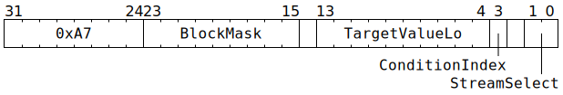

# `STREAMWAIT` (Limit thread execution until NoC Overlay stream condition met)

**Summary:** One NoC Overlay stream condition is selected, and then one or more blocked instructions are selected using a bitmask. The issuing thread can continue execution until one of the blocked instructions is reached, at which point execution of the thread is paused until the selected condition is met.

**Backend execution unit:** [Sync Unit](SyncUnit.md)

> [!TIP]
> This instruction is new in Blackhole.

## Syntax

```c
TT_STREAMWAIT(/* u9 */ BlockMask, /* u10 */ TargetValueLo, /* u1 */ ConditionIndex, /* u2 */ StreamSelect)
```

## Encoding



## Functional model

The instruction is considered complete once the following happens:
```c
uint32_t TargetValue;
switch (ConditionIndex) {
case 0: TargetValue = (ThreadConfig[CurrentThread].STREAMWAIT_PHASE_HI_Val    << 10) | TargetValueLo; break;
case 1: TargetValue = (ThreadConfig[CurrentThread].STREAMWAIT_NUM_MSGS_HI_Val << 10) | TargetValueLo; break;
}

WaitGate[CurrentThread].LatchedWaitInstruction.Opcode = STREAMWAIT;
WaitGate[CurrentThread].LatchedWaitInstruction.ConditionMask = 1u << ConditionIndex;
WaitGate[CurrentThread].LatchedWaitInstruction.TargetValue = TargetValue;
WaitGate[CurrentThread].LatchedWaitInstruction.StreamSelect = StreamSelect;
WaitGate[CurrentThread].LatchedWaitInstruction.SemaphoreMask = 0;
WaitGate[CurrentThread].LatchedWaitInstruction.BlockMask = BlockMask ? BlockMask : (1u << 6);
```

The Wait Gate will then continuously re-evaluate the latched wait instruction until the selected condition is met, at which point the latched wait instruction will be forgotten, and instructions will no longer be blocked. The new latched wait instruction takes effect immediately, so it will influence whether or not the instruction immediately after `STREAMWAIT` can pass through the Wait Gate. There is a one cycle lag between the condition(s) being met and the block mask being removed - in particular this means that the instruction immediately after `STREAMWAIT` will always be subject to the block mask for at least one cycle, even if the condition is met immediately.

## Block mask

The block mask consists of nine bits, named B0 (least significant bit) through B8 (most significant bit). Their meaning is exactly the same [as for `STALLWAIT`](STALLWAIT.md#block-mask).

## Condition index

Unlike `STALLWAIT` and `SEMWAIT`, `STREAMWAIT` specifies a single condition index rather than a condition mask. As such, set `ConditionIndex == 0` to select C0, or `ConditionIndex == 1` to select C1. The meaning of the conditions is:

||Keep on waiting and blocking if...|
|---|---|
|**C0**|`NOC_STREAM_READ_REG(StreamIndex, STREAM_CURR_PHASE_REG_INDEX) < TargetValue`, where `StreamIndex` is `ThreadConfig[CurrentThread].STREAM_ID_SYNC_SEC[StreamSelect].BankSel`|
|**C1**|`NOC_STREAM_READ_REG(StreamIndex, STREAM_NUM_MSGS_RECEIVED_REG_INDEX) < TargetValue`, where `StreamIndex` is `ThreadConfig[CurrentThread].STREAM_ID_SYNC_SEC[StreamSelect].BankSel`|
