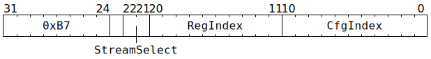

# `STREAMWRCFG` (Move from NoC Overlay to thread-agnostic backend configuration)

**Summary:** Move 32 bits from NoC Overlay to thread-agnostic backend configuration. The current thread's `CFG_STATE_ID_StateID` determines which configuration bank is written to. This instruction cannot be used to write to `ThreadConfig` (see [`SETC16`](SETC16.md) for that).

**Backend execution unit:** [Configuration Unit](ConfigurationUnit.md)

## Syntax

```c
TT_STREAMWRCFG(/* u2 */ StreamSelect, /* u10 */ RegIndex, /* u11 */ CfgIndex)
```

## Encoding



## Functional model

```c
if (CfgIndex >= (CFG_STATE_SIZE*4)) UndefinedBehaviour(); // Cannot index out of bounds.

uint6_t StreamIndex = ThreadConfig[CurrentThread].STREAM_ID_SYNC_SEC[StreamSelect].BankSel;
uint1_t StateID = ThreadConfig[CurrentThread].CFG_STATE_ID_StateID;
Config[StateID][CfgIndex] = NOC_STREAM_READ_REG(StreamIndex, RegIndex);
```

Note that `CfgIndex` values line up exactly with the `Name_ADDR32` constants in `cfg_defines.h`, though be aware that the `// Registers for THREAD` section of `cfg_defines.h` is for indexing into `ThreadConfig` rather than `Config` (see [`SETC16`](SETC16.md) for that).

## Performance

This instruction requires at least five cycles to execute, with additional cycles at the start if there is contention for NoC Overlay reads. Assuming no contention, it is fully pipelined, so a `STREAMWRCFG` instruction can be started every cycle. The issuing thread is not blocked, so it can potentially start its next instructions (of any kind) during `STREAMWRCFG`'s subsequent cycles.

## Instruction scheduling

`STREAMWRCFG` spends at least one cycle, and possibly more in the case of contention, preparing to issue a memory request. Due to a hardware bug, if a `STREAMWRCFG` is in one of these cycles, the thread which issued `STREAMWRCFG` can still issue additional Configuration Unit instructions, and those instructions (if not themselves `STREAMWRCFG`) will re-order and jump ahead of the pending `STREAMWRCFG` instruction. After this initial phase is complete, any subsequently issued Configuration Unit instructions will correctly wait for the completion of the `STREAMWRCFG` instruction.

If the result of the `STREAMWRCFG` instruction is consumed by an instruction other than a Configuration Unit instruction, software must ensure that the `STREAMWRCFG` has completed before the consuming instruction starts.

To deal with both of the above, software is encouraged to use `STALLWAIT` after `STREAMWRCFG`. Alternatively, `LOADREG` followed by `WRCFG` can be used instead of `STREAMWRCFG`.
