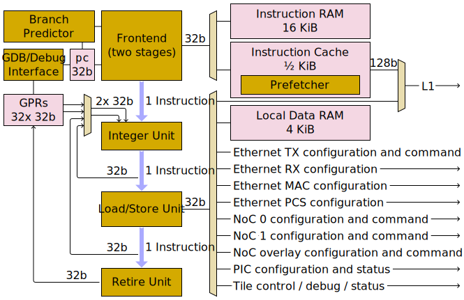

# "Baby" RISCV

Each Ethernet tile contains one RISCV core. It is called a "baby" core as it is a relatively small 32-bit in-order single-issue core, optimised for area and power efficiency rather than for high performance. The RISCV core is intended to execute one RV32IM instruction per cycle, running at a clock speed of 1 GHz.

The baby RISCV core in every Ethernet tile is very similar to [the baby RISCV cores in every Tensix tile](../../TensixTile/BabyRISCV/README.md). As a continuation of the naming scheme used there, "RISCV E" is used to refer to the baby RISCV core in an Ethernet tile. From the RISCV point of view, the major differences in Ethernet tiles as compared to Tensix tiles are:
* Just one RISCV core in every Ethernet tile (versus five in every Tensix tile).
* Just 256 KiB of [L1](../L1.md) in every Ethernet tile (versus 1464 KiB in every Tensix tile).
* The RISCV core is attached to Ethernet transmit and receive subsystems, rather than being attached to a Tensix coprocessor.
* The RISCV core is cooperatively shared between Tenstorrent code and customer code, rather than exclusively running customer code. Said Tenstorrent code is responsible for:
    * Initial [configuration](../EthernetTxRx.md#associating-tx-queues-with-rx-queues) and training of the Ethernet link.
    * Retraining the Ethernet link in response to link drops.
    * Providing a [baseline data movement service](../BaselineDataMovementService.md) to host software.
    * [Calling into customer code](CallingIntoCustomerCode.md).

## Instruction set

The full RV32IM instruction set is implemented, with two caveats:
* The `fence` instruction is executed as if it were `nop`, and hence cannot be used to enforce memory ordering.
* The `ebreak` and `ecall` instructions [trigger a debug pause, in the same fashion as a hardware breakpoint](DebugInterface.md#ebreak-and-ecall-instructions).

Consult the RISCV specifications of "RV32I Base Integer Instruction Set" and "M Standard Extension for Integer Multiplication and Division" for full details of RV32IM, including instruction semantics and instruction encodings.

Invalid / unsupported RISCV instructions are silently executed as if they were _some_ other instruction - usually as if they were a `nop` instruction, but not always.

## Pipeline

All instructions execute by flowing down the pipeline: every instruction spends at least one cycle in the Integer Unit, at least one cycle in the Load/Store Unit, and at least one cycle in Retire Unit. Everything is in-order, except for the innards of the Load/Store Unit: instructions enter the Load/Store Unit in order, and leave the Load/Store Unit in order, but significant re-ordering can occur within the Load/Store Unit. This unit is also where all interesting interactions with the outside world happen: the Load/Store Unit _can_ access [L1](../L1.md) and local data RAM, but every other entry on its outgoing mux represents an interesting device which has been mapped into its address space.

## Frontend

The Frontend is responsible for fetching instructions from memory, and is capable of sending one instruction per cycle to the Integer Unit. The Frontend _predicts_ all control flow, so instructions leaving the Frontend are _speculative_: the Integer Unit is responsible for reconciling predicted control flow with actual control flow, notifying the Frontend of actual control flow, and discarding any incorrectly predicted instructions.

Instructions can only be fetched and executed from L1 or from a core-local instruction RAM; instructions cannot be executed out of any other memory regions. There is a little [instruction cache](InstructionCache.md) sitting between the RISCV and L1. There is also a separate instruction RAM, but the Load/Store Unit is neither able to read nor write to this RAM; see [core-local instruction RAM](InstructionRAM.md) for details on how to populate it.

## Integer Unit

Identical to that of [the baby RISCV cores in Tensix tiles](../../TensixTile/BabyRISCV/README.md#integer-unit).

## Load/Store Unit

Every instruction spends at least one cycle in the Load/Store Unit, though instructions other than loads or stores merely pass through it inert on their way to retirement. Instructions enter in order, and leave in order, but significant re-ordering can occur within the unit; see [memory ordering](../../TensixTile/BabyRISCV/MemoryOrdering.md) for details. A load instruction cannot leave the unit until its result has come back from the memory subsystem, and as instructions have to leave in order, there can be several instructions queued up behind a slow load. The capacity of this queue allows for up to eight instructions to sit within the Load/Store Unit at any time: the oldest non-retired load, plus (up to) the next seven instructions in program order.

The latency of a load instruction depends upon the memory region being accessed. A latency of `N` cycles means that `N - 1` independent instructions need to follow the load if the latency is to be entirely hidden. The minimum possible load latency is two cycles, due to all instructions spending at least one cycle in the Integer Unit and one cycle in the Load/Store Unit.

<table><thead><tr><th>Load address range</th><th>Load latency (cycles)</th><th>Maximum loads in flight</th></tr></thead>
<tr><td><a href="README.md#local-data-ram">Core-local data RAM</a></td><td>2</td><td>8</td></tr>
<tr><td><a href="../L1.md">L1 scratchpad RAM (256 KiB)</a></td><td>≥ 7 (more in the case of access port conflicts or bank conflicts)</td><td rowspan="2">4 (in aggregate across all of these regions)</td></tr>
<tr><td>Any other address</td><td>≥ 7 (more in the case of access conflicts)</td></tr>
</table>

Throughput of sustained loads is one per cycle if the load latency is less than five cycles. Otherwise, when the load latency is `N` cycles, the throughput of sustained loads is four such loads every `N - 1` cycles. In either case, this can require careful instruction scheduling to ensure that load latency is hidden via use of independent instructions.

Throughput of sustained stores to L1 is at most one store every five cycles. Other memory regions can achieve a throughput of one store every cycle (access conflicts notwithstanding).

## Retire Unit

Identical to that of [the baby RISCV cores in Tensix tiles](../../TensixTile/BabyRISCV/README.md#retire-unit).

## Memory map

The "NoC" column indicates which parts of the address space are made available to the NoC in addition to being available to the RISCV core.

The "Ethernet" column indicates what kind(s) of packets can be used to write to parts of the address space using the [Ethernet transmit and receive subsystems](../EthernetTxRx.md).

<table><thead><tr><th>Name and address range</th><th>RISCV&nbsp;E</th><th>NoC</th><th>Ethernet</th></tr></thead>
<tr><td><code>MEM_ETH_BASE</code> <code>0x0000_0000</code> to <code>0x0003_FFFF</code></td><td colspan="2"><a href="../L1.md">L1 scratchpad RAM (256 KiB)</a></td><td>Raw writes TT-link L1 writes</td></tr>
<tr><td><code>MEM_LOCAL_BASE</code> <code>0xFFB0_0000</code> to <code>0xFFB0_0FFF</code></td><td><a href="README.md#local-data-ram">RISCV E local data RAM</a></td><td colspan="2">Unmapped</td></tr>
<tr><td><code>RISCV_DEBUG_REGS_START_ADDR</code> <code>0xFFB1_2000</code> to <code>0xFFB1_2FFF</code></td><td colspan="2"><a href="../TileControlDebugStatus.md">Tile control / debug / status registers</a></td><td>TT-link MMIO writes</td></tr>
<tr><td><code>0xFFB1_3000</code> to <code>0xFFB1_3FFF</code></td><td colspan="2"><a href="../../TensixTile/PIC.md">PIC configuration and status registers</a></td><td>TT-link MMIO writes</td></tr>
<tr><td><code>NOC0_REGS_START_ADDR</code> <code>0xFFB2_0000</code> to <code>0xFFB2_FFFF</code></td><td colspan="2"><a href="../../NoC/MemoryMap.md">NoC 0 configuration registers and command interface</a></td><td>TT-link MMIO writes</td></tr>
<tr><td><code>NOC1_REGS_START_ADDR</code> <code>0xFFB3_0000</code> to <code>0xFFB3_FFFF</code></td><td colspan="2"><a href="../../NoC/MemoryMap.md">NoC 1 configuration registers and command interface</a></td><td>TT-link MMIO writes</td></tr>
<tr><td><code>NOC_OVERLAY_START_ADDR</code> <code>0xFFB4_0000</code> to <code>0xFFB7_FFFF</code></td><td colspan="2"><a href="../../NoC/Overlay/README.md">NoC overlay configuration registers and command interface</a></td><td>TT-link MMIO writes</td></tr>
<tr><td><code>ETH_TXQ0_REGS_START</code> <code>0xFFB9_0000</code> to <code>0xFFB9_1FFF</code></td><td colspan="2"><a href="../EthernetTxRx.md">Ethernet TX queues configuration registers and command interface</a></td><td>TT-link MMIO writes</td></tr>
<tr><td><code>ETH_RXQ0_REGS_START</code> <code>0xFFB9_2000</code> to <code>0xFFB9_3FFF</code></td><td colspan="2"><a href="../EthernetTxRx.md">Ethernet RX queues configuration registers</a></td><td>TT-link MMIO writes</td></tr>
<tr><td><code>ETH_CTRL_REGS_START</code> <code>0xFFB9_4000</code> to <code>0xFFB9_4053</code></td><td colspan="2"><a href="../TileControlDebugStatus.md">Additional tile control / status registers</a></td><td>TT-link MMIO writes</td></tr>
<tr><td><code>0xFFBA_0000</code> to <code>0xFFBA_FFFF</code></td><td colspan="2">Ethernet MAC registers</td><td>TT-link MMIO writes</td></tr>
<tr><td><code>0xFFBB_0000</code> to <code>0xFFBB_FFFF</code></td><td colspan="2">Ethernet PCS registers</td><td>TT-link MMIO writes</td></tr>
<tr><td><code>ERISC_IRAM_BASE</code> <code>0xFFC0_0000</code> to <code>0xFFC0_FFFF</code></td><td><a href="InstructionRAM.md">RISCV E local IRAM</a> (Not accessible by Load/Store Unit)</td><td colspan="2">Unmapped</td></tr>
</table>

## Faults / exceptions

Identical to that of [the baby RISCV cores in Tensix tiles](../../TensixTile/BabyRISCV/README.md#faults--exceptions).

## Local data RAM

RISCV E has 4 KiB of local data RAM, starting at address `MEM_LOCAL_BASE`. The first 1½ KiB is reserved for Tenstorrent code, and then the remaining 2½ KiB is available for customer use. The call stack for customer code will initially be set up to point at the top of this 2½ KiB range, and any space not required by the stack can be used for other things. Access to this RAM is low latency, and accesses never suffer from contention. A load from local RAM has a latency of two cycles, meaning that so long as the one instruction immediately after the load is independent of the load result, the latency of the load is entirely hidden. In contrast, a load from L1 has a latency of at least seven cycles: six independent instructions are required to fully hide the latency.
