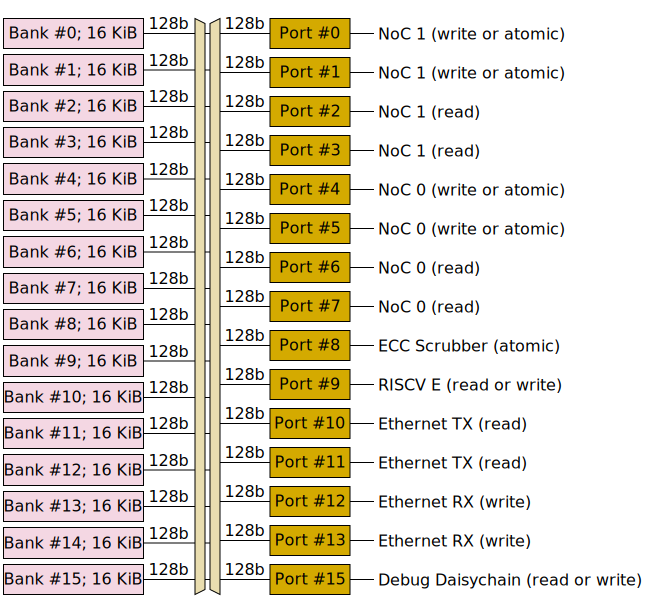

# L1

Each Ethernet tile has 256 KiB of scratchpad RAM. This RAM is called "L1", but this is somewhat of a misnomer, as it is suggestive of a hardware-managed cache, which is not the case - this is plain RAM.

L1 is organised as 16 banks of 16 KiB, with each bank capable of one 128-bit read or one 128-bit write per cycle. Access to these banks is arbitrated through 15 access ports; any port can access any bank, but a bank conflict will occur if multiple ports try to access the same bank on the same cycle - all but one of the ports will be forced to wait.

Access ports support slightly richer functionality than the underlying banks:
  * 128-bit read or 128-bit write (exposing the underlying bank functionality).
  * Narrow reads of less than 128 bits. This is implemented by reading 128 bits and then discarding the unwanted bits, so a narrow read uses just as much bandwidth as a 128-bit read.
  * Narrow writes of less than 128 bits. This is implemented as an atomic read-modify-write operation, which blocks both the port and the underlying bank for five cycles, so a narrow write uses five times the bandwidth of a 128-bit write.
  * Unconditional atomic increment (of one 32-bit integer) or atomic swap. These are implemented as atomic read-modify-write operations, which block both the port and the underlying bank for five cycles. This functionality is exposed to the NoC.
  * Conditional atomic compare-and-set. This is implemented as an atomic read-modify-write operation, which blocks both the port and the underlying bank for five cycles. If the comparison fails, then the data in memory is not changed. This functionality is exposed to the NoC.

## Memory map

L1 on Ethernet tiles is shared between Tenstorrent and customers. As such, it is carved up in to various pieces rather than being entirely available for customer use.

|Address range|Size|Contents|Customer access|
|---|--:|---|---|
|`0x0_0000`&nbsp;to&nbsp;`0x0_03FF`|1 KiB|Tenstorrent code and data|Read-only; particular addresses have defined meaning|
|`0x0_0400` to `0x0_0FFF`|3 KiB|Tenstorrent code (†)|No access (†)|
|`0x0_1000` to `0x0_1FFF`|4 KiB|Tenstorrent data|Read-only; particular addresses have defined meaning|
|`0x0_2000` to `0x0_8FFF`|28 KiB|Tenstorrent code and data (†)|No access (†)|
|`0x0_9000` to `0x0_900F`|16 B|Customer code launch flags (†)|Read/write, though addresses have defined meaning (†)|
|`0x0_9010` to `0x0_901F`|16 B|Tenstorrent data (†)|No access (†)|
|`0x0_9020` to `0x0_903F`|32 B|Function pointer table (†)|Read-only; particular addresses have defined meaning (†)|
|`0x0_9040` to `0x1_0FFF`|31.9&nbsp;KiB|Customer code Optionally also customer data|Full access|
|`0x1_1000` to `0x1_7FFF`|28 KiB|Command queues and buffers for baseline data movement service (†)|Read/write from host software, subject to protocol (†)|
|`0x1_8000` to `0x3_FFFF`|160 KiB|Customer data Optionally also customer code|Full access|

> (†) If customers do not want to use the Ethernet link, and no software on the host wants to use the baseline data movement service, customers can instead have full access to this region, replacing its contents with whatever they want.

If using [TT-Metalium](https://github.com/tenstorrent/tt-metal), then its runtime takes up part of the customer space.

## Port assignments

The assignment of clients to ports is shown in the below diagram.

## Maximum theoretical bandwidth

### Baby RISCV cores

Baby RISCV store instructions against L1 are always narrow stores, so their peak bandwidth to L1 is one 32-bit write every five cycles (6.4 bits per cycle). RISCV load instructions against L1 are always narrow loads, so once their requests reach the access port, they can perform one 32-bit read every cycle. However, a limit on the number of in-flight loads within the RISCV load / store unit means that sustained throughput is limited to four 32-bit reads every six cycles (~21.3 bits per cycle). Throughput of _dependent_ loads, or of poorly scheduled assembly code which does not use independent instructions to hide latency, is even lower: one 32-bit load every seven cycles (~4.6 bits per cycle). RISCV instruction fetches into the instruction cache are always 128-bit reads against L1, though each read yields four instructions, so instruction fetches are expected to occur at most once every four cycles (and ideally much less frequently than this if the instruction cache hit rate is high).

These bandwidth numbers are lower than what other clients can achieve; RISCV cores are _strongly_ encouraged to instruct other clients to access L1 on their behalf whenever viable. In particular, for `memcpy` operations, RISCV cores should instruct a NoC or two (noting that a NoC transaction can write to the same tile that it reads from, in which case the transaction doesn't actually travel over the network at all). For atomic operations, RISCV cores _have_ to instruct a NoC to perform them on their behalf, as the baby RISCV cores do not implement the "A" instruction set extension.

These bandwidth numbers are also lower than what RISCV cores can achieve against other memory regions, so RISCV cores are encouraged to use other memory regions whenever viable. In particular, the call stack is placed in local data RAM rather than L1. Certain registers within the NIU or within the NoC overlay can also be treated as shared memory for synchronization purposes, rather than using bytes in L1 for synchronization purposes.

### NoC

Each NoC has four 128-bit connections to L1: two for reading and two for writing. These connections do not suffer from access port contention, but can still suffer from bank conflicts. This theoretically allows each NoC to read 256 bits per cycle and write 256 bits per cycle. Note that connections between adjacent NoC routers are also 256 bits wide, so NoC transactions are theoretically able to sustain reading at 256 bits per cycle, transiting multiple NoC router hops at 256 bits per cycle per hop (though the _latency_ of each hop is at least 9 cycles), and writing to some other tile at 256 bits per cycle.

### Ethernet

The Ethernet TX/RX subsystem has four 128-bit connections to L1: two for reading and two for writing. These connections do not suffer from access port contention, but can still suffer from bank conflicts. The bandwidth of 100 GbE Ethernet will become a bottleneck before the connections to L1 become a bottleneck.

## Atomics

Some atomic operations are available on L1:
* Atomic increment of aligned 32-bit integer, or of N-bit integer in low N bits of aligned 32 bits, returning the value from before the increment. This can be performed by the NoC.
* Atomic compare and swap on an aligned 32-bit integer (albeit the compare value and the swap value are both limited to 4 bits each). This can be performed by the NoC, and returns the value of the integer from before the compare and swap (which software can inspect to determine whether the swap happened).
* Atomic swap of an aligned 32-bit value. This can be performed by the NoC.

Note that atomic operations are also available on some other memory spaces:
* Some NoC Overlay stream configuration registers [can be repurposed](../NoC/Overlay/AsGeneralUse.md) for atomic increment/decrement.
* The [address `0xFFB9_4080`](CycleCounters.md) can be used for atomic increment/decrement.
