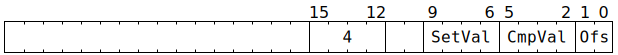
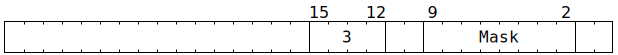
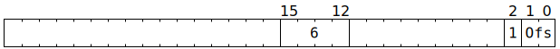

# NoC Atomic Requests

Software can instruct the NIU to perform certain atomic operations against L1 (atomic operations cannot be performed against MMIO addresses, nor DRAM addresses, nor can they be translated to or from PCIe transactions). This can be the L1 of the initiating tile, or the L1 of any other tile, or the request can be broadcast to a rectangle of tiles and separately performed on the L1 of each of them.

## Atomic increment

To perform this operation, software should populate `NOC_AT_LEN_BE` with:


In the address space of the tile(s) identified by `NOC_TARG_ADDR_MID`:
```c
uint32_t Result;
atomic {
  Result = *(uint32_t*)NOC_TARG_ADDR_LO;
  uint32_t* L1Address = (uint32_t*)((NOC_TARG_ADDR_LO & ~0xf) + (NOC_AT_LEN_BE.Ofs * 4));
  uint32_t OriginalValue = *L1Address;
  uint32_t Incremented = OriginalValue + NOC_AT_DATA;
  uint32_t IntMask = (2u << NOC_AT_LEN_BE.IntWidth) - 1u;
  *L1Address = (Incremented & IntMask) | (OriginalValue & ~IntMask);
}
```

Software is encouraged to set `NOC_AT_LEN_BE.Ofs` such that `L1Address` equals `NOC_TARG_ADDR_LO`, at which point `Result` will contain `OriginalValue`. Note that setting `IntWidth` to `31` performs a full 32-bit increment, whereas setting it to a smaller value causes an increment within the low `IntWidth+1` bits (the higher bits will be left unchanged).

If `NOC_CMD_RESP_MARKED` is set, then at some later point in time, in the address space of the tile identified by `NOC_RET_ADDR_MID`:
```c
*(uint32_t*)NOC_RET_ADDR_LO = Result;
memory_barrier;
atomic {
  NIUCounters.NIU_MST_ATOMIC_RESP_RECEIVED += 1;
  NIUCounters.NIU_MST_REQS_OUTSTANDING_ID(NOC_PACKET_TRANSACTION_ID) -= 1;
}
```

Note that this is similar to the Tensix coprocessor [`ATINCGET` instruction](../TensixTile/TensixCoprocessor/ATINCGET.md).

## Atomic compare and swap

To perform this operation, software should populate `NOC_AT_LEN_BE` with:



In the address space of the tile(s) identified by `NOC_TARG_ADDR_MID`:
```c
uint32_t Result;
atomic {
  Result = *(uint32_t*)NOC_TARG_ADDR;
  uint32_t* L1Address = (uint32_t*)((NOC_TARG_ADDR & ~0xf) + (NOC_AT_LEN_BE.Ofs * 4));
  uint32_t OriginalValue = *L1Address;
  if (OriginalValue == NOC_AT_LEN_BE.CmpVal) {
    *L1Address = NOC_AT_LEN_BE.SetVal;
  }
}
```

Software is encouraged to set `NOC_AT_LEN_BE.Ofs` such that `L1Address` equals `NOC_TARG_ADDR_LO`, at which point `Result` will contain `OriginalValue`. Software can then use `Result` to determine whether the comparison succeeded or not.

If `NOC_CMD_RESP_MARKED` is set, then at some later point in time, in the address space of the tile identified by `NOC_RET_ADDR_MID`:
```c
*(uint32_t*)NOC_RET_ADDR_LO = Result;
memory_barrier;
atomic {
  NIUCounters.NIU_MST_ATOMIC_RESP_RECEIVED += 1;
  NIUCounters.NIU_MST_REQS_OUTSTANDING_ID(NOC_PACKET_TRANSACTION_ID) -= 1;
}
```

Note that this is similar to the Tensix coprocessor [`ATCAS` instruction](../TensixTile/TensixCoprocessor/ATCAS.md).

## Atomic swap, mask variant

To perform this operation, software should populate `NOC_AT_LEN_BE` with:



In the address space of the tile(s) identified by `NOC_TARG_ADDR_MID`:
```c
uint32_t Result;
atomic {
  Result = *(uint32_t*)NOC_TARG_ADDR;
  uint16_t* L1Address = (uint16_t*)(NOC_TARG_ADDR & ~0xf);
  uint16_t ToWrite[2] = {NOC_AT_DATA & 0xffff, NOC_AT_DATA >> 16};
  for (unsigned i = 0; i < 8; ++i) {
    if (NOC_AT_LEN_BE.Mask & (1u << i)) {
      L1Address[i] = ToWrite[i & 1];
    }
  }
}
```

If `NOC_CMD_RESP_MARKED` is set, then at some later point in time, in the address space of the tile identified by `NOC_RET_ADDR_MID`:
```c
*(uint32_t*)NOC_RET_ADDR_LO = Result;
memory_barrier;
atomic {
  NIUCounters.NIU_MST_ATOMIC_RESP_RECEIVED += 1;
  NIUCounters.NIU_MST_REQS_OUTSTANDING_ID(NOC_PACKET_TRANSACTION_ID) -= 1;
}
```

Note that this is similar to the Tensix coprocessor [`ATSWAP` instruction](../TensixTile/TensixCoprocessor/ATSWAP.md).

## Atomic swap, index variant

To perform this operation, software should populate `NOC_AT_LEN_BE` with:



Or with:


In the address space of the tile(s) identified by `NOC_TARG_ADDR_MID`:
```c
uint32_t Result;
atomic {
  Result = *(uint32_t*)NOC_TARG_ADDR;
  uint32_t* L1Address = (uint32_t*)((NOC_TARG_ADDR & ~0xf) + (NOC_AT_LEN_BE.Ofs * 4));
  *L1Address = NOC_AT_DATA;
}
```

Software is encouraged to set `NOC_AT_LEN_BE.Ofs` such that `L1Address` equals `NOC_TARG_ADDR_LO`, at which point `Result` will contain the original value of `*L1Address`.

If `NOC_CMD_RESP_MARKED` is set, then at some later point in time, in the address space of the tile identified by `NOC_RET_ADDR_MID`:
```c
*(uint32_t*)NOC_RET_ADDR_LO = Result;
memory_barrier;
atomic {
  NIUCounters.NIU_MST_ATOMIC_RESP_RECEIVED += 1;
  NIUCounters.NIU_MST_REQS_OUTSTANDING_ID(NOC_PACKET_TRANSACTION_ID) -= 1;
}
```
