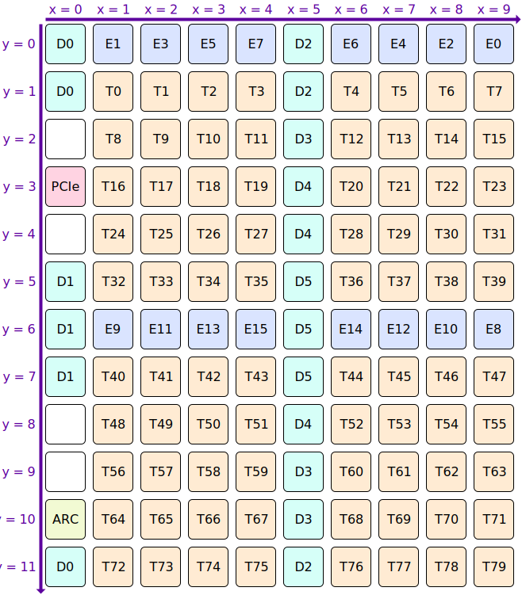
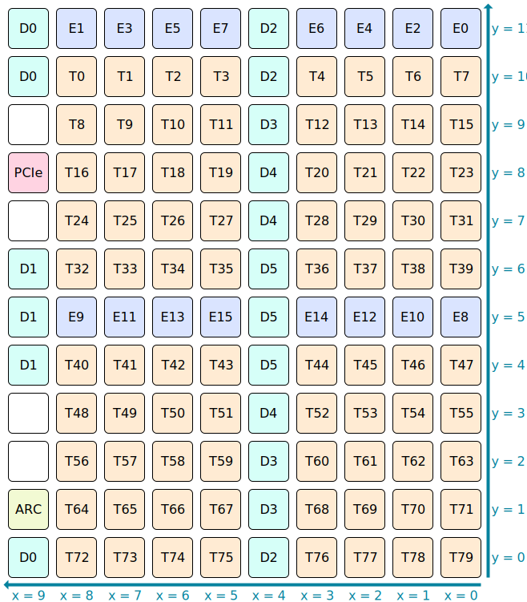
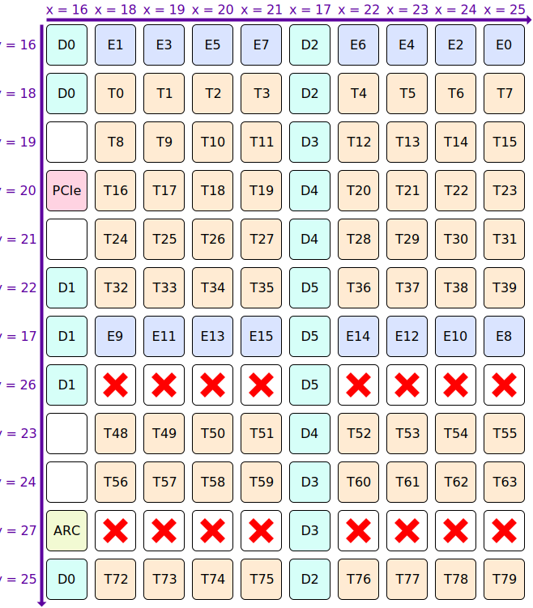
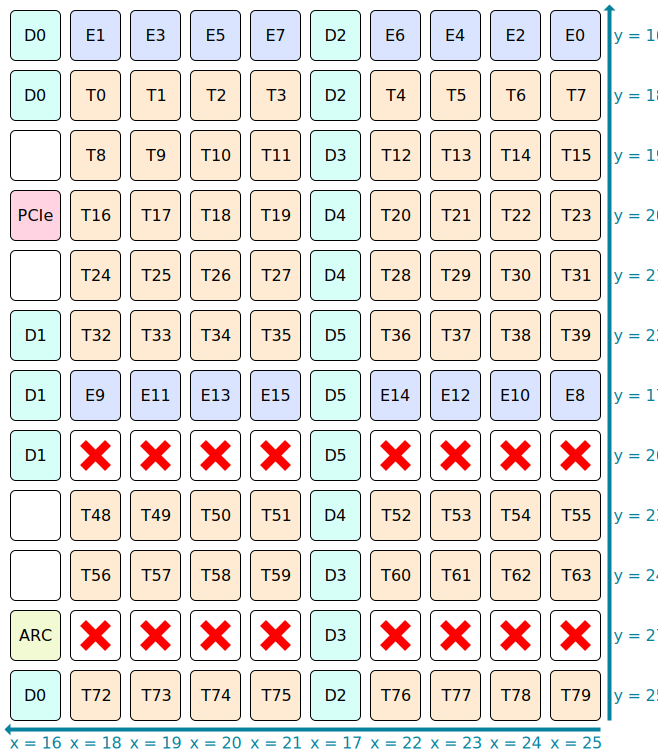

# NoC Coordinates

Each NoC uses a 2D coordinate system to identify tiles.

## NoC #0

NoC #0 coordinates have `(0, 0)` as the top left tile, and then increment in the [direction of data flow (rightwards and downwards)](RoutingPaths.md):

## NoC #1

NoC #1 coordinates have `(0, 0)` as the bottom right tile, and then increment in the [direction of data flow (leftwards and upwards)](RoutingPaths.md):

## Coordinate Translation

NIUs support a coordinate translation feature. When this feature is enabled, the X/Y coordinates within `NOC_TARG_ADDR_MID` and `NOC_RET_ADDR_MID` have a translation step applied to them, which happens as software writes to `NOC_CMD_CTRL` (and before the resultant packet leaves the NIU). Firmware will configure the translation feature with the following aims in mind:
* Uniform coordinate system for both NoC #0 and NoC #1 (*)
* Similar types of tile having a contiguous coordinate range
* On products where one or two rows of Tensix tiles have been harvested (fused off) for yield reasons, renumber rows so that harvested rows are always at the end
* Still allow software to use raw NoC coordinates if it wants to

(*) Except when performing broadcasts, where StartX ↔ EndX need to be swapped by software, and likewise StartY ↔ EndY need to be swapped. This is because coordinate translation does not change the direction of data flow.

The firmware-configured translation table for the X axis is:

|X|→|NoC&nbsp;#0&nbsp;X|NoC&nbsp;#1&nbsp;X|Notes|
|--:|--|--:|--:|---|
|0 to&nbsp;15|→|0 to&nbsp;15|0 to&nbsp;15|Identity translation, allowing software to still use raw NoC coordinates when coordinate translation is enabled|
|16|→|0|9|Column containing PCIe, ARC, and DRAM D0 / D1|
|17|→|5|4|Column containing DRAM D2 / D3 / D4 / D5|
|18|→|1|8|Column containing mostly Tensix tiles (leftmost)|
|19|→|2|7|Column containing mostly Tensix tiles|
|20|→|3|6|Column containing mostly Tensix tiles|
|21|→|4|5|Column containing mostly Tensix tiles|
|22|→|6|3|Column containing mostly Tensix tiles|
|23|→|7|2|Column containing mostly Tensix tiles|
|24|→|8|1|Column containing mostly Tensix tiles|
|25|→|9|0|Column containing mostly Tensix tiles (rightmost)|
|26 to&nbsp;31|→|0|0|

The firmware-configured translation table for the Y axis depends on which rows of Tensix tiles (if any) were harvested (fused off) for yield reasons. The number of fused-off rows will vary based on the product part number (e.g. n150 boards have one fused-off row, and n300 boards have two fused-off rows per ASIC), and if any rows _are_ fused off, then the _particular_ fused-off rows will vary from ASIC to ASIC. For the sake of exposition, the remainder of this section assumes two particular rows are fused off, causing the firmware-configured translation table for the Y axis to be:

|Y|→|NoC&nbsp;#0&nbsp;Y&nbsp;(†)|NoC&nbsp;#1&nbsp;Y&nbsp;(‡)|Notes|
|--:|---|--:|--:|---|
|0 to&nbsp;15|→|0 to&nbsp;15|0 to&nbsp;15|Identity translation, allowing software to still use raw NoC coordinates when coordinate translation is enabled|
|16|→|0|11|Row containing Ethernet tiles E0 - E7 and some DRAM|
|17|→|6|5|Row containing Ethernet tiles E8 - E15 and some DRAM|
|18|→|1|10|Row containing mostly Tensix tiles (topmost)|
|19|→|2|9|Row containing mostly Tensix tiles|
|20|→|3|8|Row containing mostly Tensix tiles|
|21|→|4|7|Row containing mostly Tensix tiles|
|22|→|5|6|Row containing mostly Tensix tiles|
|23|→|8|3|Row containing mostly Tensix tiles|
|24|→|9|2|Row containing mostly Tensix tiles|
|25|→|11|0|Row containing mostly Tensix tiles (bottommost)|
|26|→|7|4|Row containing mostly harvested (fused off) Tensix tiles|
|27|→|10|1|Row containing mostly harvested (fused off) Tensix tiles|
|28 to&nbsp;31|→|0|0|

(†) Assuming y=7 and y=10 harvested for yield reasons.

(‡) Assuming y=4 and y=1 harvested for yield reasons.

The resultant coordinate scheme for NoC #0 (†) is:

The resultant coordinate scheme for NoC #1 (‡) is identical, just with data flow going in the opposite direction:

