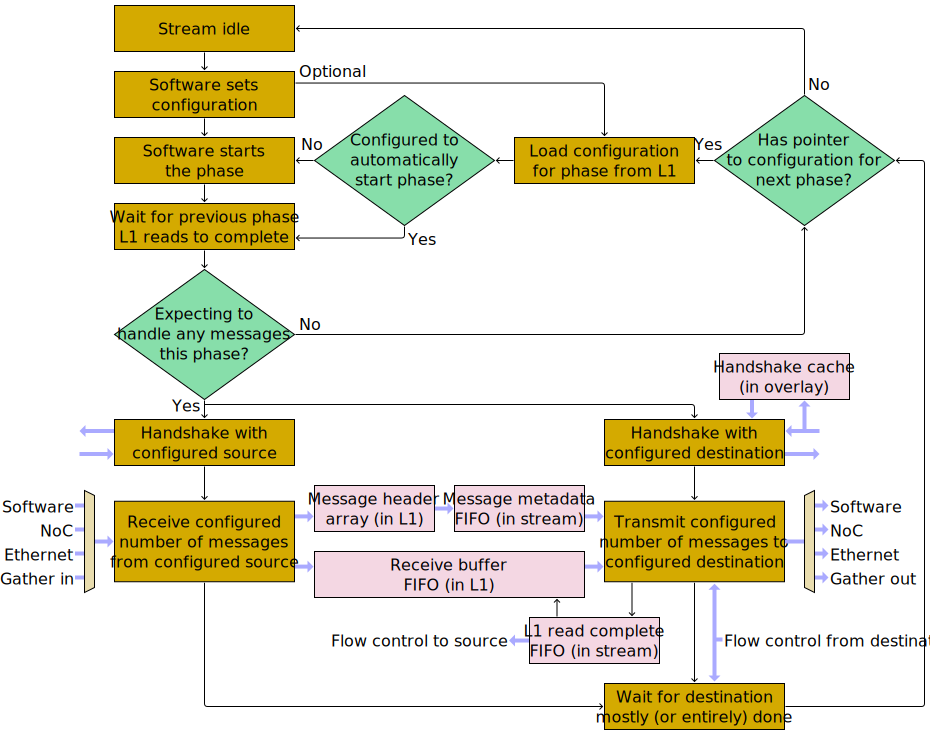

# NoC Overlay

The NoC Overlay is a little coprocessor that can assist with NoC transactions. It is used to send _messages_ from one tile to another. Messages are mostly arbitrary collections of bytes, with just a few restrictions:
1. The length of a message needs to be `16 * N` bytes for some `N`, where <code>1 ≤ N &lt; 215</code> (i.e. the minimum message length is 16 bytes, and the maximum is just shy of 512 KiB).
2. The value `N` needs to appear somewhere within the first 16 bytes of the message (and be at the same position for every message).
3. When stored in L1, messages must start at aligned 16-byte boundaries.

Every Tensix tile contains a NoC Overlay coprocessor, as does every Ethernet tile. Each such coprocessor consists of some number of _streams_. The streams _within_ a coprocessor are configured independently, and operate independently (†). Streams in _different_ coprocessors can be connected together using point-to-point Ethernet (‡) or using either [NoC](../README.md), with messages flowing from one stream to another. This allows software in one tile to push messages on to a stream, and software in a different tile to pop messages off. Streams have a concept of _phases_: at the start of a phase, stream configuration is set to tell the stream how/where to receive messages, how/where to transmit the received messages, and how many messages are to be received during the phase (which can be between 0 and 4095). Once (re)configuration is complete, the stream is started. Once the configured number of messages have been received, the phase is considered complete, at which point the stream can be reconfigured for the next phase (this can happen in parallel with transmitting the last message from the previous phase). Streams can be configured to load the next phase's configuration from L1, so a RISCV core does not need to be involved in phase changes. Use of the NoC Overlay is entirely optional; software can instead use the [NIU request initiators](../MemoryMap.md#niu-request-initiators) to perform NoC transactions.

> (†) With one exception: several streams within the same coprocessor can be joined together to perform gather operations. When so configured, messages received on _any_ of the gather input streams will be internally transferred to the gather output stream, and then transmitted by the gather output stream.
>
> (‡) Only available in Ethernet tiles.

In order to receive messages, a stream needs a receive buffer somewhere in L1. Software can choose where to put this buffer and how large to make it: it needs to be large enough to receive at least one message (*), and larger buffers allow for more latency hiding. A stream will use its receive buffer in a circular fashion, so the receiver buffer typically referred to as a FIFO. A stream _also_ needs a message header array somewhere in L1, the size of which must be 16 bytes times the number of messages to be received during the phase. This array is used in a strictly linear (i.e. not circular) fashion. The first 16 bytes of every message will exist in both the receive buffer and the message header array.

> (*) This needs to be true if a stream is receiving from software or transmitting to software. If a stream is only communicating with other streams, its receive buffer is allowed to be smaller than a single message.

Streams are unidirectional: messages travel in one direction, and internal flow control packets travel in the opposite direction. If software wishes to send messages in both directions, it needs to use one stream per direction. For bidirectional messages between a pair of tiles, this will involve four streams total, as each of the two involved overlay coprocessors will need one stream for software-to-NoC and one stream for NoC-to-software.

## Stream Capabilities

The various streams within each NoC Overlay are not entirely uniform; some features are supported on certain streams but not on others. In every Tensix tile, where the NoC Overlay in the tile supports 64 streams:

|Capability|Streams 0 - 3|4 & 5|6 & 7|8 - 11|12 - 63|
|---|--:|:-:|:-:|:-:|:-:|
|[Receive from software](ReceiveFromSoftware.md) (Local RISCV / Tensix)|✅|✅|✅|✅|✅|
|[Receive from other stream](TransferBetweenTiles.md) (NoC)|✅|✅|✅|✅|✅|
|[Receive from other stream](TransferBetweenTiles.md) (Ethernet unicast peer)|❌|❌|❌|❌|❌|
|[Receive from other streams within same overlay (gather)](Gather.md)|✅|✅|❌|❌|❌|
|Message metadata FIFO capacity (# of messages)|8|8|2|8|2|
|Message metadata FIFO group size (# of messages)|2|4|2|2|2|
|Message metadata FIFO includes copy of message header|❌|✅|❌|❌|❌|
|L1 read complete FIFO capacity (# of entries)|8|8|2|8|2|
|[Transmit to other stream](TransferBetweenTiles.md) (NoC unicast)|✅|✅|✅|✅|✅|
|[Transmit to other streams](TransferBetweenTiles.md) (NoC multicast, up to 32 receivers)|✅|❌|❌|❌|❌|
|[Transmit to other stream](TransferBetweenTiles.md) (Ethernet unicast peer)|❌|❌|❌|❌|❌|
|[Transmit to other stream within same overlay (for gather)](Gather.md)|✅|✅|✅|✅|✅|
|[Transmit to DRAM buffer](TransmitToDRAMBuffer.md) (NoC unicast)|✅|❌|❌|✅|❌|
|[Transmit to software](TransmitToSoftware.md) (Local RISCV / Tensix)|✅|✅|✅|✅|✅|
|[Transmit to nowhere](TransmitToNowhere.md)|✅|✅|✅|✅|✅|
|Can cause PIC IRQ on phase start / end|✅|❌|❌|✅|❌|

Whereas in every Ethernet tile, where the NoC Overlay in the tile supports 32 streams:

|Capability|Streams 0 & 1|2 & 3|4 - 7|8 - 11|12 - 31|
|---|--:|:-:|:-:|:-:|:-:|
|[Receive from software](ReceiveFromSoftware.md) (Local RISCV)|✅|✅|✅|✅|✅|
|[Receive from other stream](TransferBetweenTiles.md) (NoC)|✅|✅|✅|✅|✅|
|[Receive from other stream](TransferBetweenTiles.md) (Ethernet unicast peer)|✅|✅|❌|✅|❌|
|[Receive from other streams within same overlay (gather)](Gather.md)|✅|❌|❌|❌|❌|
|Message metadata FIFO capacity (# of messages)|32|32|2|32|2|
|Message metadata FIFO group size (# of messages)|2|2|2|2|2|
|Message metadata FIFO includes copy of message header|❌|❌|❌|❌|❌|
|L1 read complete FIFO capacity (# of entries)|128|128|2|128|2|
|[Transmit to other stream](TransferBetweenTiles.md) (NoC unicast)|✅|✅|✅|✅|✅|
|[Transmit to other streams](TransferBetweenTiles.md) (NoC multicast, up to 32 receivers)|✅|❌|❌|❌|❌|
|[Transmit to other stream](TransferBetweenTiles.md) (Ethernet unicast peer)|✅|✅|❌|✅|❌|
|[Transmit to other stream within same overlay (for gather)](Gather.md)|✅|✅|✅|✅|✅|
|[Transmit to DRAM buffer](TransmitToDRAMBuffer.md)|✅|✅|❌|✅|❌|
|[Transmit to software](TransmitToSoftware.md) (Local RISCV)|✅|✅|✅|✅|✅|
|[Transmit to nowhere](TransmitToNowhere.md)|✅|✅|✅|✅|✅|
|Can cause PIC IRQ on phase start / end|✅|✅|❌|✅|❌|

## Stream state machine

Each stream within each NoC Overlay is independently navigating the following state machine:

The message header array exists in L1; the stream itself only maintains front/back pointers into the array.

The receive buffer FIFO exists in L1; the stream itself only maintains base/size/read/write pointers into it.

The message metadata FIFO exists in the stream itself. In most streams, each element of the FIFO consists of a pointer to a message (somewhere in the receive buffer) and the length of that message. Some streams augment each element of the FIFO with a full copy of the header of the message in question (its first 16 bytes).

The L1 read complete FIFO also exists in the stream itself. In typical usage, transmitting a message involves the stream popping a pointer and a length from the message metadata FIFO, instructing an NIU to perform a posted write using that data, and pushing the length on to the L1 read complete FIFO. Once the NIU later confirms that it has finished reading the data from L1, the stream will pop the length from the L1 read complete FIFO and use it to advance the receive buffer FIFO read pointer. This will create space in the FIFO, and that space can be used to receive subsequent messages.

## Configuring streams from software

Each stream is presented to software as a bunch of memory-mapped registers. The [`STREAM_REG_ADDR(stream_id, reg_id)`](https://github.com/tenstorrent/tt-metal/blob/755ef352bda792393f437e2f378ffc9b0685df8e/tt_metal/hw/inc/wormhole/noc/noc_overlay_parameters.h#L41) macro can be used to obtain the memory address of a particular register for a particular stream, which is wrapped by [`NOC_STREAM_READ_REG(stream_id, reg_id)`](https://github.com/tenstorrent/tt-metal/blob/755ef352bda792393f437e2f378ffc9b0685df8e/tt_metal/hw/inc/wormhole/noc/noc_overlay_parameters.h#L55) and [`NOC_STREAM_WRITE_REG(stream_id, reg_id, val)`](https://github.com/tenstorrent/tt-metal/blob/755ef352bda792393f437e2f378ffc9b0685df8e/tt_metal/hw/inc/wormhole/noc/noc_overlay_parameters.h#L53).

Before using any streams, software needs to tell the overlay where to find the message length within a message header, by writing to [`STREAM_MSG_HEADER_FORMAT_REG_INDEX`](#stream_msg_header_format_reg_index).

To then configure an individual stream, software needs to tell it:
1. How many messages to expect to handle during the phase, by writing `N << 12` to `STREAM_PHASE_AUTO_CFG_HEADER_REG_INDEX`. This is the number of messages to expect to receive during the phase, and also the number of messages to expect to transmit during the phase.
2. How/where to receive messages; either [from software](ReceiveFromSoftware.md), or [from another stream](TransferBetweenTiles.md), or [gathering from several other streams](Gather.md).
3. How/where to transmit messages; either [to software](TransmitToSoftware.md), or [to another stream](TransferBetweenTiles.md), or [as input to a gather operation](Gather.md), or [to nowhere](TransmitToNowhere.md).
4. To start the phase, by writing any value to `STREAM_PHASE_ADVANCE_REG_INDEX`.

Software can also configure a stream to [load configuration from L1](LoadConfigurationFromL1.md).

## Repurposing streams

If a NoC Overlay stream is idle, [software can repurpose some of its MMIO configuration/state registers for general use](AsGeneralUse.md).

Software might also wish to configure a NoC Overlay stream to [receive from software](ReceiveFromSoftware.md) and [transmit to software](TransmitToSoftware.md) (or [transmit to nowhere](TransmitToNowhere.md)). In this case the stream will not send nor receive any NoC packets, and is instead used for one or more of its:
* Message metadata FIFO
* L1 read complete FIFO
* Receive buffer FIFO base/size/read/write pointers
* Message header array front/back pointers

## Register reference

### `STREAM_MSG_HEADER_FORMAT_REG_INDEX`

|First&nbsp;bit|#&nbsp;Bits|Name|Purpose|
|--:|--:|---|---|
|0|7|`MSG_HEADER_WORD_CNT_OFFSET`|Bit index of least significant bit of message length field within message header (must be a multiple of 8; will be rounded down if not)|
|7|7|`MSG_HEADER_WORD_CNT_BITS`|Bit width of message length field within message header|
|14|18|Reserved|Writes ignored, reads as zero|

The NoC Overlay uses `MSG_HEADER_WORD_CNT_OFFSET` and `MSG_HEADER_WORD_CNT_BITS` to populate the message metadata FIFO from message headers. The length needs to be specified in units of 16 bytes, and needs to include the header itself (i.e. the first 16 bytes of the message).

This register exists once per NoC Overlay. For the purpose of `STREAM_REG_ADDR`, it's part of stream ID 0, but it relates to all streams.

### `STREAM_MISC_CFG_REG_INDEX`

|First&nbsp;bit|#&nbsp;Bits|Name|Purpose|
|--:|--:|---|---|
|0|1|`INCOMING_DATA_NOC`|Not used for anything|
|1|1|`OUTGOING_DATA_NOC`|Which NoC (#0 or #1) to use for sending message contents between overlays. When the overlay needs to fetch data from L1, it'll do so using a loopback read request on the _other_ NoC.|
|2|1|`REMOTE_SRC_UPDATE_NOC`|Which NoC (#0 or #1) to use for sending flow control packets (these packets go in the opposite direction to message contents).|
|3|1|`LOCAL_SOURCES_CONNECTED`|If `true`, the stream will be [receiving from other streams within same overlay (gather)](Gather.md). Exactly one of `LOCAL_SOURCES_CONNECTED` or `SOURCE_ENDPOINT` or `REMOTE_SOURCE` should be set.|
|4|1|`SOURCE_ENDPOINT`|If `true`, the stream will be [receiving from software (RISCV / Tensix)](ReceiveFromSoftware.md). Exactly one of `LOCAL_SOURCES_CONNECTED` or `SOURCE_ENDPOINT` or `REMOTE_SOURCE` should be set.|
|5|1|`REMOTE_SOURCE`|If `true`, the stream will be [receiving from another stream (NoC or Ethernet)](TransferBetweenTiles.md). Exactly one of `LOCAL_SOURCES_CONNECTED` or `SOURCE_ENDPOINT` or `REMOTE_SOURCE` should be set.|
|6|1|`RECEIVER_ENDPOINT`|If `true`, the stream will be [transmitting to software (RISCV / Tensix)](TransmitToSoftware.md). At most one of `RECEIVER_ENDPOINT` or `LOCAL_RECEIVER` or `REMOTE_RECEIVER` should be set.|
|7|1|`LOCAL_RECEIVER`|If `true`, the stream will be [transmitting to another stream within same overlay (for gather)](Gather.md). At most one of `RECEIVER_ENDPOINT` or `LOCAL_RECEIVER` or `REMOTE_RECEIVER` should be set.|
|8|1|`REMOTE_RECEIVER`|If `true`, the stream will be [transmitting to another stream (NoC or Ethernet)](TransferBetweenTiles.md) or [to a DRAM buffer](TransmitToDRAMBuffer.md). At most one of `RECEIVER_ENDPOINT` or `LOCAL_RECEIVER` or `REMOTE_RECEIVER` should be set.|
|9|1|`PHASE_AUTO_CONFIG`|If `true`, when the stream finishes a phase, it will automatically read configuration for the next phase from L1. If `false`, the stream will instead revert to the idle state at the end of a phase.|
|10|1|`PHASE_AUTO_ADVANCE`|If `true`, the stream will automatically start after reading configuration for the next phase from L1 (only relevant when `PHASE_AUTO_CONFIG` is `true`). If `false`, software will need to write to `STREAM_PHASE_ADVANCE_REG_INDEX` to start the stream.|
|11|1|`DATA_AUTO_SEND`|Not used for anything|
|12|1|`NEXT_PHASE_SRC_CHANGE`|Should be set to `false` if the next phase is known to be receiving from the exact same place as the current phase, which will cause the flush and the resync between phases to be skipped. Should be set to `true` in all other cases.|
|13|1|`NEXT_PHASE_DEST_CHANGE`|Should be set to `false` if the next phase is known to be transmitting to the exact same place(s) as the current phase, which will cause the flush and the resync between phases to be skipped. Should be set to `true` in all other cases.|
|14|1|`DATA_BUF_NO_FLOW_CTRL`|Mode bit applicable when `REMOTE_SOURCE` is set. See [receiving from another stream (NoC or Ethernet)](TransferBetweenTiles.md#flow-control).|
|15|1|`DEST_DATA_BUF_NO_FLOW_CTRL`|Mode bit applicable when `REMOTE_RECEIVER` is set. See [transmitting to another stream (NoC or Ethernet)](TransferBetweenTiles.md#flow-control).|
|16|1|`REMOTE_SRC_IS_MCAST`|Mode bit applicable when `REMOTE_SOURCE` is set. See [receiving from another stream (NoC or Ethernet)](TransferBetweenTiles.md).|
|17|1|`NO_PREV_PHASE_OUTGOING_DATA_FLUSH`|If `true`, the "Wait for previous phase L1 reads to complete" stage on [state machine diagram](#stream-state-machine) will be skipped.|
|18|3|`UNICAST_VC_REG`|Configuration bits applicable when `REMOTE_RECEIVER` is set. See [transmitting to another stream (NoC or Ethernet)](TransferBetweenTiles.md#virtual-channel-control).|
|21|3|`REG_UPDATE_VC_REG`|Configuration bits applicable when `REMOTE_SOURCE` is set. See [receiving from another stream (NoC or Ethernet)](TransferBetweenTiles.md#virtual-channel-control).|
|24|8|Reserved|Writes ignored, reads as zero|

### `STREAM_PHASE_ADVANCE_REG_INDEX`

Write-only, value ignored, reads as zero.

If a stream waiting to start (because it is idle, or because it has finished reading configuration for the next phase from L1 but `PHASE_AUTO_ADVANCE` was not set), then writing to `STREAM_PHASE_ADVANCE_REG_INDEX` will start it.

`STREAM_WAIT_STATUS_REG_INDEX` can be used as a debug check: if the `WAIT_SW_PHASE_ADVANCE_SIGNAL` bit of `STREAM_WAIT_STATUS_REG_INDEX` is not set, then writing to `STREAM_PHASE_ADVANCE_REG_INDEX` will have no effect, as the stream is not waiting to start. After a successful write to `STREAM_PHASE_ADVANCE_REG_INDEX`, the `STREAM_CURR_STATE` field within `STREAM_WAIT_STATUS_REG_INDEX` should transition to either `4` or `5`.

### `STREAM_WAIT_STATUS_REG_INDEX`

Read-only.

|First&nbsp;bit|#&nbsp;Bits|Name|Purpose|
|--:|--:|---|---|
|0|1|`WAIT_SW_PHASE_ADVANCE_SIGNAL`|If `true`, the stream is waiting for software to start it by means of writing to `STREAM_PHASE_ADVANCE_REG_INDEX`. This represents any of "Stream idle" or "Software sets configuration" or "Software starts the phase" on the [state machine diagram](#stream-state-machine).|
|1|1|`WAIT_PREV_PHASE_DATA_FLUSH`|If `true`, the stream is waiting for all L1 reads performed by the previous phase to complete. This is "Wait for previous phase L1 reads to complete" on the [state machine diagram](#stream-state-machine).|
|2|1|`MSG_FWD_ONGOING`|If `true`, the stream is in normal operation of receiving and transmitting messages. This covers all points on the [state machine diagram](#stream-state-machine) below "Expecting to receive any messages this phase?"|
|3|4|`STREAM_CURR_STATE`|Indicates the current state of the stream:<ul><li>`0` if the stream is idle or is having software set its configuration (also the case for one cycle before it starts loading configuration for the next phase from L1) - in this state, `WAIT_SW_PHASE_ADVANCE_SIGNAL` will be `true`</li><li>`1` or `2` if the stream is loading configuration for the next phase from L1</li><li>`3` if the stream has finished loading configuration for the next phase from L1 and is now waiting for software to start by means of writing to `STREAM_PHASE_ADVANCE_REG_INDEX` - in this state, `WAIT_SW_PHASE_ADVANCE_SIGNAL` will be `true`</li><li>`4` if the stream is waiting for all L1 reads performed by the previous phase to complete - this exactly coincides with `WAIT_PREV_PHASE_DATA_FLUSH`</li><li>`5` if the stream is in normal operation of receiving and transmitting messages - this exactly coincides with `MSG_FWD_ONGOING`</li></ul>|
