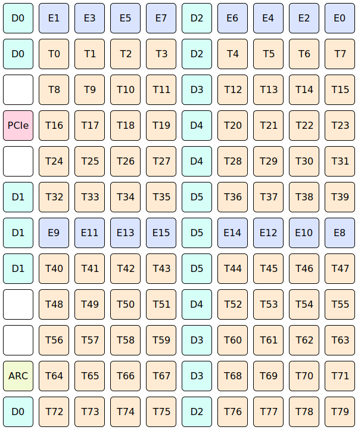

# Wormhole

Each Wormhole ASIC contains:
* [80x Tensix tile](TensixTile/README.md), also known as worker tiles or compute tiles. Depending on the particular product, either 64 or 72 or 80 will be available, with the others fused off.
* 18x DRAM tile, collectively exposing 12 GiB of GDDR6 (each 2 GiB is exposed identically on 3 tiles).
* 16x Ethernet tile, each one with bidirectional 100 GbE connectivity. Depending on the particular product, some of these tiles will not be connected to anything - they can still be used (for their RISCV and their L1), but they'll never receive any ethernet packets, nor will transmitted packets go anywhere. The 100 GbE links are intended for connecting multiple ASICs together, using QSFP-DD cables or warp 100 bridges or static links printed directly on to a circuit board.
* 1x PCI Express tile, for PCI Express 4.0 x16 connectivity with a host system. For products containing multiple ASICs, some of these tiles will not be connected to anything (an ASIC without PCIe connected is still reachable via ethernet).
* 1x ARC tile, for board management purposes. Customers can mostly ignore this tile, as it does not execute customer workloads, nor is it involved in dispatching customer workloads.
* [2x NoC (Network on Chip)](NoC/README.md), for communication between different tiles on the same ASIC.

The [NoCs](NoC/README.md) connect the various tiles to form a 2D torus. The 2D torus is usually visualised as a 2D grid:

