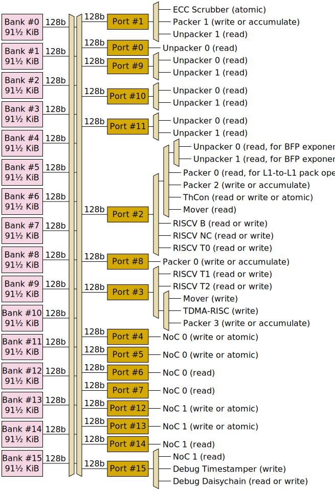

# L1

Each Tensix tile has 1464 KiB of scratchpad RAM. This RAM is called "L1", but this is somewhat of a misnomer, as it is suggestive of a hardware-managed cache, which is not the case - this is plain RAM.

L1 is organised as 16 banks of 91.5 KiB, with each bank capable of one 128-bit read or one 128-bit write per cycle. Access to these banks is arbitrated through 16 access ports; any port can access any bank, but a bank conflict will occur if multiple ports try to access the same bank on the same cycle - all but one of the ports will be forced to wait. Some ports have multiple clients attached to them, and in such cases, only one client can use the port on any given cycle - other clients will be forced to wait.

Access ports support slightly richer functionality than the underlying banks:
  * 128-bit read or 128-bit write (exposing the underlying bank functionality).
  * Narrow reads of less than 128 bits. This is implemented by reading 128 bits and then discarding the unwanted bits, so a narrow read uses just as much bandwidth as a 128-bit read.
  * Narrow writes of less than 128 bits. This is implemented as an atomic read-modify-write operation, which blocks both the port and the underlying bank for five cycles, so a narrow write uses five times the bandwidth of a 128-bit write.
  * Unconditional atomics such as atomic increment (of one 32-bit integer). These are implemented as atomic read-modify-write operations, which block both the port and the underlying bank for five cycles. This functionality is exposed to the NoC and to the Tensix [Scalar Unit (ThCon)](TensixCoprocessor/ScalarUnit.md).
  * Conditional atomics such as compare-and-increment (used for FIFO metadata) or compare-and-set. These are implemented as atomic read-modify-write operations, which block both the port and the underlying bank for five cycles. If the comparison fails, then the data in memory is not changed. This functionality is exposed to the NoC and to the Tensix [Scalar Unit (ThCon)](TensixCoprocessor/ScalarUnit.md).
  * Near-memory accumulate of 4xFP32 or 4xINT32 (sign-magnitude, with saturation) or 8xFP16 or 8xBF16. This is implemented as an atomic read-modify-write operation, which blocks both the port and the underlying bank for five cycles, or as a non-atomic read-modify-write operation which only blocks the port and bank for two out of those five cycles (but in this case users need to ensure that temporally-overlapping operations are targeting non-overlapping addresses). This functionality is exposed to [packers](TensixCoprocessor/Packers/README.md).

## Port assignments

The assignment of clients to ports is shown in the below diagram. Each mux can be modelled as performing round-robin allocation in the case of conflicts. Where an access port has multiple levels of muxing, there is independent conflict resolution and round-robin allocation at each mux.

## Maximum theoretical bandwidth

### Baby RISCV cores

Baby RISCV store instructions against L1 are always narrow stores, so their peak bandwidth to L1 is one 32-bit write every five cycles (6.4 bits per cycle). They can also suffer contention on their access ports, further reducing this. RISCV load instructions against L1 are always narrow loads, so once their requests reach the access port, they can perform one 32-bit read every cycle. However, a limit on the number of in-flight loads within the RISCV load / store unit means that sustained throughput is limited to four 32-bit reads every seven cycles (~18.3 bits per cycle). Throughput of _dependent_ loads, or of poorly scheduled assembly code which does not use independent instructions to hide latency, is even lower: one 32-bit load every eight cycles (4 bits per cycle). RISCV instruction fetches into the instruction cache are always 128-bit reads against L1, though each read yields four instructions, so instruction fetches are expected to occur at most once every four cycles (and ideally much less frequently than this if the instruction cache hit rate is high).

These bandwidth numbers are lower than what other clients can achieve; RISCV cores are _strongly_ encouraged to instruct other clients to access L1 on their behalf whenever viable. In particular, for `memcpy` operations, RISCV cores should either instruct the mover, or instruct an unpacker and four packers, or instruct a NoC or two (noting that a NoC transaction can write to the same tile that it reads from, in which case the transaction doesn't actually travel over the network at all). For atomic operations, RISCV cores _have_ to instruct other clients (either the Tensix [Scalar Unit (ThCon)](TensixCoprocessor/ScalarUnit.md) or a NoC) to perform them on their behalf, as the baby RISCV cores do not implement the "A" instruction set extension.

These bandwidth numbers are also lower than what RISCV cores can achieve against any other memory region, so RISCV cores are encouraged to use other memory regions whenever viable. In particular, the call stack is _strongly_ encouraged to be placed in local data RAM rather than L1. Certain registers within the NIU or within the NoC overlay can also be treated as shared memory for synchronization purposes, rather than using bytes in L1 for synchronization purposes.

### Mover

The [mover](Mover.md) has two connections to L1; one for reading, and one for writing. In theory this allows one 128-bit read and one 128-bit write every cycle, though measured performance is eight 128-bit reads and eight 128-bit writes every 11 cycles (~93.1 bits read per cycle plus ~93.1 bits written per cycle). Access port contention can further reduce this. Bank conflicts between the mover's reads and the mover's writes do not pose a problem as the mover's read head and write head will naturally fall out of phase, but bank conflicts with other clients can further reduce this bandwidth.

### Unpackers

If just one unpacker is operating, it can theoretically achieve four 128-bit reads from L1 per cycle (plus another 128-bit read for BFP exponents when unpacking BFP formats). If both unpackers are operating, they can theoretically jointly achieve five 128-bit reads from L1 per cycle (plus another 128-bit read for BFP exponents when unpacking BFP formats), as ports #2 / #3 / #4 are shared between the two unpackers. There can be a lot of access port contention for BFP exponent reads, but these reads are expected to be infrequent, as a single exponent read provides exponents for 256 datums.

Note that depending on the data format being unpacked, the bottleneck for the unpacker might be downstream of L1, in which case the unpacker will throttle down its L1 read rate.

### Packers

There are four [packers](TensixCoprocessor/Packers/README.md), each theoretically capable of one 128-bit write per cycle, or one 128-bit atomic accumulate (4 lanes of 32-bit or 8 lanes of 16-bit) every five cycles, or one 128-bit non-atomic accumulate every two cycles. Port contention and bank contention can reduce this.

Packer 0 can optionally _read_ from L1. These so-called L1-to-L1 pack operations can theoretically achieve one 128-bit read and one 128-bit write per cycle, or one 128-bit read and one 128-bit accumulate every five cycles. The other three packers cannot perform this type of operation, and are therefore expected to be idle when packer 0 is performing an L1-to-L1 pack operation, meaning that port #2 contention between packer 0's reads and packer 2's writes should never happen in practice.

### Scalar Unit (ThCon)

The [scalar execution unit](TensixCoprocessor/ScalarUnit.md) within the Tensix coprocessor, also known as ThCon, can perform 32-bit or 128-bit reads or writes against L1 using [`LOADIND`](TensixCoprocessor/LOADIND.md) and [`STOREIND`](TensixCoprocessor/STOREIND.md) instructions. Due to limitations of the scalar unit, it can only issue one memory request every three cycles. Just as for other clients, 32-bit writes by the scalar unit have a peak bandwidth of one 32-bit write every five cycles, so 128-bit writes are preferred where possible (peak bandwidth one 128-bit write every three cycles).

### NoC

Each NoC has four 128-bit connections to L1: two for reading and two for writing. These connections do not suffer from access port contention (there _are_ some debug clients sharing port #15, but said clients are almost never active), but can still suffer from bank conflicts. This theoretically allows each NoC to read 256 bits per cycle and write 256 bits per cycle. Note that connections between adjacent NoC routers are also 256 bits wide, so NoC transactions are theoretically able to sustain reading at 256 bits per cycle, transiting multiple NoC router hops at 256 bits per cycle per hop (though the _latency_ of each hop is at least 9 cycles), and writing to some other tile at 256 bits per cycle.

## Atomics

Some atomic operations are available on L1:
* Atomic increment of aligned 32-bit integer, or of N-bit integer in low N bits of aligned 32 bits, returning the value from before the increment. This can be performed by the [Scalar Unit (ThCon)](TensixCoprocessor/ScalarUnit.md) [`ATINCGET`](TensixCoprocessor/ATINCGET.md) instruction, or by the NoC.
* Considering an adjacent pair of 32-bit integers as each containing an N-bit FIFO control counter, atomically wait for the pair of counters to indicate that the FIFO is either non-empty or non-full and optionally increment one counter by a power of 2 (i.e. popping if non-empty, pushing if non-full). This can be performed by the [Scalar Unit (ThCon)](TensixCoprocessor/ScalarUnit.md) [`ATINCGETPTR`](TensixCoprocessor/ATINCGETPTR.md) instruction.
* Atomically wait for an aligned 32-bit integer to contain a particular 4-bit value and then change it to contain a different 4-bit value. This can be performed by the [Scalar Unit (ThCon)](TensixCoprocessor/ScalarUnit.md) [`ATCAS`](TensixCoprocessor/ATCAS.md) instruction.
* Atomic compare and swap on an aligned 32-bit integer (albeit the compare value and the swap value are both limited to 4 bits each). This can be performed by the NoC, and returns the value of the integer from before the compare and swap (which software can inspect to determine whether the swap happened).
* Atomic swap of an aligned 32-bit value. This can be performed by the NoC.

Note that atomic operations are also available on some other memory spaces:
* [Mailboxes](BabyRISCV/Mailboxes.md) and [PCBufs](BabyRISCV/PCBufs.md) are FIFOs between RISCV cores with atomic push/pop operations.
* Tensix [semaphores](TensixCoprocessor/SyncUnit.md#semaphores) have atomic increment/decrement, and are available to the Tensix coprocessor and to RISCV B / T0 / T1 / T2.
* Tensix [mutexes](TensixCoprocessor/SyncUnit.md#semaphores) have atomic acquire/release, and are available to the Tensix coprocessor.
* Tensix [backend configuration](TensixCoprocessor/BackendConfiguration.md) can have individual bits (or multiple bits within the same byte) atomically set/cleared by using [`RMWCIB`](TensixCoprocessor/RMWCIB.md) instructions, with this configuration also mapped into the address space of RISCV B / T0 / T1 / T2.
* Some NoC Overlay stream configuration registers [can be repurposed](../NoC/Overlay/AsGeneralUse.md) for atomic increment/decrement.
