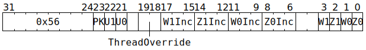

# `ADDRCRZW` (Manipulate some ADC Z and W counters)

**Summary:**

**Backend execution unit:** [Miscellaneous Unit](MiscellaneousUnit.md)

## Syntax

```c
TT_ADDRCRZW(((/* bool */ PK) << 2) +
            ((/* bool */ U1) << 1) +
              /* bool */ U0,
              /* u3 */ W1Inc,
              /* u3 */ Z1Inc,
              /* u3 */ W0Inc,
              /* u3 */ Z0Inc,
            ((/* bool */ W1) << 3) +
            ((/* bool */ Z1) << 2) +
            ((/* bool */ W0) << 1) +
              /* bool */ Z0)
```

There is no syntax to specify `/* u2 */ ThreadOverride`; if a non-zero value is desired for this field, the raw encoding must be used.

## Encoding



## Functional model

```c
uint2_t WhichThread = ThreadOverride == 0 ? CurrentThread : ThreadOverride - 1;
if (U0) ApplyTo(ADCs[WhichThread].Unpacker[0]);
if (U1) ApplyTo(ADCs[WhichThread].Unpacker[1]);
if (PK) ApplyTo(ADCs[WhichThread].Packers);

void ApplyTo(ADC& ADC_) {
  if (Z0) ADC_.Channel[0].Z_Cr += Z0Inc, ADC_.Channel[0].Z = ADC_.Channel[0].Z_Cr;
  if (W0) ADC_.Channel[0].W_Cr += W0Inc, ADC_.Channel[0].W = ADC_.Channel[0].W_Cr;
  if (Z1) ADC_.Channel[1].Z_Cr += Z1Inc, ADC_.Channel[1].Z = ADC_.Channel[1].Z_Cr;
  if (W1) ADC_.Channel[1].W_Cr += W1Inc, ADC_.Channel[1].W = ADC_.Channel[1].W_Cr;
}
```
