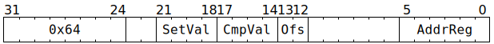

# `ATCAS` (L1 atomic compare and set)

**Summary:** Block execution of the Tensix thread until a 32-bit field in L1 contains a particular 4-bit value, then atomically change that field to contain a new 4-bit value. The instruction completes execution once the Scalar Unit has received confirmation that the change has been made in L1, at which point the thread's next instruction can execute. Note that the Scalar Unit remains busy for the duration of the instruction, and that repeated requests are made through the ThCon L1 access port until the comparison succeeds, making this a fairly heavyweight instruction - the facilities of the Sync Unit should be used instead where possible.

**Backend execution unit:** [Scalar Unit (ThCon)](ScalarUnit.md)

## Syntax

```c
TT_ATCAS(0, /* u4 */ SetVal, /* u4 */ CmpVal, /* u2 */ Ofs, 0, /* u6 */ AddrReg)
```

## Encoding



## Functional model

```c
retry:

uint32_t* L1Address = GPRs[CurrentThread][AddrReg] * 16 + Ofs * 4;
if (L1Address >= (1464*1024)) UndefinedBehaviour(); // Address must be in L1

atomic {
  if (*L1Address != CmpVal) {
    goto retry; // Comparison failed
  }
  *L1Address = SetVal;
}
```

## Performance

This instruction takes at least 15 cycles to execute, possibly longer if there is L1 access port or bank contention. If the comparison fails, each subsequent attempt takes another 15 (or more) cycles, until the comparison eventually succeeds.
