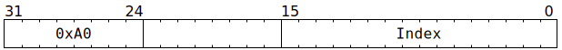

# `ATGETM` (Acquire a Tensix mutex)

**Summary:** Atomically acquire a Tensix mutex for the current thread. The thread will be blocked from issuing subsequent Tensix instructions until the mutex has been acquired. Once the thread no longer needs the mutex, it should use [`ATRELM`](ATRELM.md) to release it, which will allow other threads to acquire it.

**Backend execution unit:** [Sync Unit](SyncUnit.md)

## Syntax

```c
TT_ATGETM(/* u16 */ Index)
```

## Encoding



## Functional model

This instruction will, if neccessary, spend time waiting at the Wait Gate for the mutex to become available:

```c
if (Index == 1 || Index > 7) {
  // Invalid index causes infinite wait.
  while (true) {
    wait;
  }
}

if (Mutex[Index].HeldBy == CurrentThread) {
  // Maybe wait for a cycle or two if trying to acquire
  // a mutex already held by the current thread. These
  // waits can happen if other threads are also trying to
  // either acquire or release the mutex in question.
  if (maybe) wait;
  if (maybe) wait;
} else {
  // Wait for mutex to become available if it is held
  // by some other thread.
  while (Mutex[Index].HeldBy != Nobody) {
    wait;
  }
}
```

Once the wait is complete, if the current thread already holds the mutex, or is the only thread trying to acquire the mutex, it proceeds to acquire it:

```c
Mutex[Index].HeldBy = CurrentThread;
```

If multiple threads are trying to acquire a mutex not held by anyone, then one thread is chosen to acquire the mutex, and the other threads continue waiting. Once the acquirer subsequently uses [`ATRELM`](ATRELM.md) to release the mutex, the behaviour of `ATRELM` ensures fairness.
