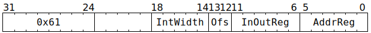

# `ATINCGET` (Atomically increment an integer in L1)

**Summary:** Atomically increments an integer in L1, whose width is between 1 and 32 bits, by an arbitrary amount. The original value of the integer (from before the increment) is returned to a Tensix GPR. The instruction completes execution as soon as the atomic-request has been sent towards L1, at which point the thread's next instruction can execute. Note that until the atomic-request subsequently reaches L1, clients other than the Scalar Unit will not observe the change to memory.

**Backend execution unit:** [Scalar Unit (ThCon)](ScalarUnit.md)

## Syntax

```c
TT_ATINCGET(0, /* u5 */ IntWidth, /* u2 */ Ofs, /* u6 */ InOutReg, /* u6 */ AddrReg)
```

## Encoding



## Functional model

The instruction is considered complete once the following happens:

```c
uint32_t* L1Address = GPRs[CurrentThread][AddrReg] * 16 + Ofs * 4;
if (L1Address >= (1464*1024)) UndefinedBehaviour(); // Address must be in L1
uint32_t* GPR = &GPRs[CurrentThread][InOutReg];
uint32_t IncrementBy = *GPR;
uint32_t IntMask = (2u << IntWidth) - 1u;
```

The values from the above are captured, and then at some later point in time, the following happens:

```c
uint32_t OriginalValue;
atomic {
  OriginalValue = *L1Address;
  uint32_t Incremented = OriginalValue + IncrementBy;
  *L1Address = (Incremented & IntMask) | (OriginalValue & ~IntMask);
}
```

The values from the above are captured, and then at some even later point in time, the following happens:

```c
*GPR = OriginalValue;
```

## Instruction scheduling

Various mechanisms exist to wait for the original value to be written to the GPR, including [`STALLWAIT`](STALLWAIT.md) (with condition bit C0), [`FLUSHDMA`](FLUSHDMA.md) (with condition bit C0), and [RISCV TTSync](../BabyRISCV/TTSync.md). In _most_ cases it also suffices to just let some cycles elapse, for example by issuing 24 [`DMANOP`](DMANOP.md) instructions after `ATINCGET`, though such an approach is inherently racy.

## Performance

The instruction occupies the Scalar Unit (ThCon) for at least three cycles, possibly longer in the case of contention for GPR reads. However, due to limits on the number of in-flight L1 requests from the Scalar Unit, sustained throughput is (at best) one `ATINCGET` instruction every 12 cycles.