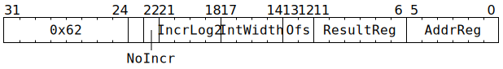

# `ATINCGETPTR` (Atomically push or pop FIFO control counters in L1)

**Summary:** A FIFO is usually controlled by two counters, with those two counters typically called the read pointer and the write pointer. For a FIFO with capacity 2<sup>N</sup>, these counters are both unsigned <code>N+1</code>-bit integers. When two counters of this form (†) exist as adjacent values in L1, this instruction can do one of four things:
* Wait until the counters indicate that the FIFO is not full.
* Wait until the counters indicate that the FIFO is not full, and then increment the write pointer by 2<sup>M</sup> (i.e. push 2<sup>M</sup> elements).
* Wait until the counters indicate that the FIFO is not empty.
* Wait until the counters indicate that the FIFO is not empty, and then increment the read pointer by 2<sup>M</sup> (i.e. pop 2<sup>M</sup> elements).

In all cases, the counter reads (and the increment, if any) are performed as a single atomic operation. The original value of the counter (from before the increment) is returned to a Tensix GPR.

(†) It is usually easier for software to let FIFO counters be free-running 32-bit integers, regardless of the FIFO capacity. Unfortunately, free-running counters are not compatible with this instruction - this instruction expects a counter in the low <code>N+1</code> bits, with the remaining bits of the 32-bit integer set to zero.

**Backend execution unit:** [Scalar Unit (ThCon)](ScalarUnit.md)

## Syntax

```c
TT_ATINCGETPTR(0,
             /* bool */ NoIncr,
               /* u4 */ IncrLog2,
               /* u4 */ IntWidth,
               /* u2 */ Ofs,
               /* u6 */ ResultReg,
               /* u6 */ AddrReg)
```

## Encoding



## Functional model

```c
union FIFOControl {
  uint32_t Words[4];
  struct {
    uint32_t Rd;
    uint32_t Wr;
    uint32_t Padding[2];
  };
};
uint32_t IncrementBy = !NoIncr << IncrLog2;
uint32_t IntMask = (1u << IntWidth) - 1; 
uint32_t OriginalValue;

retry:
FIFOControl* L1Address = GPRs[CurrentThread][AddrReg] * 16;
if (L1Address >= (1464*1024)) UndefinedBehaviour(); // Address must be in L1

atomic {
  uint32_t FIFOSize = L1Address->Wr - L1Address->Rd;
  bool FIFOEmpty = (FIFOSize == 0);
  if (Ofs & 1) {
    uint32_t FIFOCapacity = IntWidth ? (1u << (IntWidth - 1)) : 0x8000;
    bool FIFOFull = (((FIFOSize % FIFOCapacity) == 0) && !FIFOEmpty);
    if (FIFOFull) {
      goto retry; // Cannot push onto a full FIFO.
    }
    // If Ofs == 1, the increment below is incrementing Wr, i.e. pushing
    // onto the FIFO. ResultReg will end up containing the value of Wr
    // from before the increment.
  } else {
    if (FIFOEmpty) {
      goto retry; // Cannot pop from an empty FIFO.
    }
    // If Ofs == 0, the increment below is incrementing Rd, i.e. popping
    // from the FIFO. ResultReg will end up containing the value of Rd
    // from before the increment.
  }
  OriginalValue = L1Address->Words[Ofs];
  uint32_t Incremented = OriginalValue + IncrementBy;
  L1Address->Words[Ofs] = (Incremented & IntMask) | (OriginalValue & ~IntMask);
}

GPRs[CurrentThread][ResultReg] = OriginalValue;
```

## Performance

This instruction takes at least 15 cycles to execute, possibly longer if there is L1 access port or bank contention. If the FIFO empty/full test fails, each subsequent attempt takes another 15 (or more) cycles, until the test eventually succeeds.
