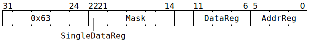

# `ATSWAP` (L1 128b store at 16b granularity)

**Summary:** Write up to 128 bits from GPRs to L1, using a mask to specify which 16-bit granules get written. The instruction completes execution as soon as the write-request has been sent towards L1, at which point the thread's next instruction can execute. Note that until the write-request subsequently reaches L1, clients other than the Scalar Unit will not observe the write.

**Backend execution unit:** [Scalar Unit (ThCon)](ScalarUnit.md)

## Syntax

```c
TT_ATSWAP(0, /* u8 */ Mask, /* u6 */ DataReg, /* u6 */ AddrReg)
```

There is no syntax to specify `/* u1 */ SingleDataReg`; if a non-zero value is desired for this field, the raw encoding must be used.

## Encoding



## Functional model

The instruction is considered complete once the following happens:
```c
uint16_t *L1Address = GPRs[CurrentThread][AddrReg] * 16;
if (L1Address >= (1464*1024)) UndefinedBehaviour(); // Address must be in L1

uint16_t ToWrite[8];
if (SingleDataReg) {
  memset(ToWrite, 0, 16);
  memcpy((char*)ToWrite + (DataReg & 3) * 4, &GPRs[CurrentThread][DataReg], 4);
} else {
  memcpy(ToWrite, &GPRs[CurrentThread][DataReg & 0x3c], 16); // Four consecutive GPRs
}
```
The values from the above are captured, and then at some later point in time, the following happens:
```c
atomic {
  for (unsigned i = 0; i < 8; ++i) {
    if (Mask & (1u << i)) {
      L1Address[i] = ToWrite[i];
    }
  }
}
```
Note that nothing gets written back to `GPRs[CurrentThread][DataReg]` - the "swap" in the instruction name is a misnomer.

## Performance

The instruction occupies the Scalar Unit (ThCon) for at least three cycles, possibly longer in the case of contention for GPR reads. However, due to limits on the number of in-flight L1 requests from the Scalar Unit, sustained throughput is (at best) one `ATSWAP` instruction every 12 cycles. The instruction executes as an atomic at the L1 access port; if a mask of `0xff` is used, then a non-atomic store would be more efficient.
