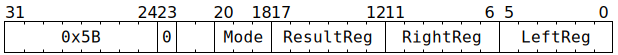
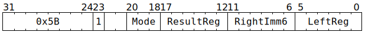

# `BITWOPDMAREG` (Perform bitwise and/or/xor on GPRs)

**Summary:** Performs a bitwise and/or/xor operation between two Tensix GPRs, or between a Tensix GPR and an unsigned 6-bit immediate.

**Backend execution unit:** [Scalar Unit (ThCon)](ScalarUnit.md)

## Syntax

```c
TT_BITWOPDMAREG(0, /* u3 */ Mode, /* u6 */ ResultReg, /* u6 */ RightReg , /* u6 */ LeftReg)
TT_BITWOPDMAREG(1, /* u3 */ Mode, /* u6 */ ResultReg, /* u6 */ RightImm6, /* u6 */ LeftReg)
```

## Encoding




## Functional model

```c
uint32_t LeftVal = GPRs[CurrentThread][LeftReg];
uint32_t RightVal = GPRs[CurrentThread][RightReg]; // RightReg  variant
uint32_t RightVal = RightImm6;                     // RightImm6 variant
uint32_t ResultVal;
switch (Mode) {
case BITWOPDMAREG_MODE_AND: ResultVal = LeftVal & RightVal; break;
case BITWOPDMAREG_MODE_OR : ResultVal = LeftVal | RightVal; break;
case BITWOPDMAREG_MODE_XOR: ResultVal = LeftVal ^ RightVal; break;
default: UndefinedBehaviour(); break;
}
GPRs[CurrentThread][ResultReg] = ResultVal;
```

Supporting definitions:
```c
#define BITWOPDMAREG_MODE_AND 0
#define BITWOPDMAREG_MODE_OR  1
#define BITWOPDMAREG_MODE_XOR 2
```

## Performance

The `RightImm6` variant takes three cycles. The `RightReg` variant takes three cycles if `LeftReg` and `RightReg` come from the same aligned group of four GPRs, or four cycles otherwise.
