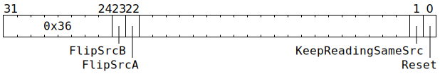

# `CLEARDVALID` (Give `SrcA` / `SrcB` banks to Unpackers)

**Summary:** The `SrcA` and/or `SrcB` banks currently being used by the [Matrix Unit (FPU)](MatrixUnit.md) are given to the Unpackers, and then the Matrix Unit (FPU) is optionally flipped to using the other `SrcA` and/or `SrcB` bank.

Can also be used to completely reset the `SrcA` / `SrcB` synchronization mechanism, giving all banks to the Unpackers, setting the Unpackers to write to bank 0, and setting the Matrix Unit (FPU) to use bank 0 (though Matrix Unit (FPU) instructions which wait for bank validity will not be able to read from here until the bank is given back to the Matrix Unit).

See also [`SETDVALID`](SETDVALID.md). It is also possible to use [`SETRWC`](SETRWC.md) to perform a slightly different flavour of flip.

**Backend execution unit:** [Matrix Unit (FPU)](MatrixUnit.md)

## Syntax

```c
TT_CLEARDVALID(((/* bool */ FlipSrcB) << 1) +
                 /* bool */ FlipSrcA,
               ((/* bool */ KeepReadingSameSrc) << 1) +
                 /* bool */ Reset);
```

## Encoding



## Functional model

```c
if (Reset) {
  MatrixUnit.SrcABank = 0;
  MatrixUnit.SrcBBank = 0;
  Unpackers[0].SrcBank = 0;
  Unpackers[1].SrcBank = 0;
  SrcA[0].AllowedClient = SrcClient::Unpackers;
  SrcA[1].AllowedClient = SrcClient::Unpackers;
  SrcB[0].AllowedClient = SrcClient::Unpackers;
  SrcB[1].AllowedClient = SrcClient::Unpackers;
} else {
  if (FlipSrcA) {
    SrcA[MatrixUnit.SrcABank].AllowedClient = SrcClient::Unpackers;
    if (!KeepReadingSameSrc) {
      MatrixUnit.SrcABank ^= 1;
    }
  }
  if (FlipSrcB) {
    SrcB[MatrixUnit.SrcBBank].AllowedClient = SrcClient::Unpackers;
    if (!KeepReadingSameSrc) {
      MatrixUnit.SrcBBank ^= 1;
    }
  }
}
```
